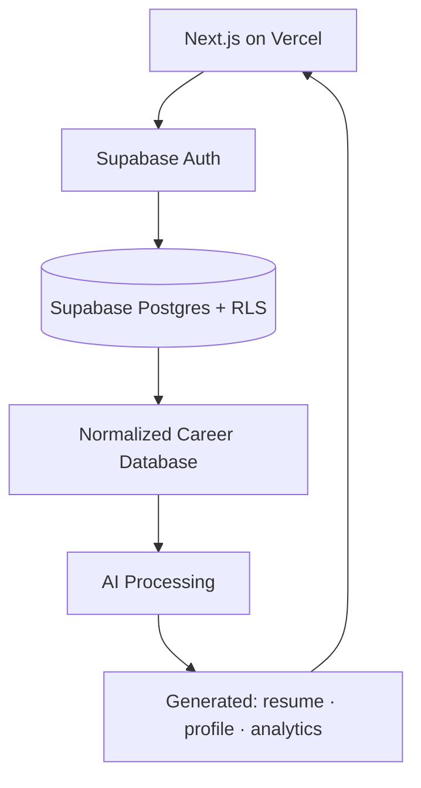

# PyTorch FIT System — AI Career Intelligence Platform

> Built by the **PyTorch FEU Institute of Technology (FEU Tech) Student Chapter**.
> 📖 **Master spec (NotebookLM source of truth):** [`docs/SPECIFICATION.md`](docs/SPECIFICATION.md)
> 🗂️ **Delegation backlog / board:** [`docs/TASKS.md`](docs/TASKS.md)

This is **not** just an AI resume builder. It is a **Career Intelligence Platform** that collects
a user's career information, normalizes it into a single career database, and *generates*
everything else from it — resumes, public profiles, portfolios, analytics, and AI suggestions.

## The one principle

> **The source of truth is the Normalized Career Database — never the résumé.**

A résumé, a PDF, a Facebook post, a LinkedIn profile — these are inputs or disposable outputs.
The database is the truth. One database → unlimited industry-targeted resumes and views.

## AI evidence output: results that explain themselves

AI interpretation produces strict JSON—not loose prose. Each evidence record separates outcomes
from its takeaway:

```json
{
  "results": {
    "quantitative": [
      "Reduced processing time from 10 min to 2 min: 8 min saved/run; 80% faster.",
      "Context: the measured workflow completes in one-fifth of the original time."
    ],
    "qualitative": [
      "Replaced a manual workflow with repeatable automation.",
      "Context: fewer handoffs; easier operation for non-developers."
    ]
  },
  "conclusion": "Demonstrates end-to-end automation work that converts a slow manual process into a faster, reusable system."
}
```

- `quantitative`: sourced metric + exact value + context + plain-language meaning; no invented or
  extrapolated numbers.
- `qualitative`: non-numeric value—problem solved, beneficiary/system effect, difficulty, ownership,
  or capability demonstrated.
- `conclusion`: concise synthesis of value created + strongest evidence-backed capability; no hype.

Result explanations add context without rewriting an already-good sentence. Missing meaning becomes
a separate short sentence or bullet—not a longer original sentence. Syntax stays compact—lists, `:`,
`-`, `,`, `()`—so tokens carry evidence rather than connector words.

Skills remain atomic in normalized data for reliable matching. Resume JSON adds a display hierarchy
with names only: `JavaScript → ReactJS, React Native, Vue`; `Python → PyTorch, FastAPI`. Libraries and
frameworks provide the context—no explanatory skill prose or unsupported proficiency labels.
Renderers compute skill columns from the actual labels and usable page width, then verify the final
injection using Chromium bounds and PDF page count. Unrelated tools must not be forced into a group.

## Architecture (MVP)



Serverless for the MVP (Vercel + Supabase). A backend (verification, AI queue, scheduled jobs,
payments) is a future phase. Full detail: [`docs/SPECIFICATION.md`](docs/SPECIFICATION.md).

## Data layers (summary)

| Layer | Purpose | Visibility |
|---|---|---|
| 1 — Auth | users, profiles, roles | — |
| 2 — Raw inputs | posts, certs, projects, history | private (RLS) |
| 3 — Normalized | experiences, skills, projects, industries… | private (RLS) |
| 4 — Generated | resumes, summaries, recommendations | derived / disposable |
| 5 — Analytics | metrics, trends, leaderboards | aggregated / anonymous |

## Privacy

Three levels — **Private** (owner only), **Public Profile** (curated fields only), **Aggregated
Analytics** (anonymous). Enforced with **Row Level Security** at the database, not just the UI.
Public profiles never expose email, phone, raw posts, certificates, or full resumes.

## Status — pivot in progress

This repository is moving from a single-output **résumé builder** to the multi-user
**platform** described above. Decision: **start fresh** on Next.js + Supabase rather than
incrementally refactor the old Python CLI.

### Legacy reference engine (Python)

The prior résumé pipeline still lives here as a **proven blueprint** for the AI Processing layer
— do not treat it as the running platform:

- Code: [`src/resume_builder/`](src/resume_builder/README.md) (module-level READMEs + diagrams)
- Architecture docs: [`docs/departments/`](docs/departments/README.md)
- How it maps to the new platform: [`docs/SPECIFICATION.md` §18](docs/SPECIFICATION.md)

GitHub evidence collection is runtime-user-driven and website-first: public profile/repository pages
are sampled through the same access-gated approach used by other profile sources. No personal
username is hardcoded. `gh` CLI collection remains an optional local-development backend only.

### Job finder: deterministic known sites, learned unknown sites

Job discovery keeps access checks, listing extraction, and application filling as separate
boundaries. Indeed and JobStreet use code-specific adapters when their required rendered controls
still match. Every other domain—or a known site whose layout has drifted—uses bounded rendered-DOM
sampling, one strict AI planning pass, and deterministic replay cached by subdomain + layout
fingerprint.

Work mode is an explicit constraint: `remote`, `hybrid`, `onsite`, or `any`. An adapter translates
it only from observable site capabilities. For example, Indeed may put `remote` in the location
field when that live field advertises remote support; this does not imply that `hybrid` is a valid
location value. Unsupported or missing controls stop or fall back to sampling rather than silently
changing the requested mode.

Detailed development flow: [`src/resume_builder/job_finder/README.md`](src/resume_builder/job_finder/README.md).

### Job application sender: tested execution boundary

The legacy Python engine now has a deterministic browser executor for accepted application JSON:

- Auto-fill: text, selections, checkboxes, safe clicks, resume upload.
- Dynamic pages: replay approved read-only interactions from the cached layout plan.
- Draft validation: missing information stops for human input; unsupported or unsafe actions fail
  closed.
- Indeed Smart Apply: reconcile contact names from the selected resume, preserve account contact
  data, and stop when the required phone is blank; never infer or generate a number.
- Role-specific resumes: upload and Continue are separate approvals; only actual professional
  experience may populate employment fields.
- Final send: always blocked until the user gives explicit approval for that application.
- Confirmation: after approval, click once; wait for the planned confirmation selector; record the
  visible reference/message without storing cookies or credentials.

An actual headless-Chromium integration test uses a local mock ATS. It verifies both outcomes:
resume attached + draft ready without approval; submitted + confirmation captured with approval.
This is assisted sending for one genuine application—not unattended bulk application blasting.

### Scraper token-cost benchmark

The saved benchmark in [`benchmarks/scraper_token_cost/`](benchmarks/scraper_token_cost/README.md)
compares naive agent tool-calling against the `AgenticCrawler` pipeline.

Measured evidence:

- Captured five live `quotes.toscrape.com` pages and tokenized them with `tiktoken cl100k_base`.
- The strict DOM fingerprint split pages 1-5 into exactly two layouts; pages 3-5 were cache hits.
- Agent tool-calling with accumulating context is modeled as O(N^2), while best-case isolated agent calls and the pipeline are O(N).
- The pipeline has a roughly 15x smaller per-page token slope than best-case isolated agent calls, plus a bounded O(L) layout-learning term.
- Crossover is about six pages: below that, the agent has lower fixed overhead; above it, the pipeline wins and the gap widens.

Caveat: the benchmark is explicit about what is measured versus modeled. It does not claim live
provider billing; it locks in the complexity model and measured page/fingerprint data so future
scraper changes cannot silently invalidate the token-cost argument.

## Contributing (chapter members)

1. Read [`docs/SPECIFICATION.md`](docs/SPECIFICATION.md) end to end.
2. Find your role workstream in §17 and your open tasks in [`docs/TASKS.md`](docs/TASKS.md).
3. Every AI-generated artifact passes a **human-in-the-loop** review before it ships.

## License

See repository for license details.
