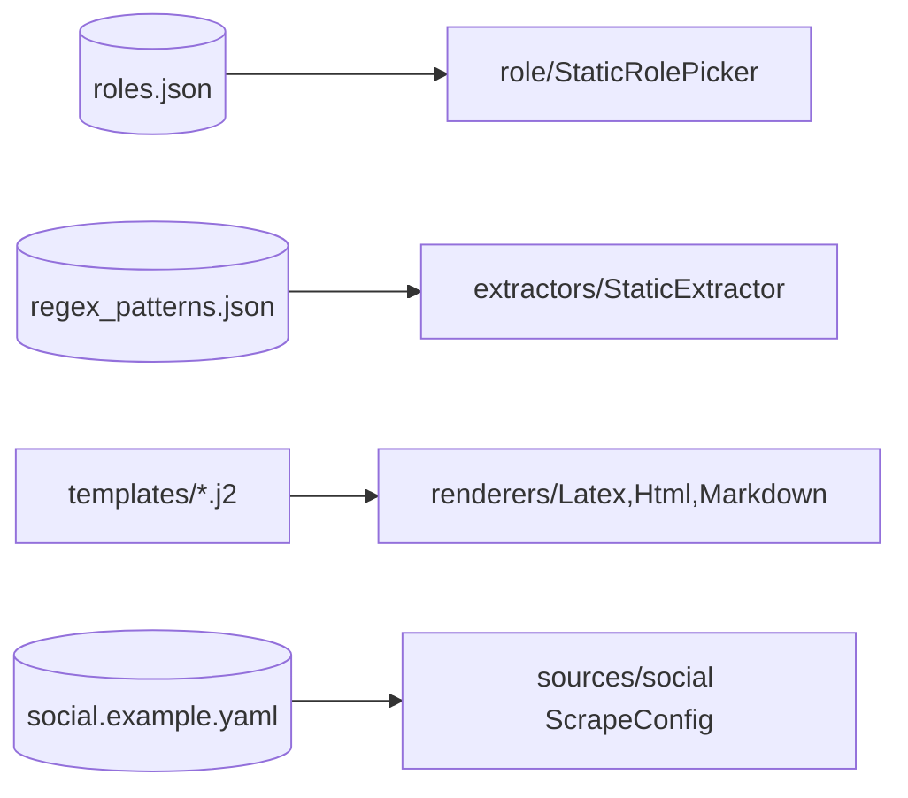

# `config/` — Configuration (data, not code)

Config-driven extensibility: add roles, keyword categories, and resume templates **without
touching code**. Read mostly by Department 01 (roles), 03 (regex), and 04 (templates).

> 📖 [docs/departments/](../docs/departments/README.md)

## What reads what

## Files

| File | Used by | Purpose |
|---|---|---|
| `roles.json` | `role/static_picker.py` | Role definitions (id, label, keywords, must-haves) |
| `regex_patterns.json` | `extractors/static_extractor.py` | Keyword categories for scoring |
| `social.example.yaml` | `sources/social` | Template for a `ScrapeConfig` |
| [`templates/`](templates/README.md) | `renderers/` | Jinja2 resume templates |

## Rules

This is **data**. Editing JSON/YAML/templates should never require a code change. Keep the
shapes aligned with the pydantic models that load them (`RoleSpec`, `ScrapeConfig`).
