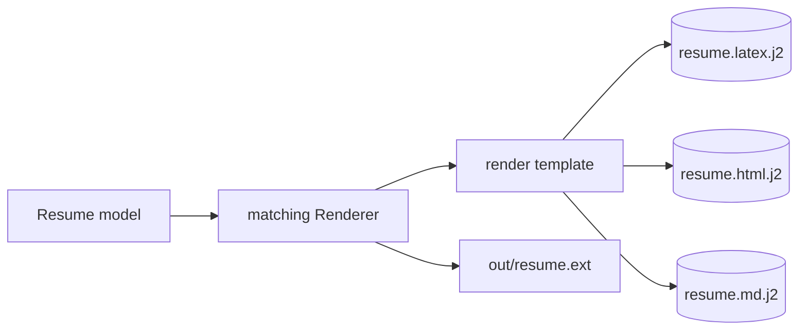

# `config/templates/` — Jinja2 Resume Templates

Layout and wording for the text-based output formats. Owned/consumed by **Department 04
(Rendering)**. These are *data*: a visual variant should be a template edit, not a renderer
rewrite.

> 📖 [Dept 04 — Rendering](../../docs/departments/04-rendering/README.md)

## How a template becomes a file

## Files

| Template | Rendered by | Output |
|---|---|---|
| `resume.latex.j2` | `LatexRenderer` | `.tex` |
| `resume.html.j2` | `HtmlRenderer` | `.html` |
| `resume.md.j2` | `MarkdownRenderer` | `.md` |

> JSON and PDF are generated programmatically (no template).

## Rules

Templates consume the `Resume` model fields directly — keep field names in sync with
`models.py`. Handle empty sections gracefully. Escape format-specific special characters
(LaTeX `& % _ #`, HTML entities).
