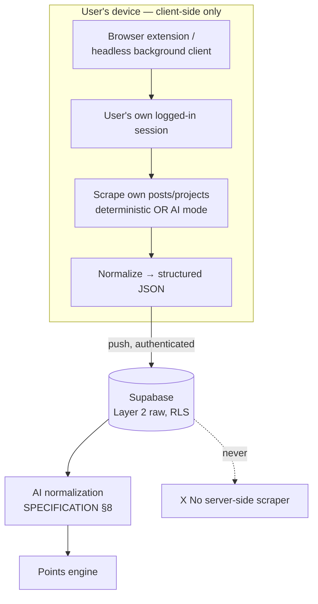
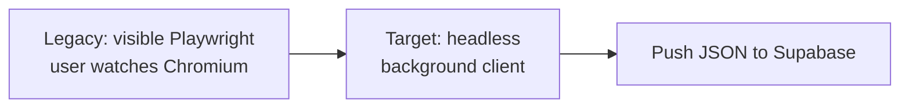
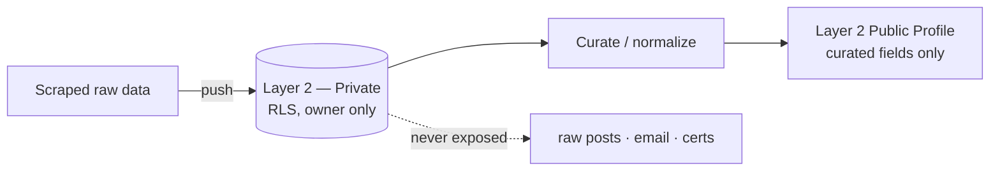

# Client-Side Scraping — CONFIRMED (v1)

> ✅ **STATUS: CONFIRMED** with the user. Defines how personal-achievement scraping (Facebook
> posts, GitHub projects) runs **on the user's own device** and pushes results to Supabase. Feeds
> the points engine ([`POINTS-ENGINE.md`](POINTS-ENGINE.md)) and the activity pipeline
> ([`ORG-OPERATIONS.md`](ORG-OPERATIONS.md)). Privacy follows SPECIFICATION §6.

## Purpose

The MVP is **Supabase-only serverless — no VPS, no EC2, no permanent backend**. We still need to
collect a member's own posts and projects to award points. The decision: **scrape client-side**.
A **browser extension / headless client on the USER's device** does the scraping using the user's
own logged-in session, then **pushes structured results to Supabase**. There is **no server-side
scraping**.

> Bakit client-side: walang server na kailangan i-maintain, ang user mismo ang may session at
> consent, at hindi tayo nagho-host ng third-party credentials. Supabase lang ang sink.

---

## 1. Architecture

- **No server-side scraping** — the dashed `SRV` node is explicitly out of scope.
- The client only ever talks to Supabase, authenticated as the user (RLS enforced).

---

## 2. Migration from the legacy engine

The legacy Python engine already does browser-based scraping, but **visible** (Playwright opens a
real Chromium the user watches). The **target** is a **headless background process** on the user
side. Use the existing files as the **blueprint** — port the *ideas*, re-implement for the
client/extension runtime:

| Legacy file (`src/resume_builder/sources/social/`) | Role today | Carries over as |
|---|---|---|
| `headless_browser.py` | `PlaywrightSession` (default **visible**) + `scroll_collect` infinite-scroll | Headless background session + scroll-to-load logic |
| `aggregator.py` | parallel dispatch, per-vendor cache (TTL 6h), dedupe, failure isolation | Client-side scheduler + local cache + dedupe |
| `base.py` / `models.py` | `SocialVendor` ABC, frozen `SocialPost`/`ScrapeConfig` | Extension's vendor contract + JSON package schema |
| `vendors/facebook.py` (+ gotchas) | FB post detection via `__cft__`/permalink, not `role=article` | Same selectors, reused in the extension |
| `auth.py` / `browser_cookies.py` / `state.py` | session/cookie persistence | Uses the user's *live* browser session instead |
| `playwright_overlay.py` / `_step.py` / `_picker.py` | visible-first debug tooling | Dev-only; **off** in the headless background path |

> The legacy README itself prescribes a **visible-first workflow** (develop visible, go headless
> only after sign-off). The platform target flips the default to **headless background** for the
> end user, keeping visible mode for development.

---

## 3. Deterministic vs AI scraping (same modes as the engine)

Client-side scraping reuses the legacy `static` vs `ai` split (see
[`POINTS-ENGINE.md` §6](POINTS-ENGINE.md)):

- **Deterministic** — regex/rules/fixed selectors (e.g. FB `__cft__` permalink anchor, GitHub API
  shapes). Fast, predictable, no LLM cost.
- **Non-deterministic (AI)** — LLM extraction for messy/freeform content, via the adapter layer
  (SPECIFICATION §15).

---

## 4. Obfuscation / abstraction considerations

The scraping is a **background process behind the user** — it should not expose its internals:

- Run as a background task; do not surface raw DOM selectors, vendor quirks, or scrape internals in
  the UI. The user sees *results*, not the machinery.
- Abstract every vendor behind the `SocialVendor`-style contract so the extension swaps vendors
  without leaking platform-specific logic upward.
- Keep selector/heuristic details (the hard-won FB gotchas) encapsulated in the vendor layer.
- Treat the scrape package as the only public surface; everything before it is implementation
  detail.

> ⚠️ This is abstraction/encapsulation hygiene — **not** a license to hide behavior from the user.
> Scraping only ever runs on data the user already has access to, with their consent.

---

## 5. Privacy (cross-ref SPECIFICATION §6)

- **Scraped raw data is Layer-2 Private (RLS)** — owner only.
- **Only curated fields ever go public** (career summary, top skills, achievements). Raw posts,
  email, phone, certificates, full resumes **never** surface (SPECIFICATION §6).
- RLS is enforced at the database, not just the UI.

---

## 6. Open questions / blocked-on

1. **Client runtime** — browser extension (MV3) vs a packaged headless client (Electron/Playwright
   on device)? Affects distribution and update story.
2. **Vendor coverage at launch** — Facebook + GitHub confirmed; LinkedIn/Twitter/Instagram TBD
   (legacy vendors exist but are visible-mode).
3. **Scheduling** — on-demand (user clicks) vs background interval; how to schedule without a
   server (browser alarms? manual trigger?).
4. **Push auth** — how the client authenticates to Supabase (user JWT) and how RLS scopes the
   write to the owner only.
5. **GitHub path** — official GitHub API (no scraping needed) vs DOM scraping for projects.
6. **Consent UX** — explicit per-vendor consent + what the user sees before/after a scrape.
7. **Headless detection** — anti-bot risk now that we lose visible-mode's lower detection profile
   (legacy notes visible Chromium triggers less bot detection).
8. **Local cache lifetime** — mirror the legacy 6h TTL, or different on-device?
