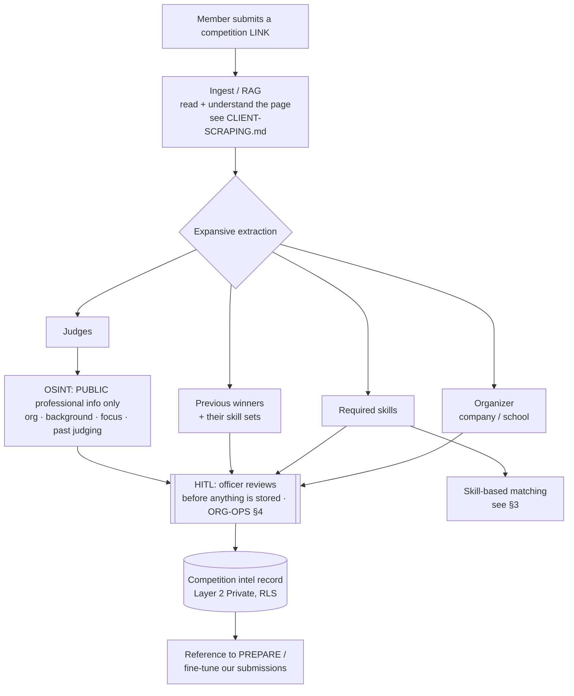
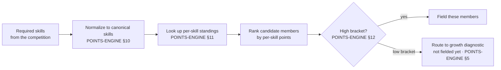

# Competition Intelligence — CONFIRMED (v1, design only)

> ✅ **STATUS: CONFIRMED** with the user as a **design** — the build is a **future gated job**.
> Today the engine only does basic detail extraction from a submitted link; the target documented
> here is **richer, expansive intelligence**. The scraping/ingestion runtime is the client-side
> path in [`CLIENT-SCRAPING.md`](CLIENT-SCRAPING.md), and every store/use step rides the
> human-in-the-loop gate of [`ORG-OPERATIONS.md` §4](ORG-OPERATIONS.md). Privacy follows
> SPECIFICATION §6. **Blocked on:** scraping infra + account/API access the user must provide.

## Purpose

Turn a submitted **competition LINK** into **expansive intelligence** the chapter can act on.
Right now a link only yields basic detail extraction (name, date, maybe required skills). The
**target** is to read a competition page and come back with: who runs it, what it needs, who has
won it before (and *how* — their skill sets), and **who will judge it** — so the org can field the
right people and **prepare/fine-tune** its submissions.

> Framing (Taglish): hindi lang "anong contest 'to" — gusto natin malaman *paano manalo* dito.
> Sino ang nag-ooorganize, anong skills ang kailangan, sino ang dating nanalo at bakit, at sino ang
> mga judges para alam natin kung paano i-angkop ang submission natin.

---

## 1. Pipeline (submit → expansive extraction)

- **Ingest / RAG** reuses the link-ingestion idea from the points engine and the activity pipeline
  ([`POINTS-ENGINE.md` §6](POINTS-ENGINE.md), [`ORG-OPERATIONS.md` §8b](ORG-OPERATIONS.md)) —
  deterministic (regex/rules) or AI (LLM) mode, run on the client-side scraping runtime.
- **Nothing is stored without HITL review** — an officer confirms the extracted record first.

---

## 2. What we extract

| Field | What | Notes |
|---|---|---|
| **Organizer** | the company/school running the competition | drives endorsement/approval routing (ORG-OPS §8b) |
| **Required skills** | skills the competition demands | normalized to the **canonical skill set** ([`POINTS-ENGINE.md` §10](POINTS-ENGINE.md)) for matching |
| **Previous winners + skill sets** | who won before and *what they were strong in* | the "what does it take to win here" signal |
| **Judges** | who evaluates submissions | **public professional info only** — see §4 ethics |

> Winners and judges are the expansive part. Knowing past winners' skill sets tells us which of our
> per-skill leaders (§3) actually fit; knowing the judges lets us prepare submissions to their known
> focus areas — **preparation, hindi manipulation** (§4).

---

## 3. Skill-based matching — who do we field?

The required skills (§2) are matched against **member per-skill standings** (the categorical
leaderboards in [`POINTS-ENGINE.md` §11](POINTS-ENGINE.md)) to select **who the org fields** — the
**high bracket** ([`POINTS-ENGINE.md` §12](POINTS-ENGINE.md)).

- Matching is **merit-driven**: required skill → top of that skill's board → field them.
- Low-bracket members who *almost* match become a **growth signal**, not a competition seat —
  consistent with the differentiated handling in `POINTS-ENGINE.md` §12.

---

## 4. Ethics & boundaries (judges OSINT)

> ⚠️ This section is a **hard boundary**, not a suggestion. Judge intelligence exists so the chapter
> can **prepare and fine-tune** its submissions — period.

- **Public data only.** Organization, professional background, stated focus areas, and **past
  judging history** that is already publicly available. Nothing more.
- **No private/personal data.** No home info, no private contact details, no personal life, no
  scraping behind logins or privacy walls. If it isn't public professional info, it doesn't get
  collected.
- **Competitive preparation, not manipulation.** Use it to tailor a stronger, more relevant
  submission to a judge's known focus — **never** to contact, pressure, harass, or influence a
  judge outside the competition's own channels.
- **Respect site ToS.** Honor each source's terms of service and robots rules. If a source forbids
  it, we don't.
- **HITL before storing.** An officer reviews every judge record before it is saved (ORG-OPS §4).
  Stored judge intel is a **reference**, kept Layer-2 Private (RLS) — never surfaced publicly
  (SPECIFICATION §6).

> Taglish gut-check: kung hindi mo kakayanin i-justify sa judge mismo na "ito ang public info na
> tiningnan namin para mas maganda ang submission namin" — huwag i-store.

---

## 5. Where this is blocked

This is **design-now, build-later**. The runtime depends on things the user must still provide:

- **Scraping infra** — the client-side scraping path in [`CLIENT-SCRAPING.md`](CLIENT-SCRAPING.md)
  must exist first (no server-side scraping; runs on the user's device, pushes to Supabase).
- **Account / API access** — credentials or API access for the competition sources and any OSINT
  lookups. The user provides these; we don't host third-party credentials.

Until both land, this stays a **gated future job** — scaffold the shapes (ingestor → extractor →
HITL → record → matcher), not the live scrapers.

---

## 6. Blocked on / open questions

1. **Data retention for judge intel** — how long do we keep judge reference records, and when do we
   purge? (Layer-2 Private, but retention window TBD.)
2. **Source legality** — per-source ToS and robots compliance; which sources are even allowed, and
   what the user's account/API access actually permits.
3. **Dedupe of winners** — same person winning multiple times / across sources; how to merge winner
   records without double-counting their skill sets.
4. **What counts as a "skill" for matching** — alignment with the canonical skill set
   ([`POINTS-ENGINE.md` §10](POINTS-ENGINE.md)); how to map a competition's free-text "required
   skills" onto approved canonical skills (alias normalization, candidates for unknown skills).
5. **Ingestion default mode** — deterministic-first with AI fallback, or AI-first, for messy
   competition pages? (mirrors `POINTS-ENGINE.md` §9 item 9.)
6. **Confidence / staleness** — past winners and judges change per edition; how fresh must the
   intel be before we trust the match?
