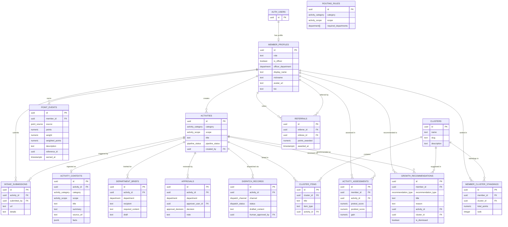
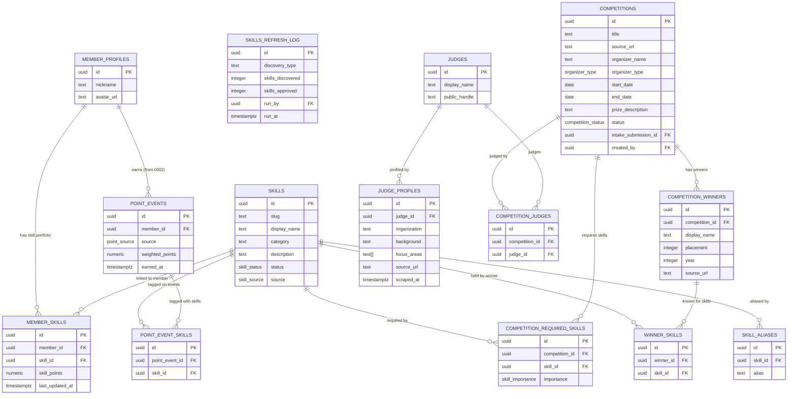

# PyTorch FIT System — Org-Ops Data Model

> Layer: Org-Operations (Layer 1 foundation + Layer 5 analytics extension).
> Stack: Supabase Postgres (serverless). RLS mandatory on every user-owned table.
> Migrations: `supabase/migrations/0001_org_activities.sql`,
>   `0002_points_leaderboard.sql`, `0003_referrals_growth.sql`.

---

## ERD (Mermaid)

---

## Table Catalog

### Migration 0001 — Activity Pipeline + Auth Foundation

#### `member_profiles`
Auth foundation (SPEC §5 Layer 1). Links `auth.users` to the org-ops layer.

| Column | Type | Notes |
|---|---|---|
| `id` | uuid PK | `REFERENCES auth.users(id)` |
| `role` | text | `member \| premium \| research \| moderator \| admin \| super_admin` |
| `is_officer` | boolean | Whether user holds an officer position |
| `officer_department` | department | Required when `is_officer = true` |
| `display_name` | text | Added in 0002 |
| `nickname` | text UNIQUE | Public handle (e.g. `Angela #7A82F`); never email. Added in 0002 |
| `avatar_url` | text | Added in 0002 |
| `bio` | text (≤500) | Added in 0002 |

#### `activities`
Master record for each org activity item. All pipeline child tables FK here.
Pipeline state is tracked via `pipeline_status` enum.

#### `intake_submissions`
Any authenticated member may submit a URL or free-text to start a pipeline.
Constraint: at least one of `url` or `details` must be non-null.

#### `activity_contexts`
Structured JSON output from the LinkIngestor / RAG step.
Maps 1:1 to `ActivityContext` in `platform/org-ops/types.ts`.
`facts` column is JSONB; has a GIN index for key/value queries.
Populated by service_role (AI pipeline) — no client INSERT policy.

#### `routing_rules`
Admin-editable configuration table.
One row per `(category, scope)` pair defines which departments must approve.
No code deployment required to change routing.

#### `department_briefs`
Per-department compacted context + AI-generated draft.
One brief per `(activity_id, department)`.
Maps to `DepartmentBrief` in `platform/org-ops/types.ts`.
Officers edit the draft in-place before approval.

#### `approvals`
One verdict row per `(activity_id, department)`.
Unanimous approval across all required departments (from `routing_rules`) is needed before the pipeline advances.
Maps to `ApprovalVerdict` in `platform/org-ops/types.ts`.
Effectively immutable: re-approvals require DELETE + INSERT at service_role level.

#### `dispatch_records`
One row per `(activity_id, channel)`.
Database-level HITL invariants: `status = 'approved'` requires `human_approved_by`; `status = 'sent'` requires both approver and timestamp.

---

### Migration 0002 — Points Ledger, Leaderboard & Cluster Graph

#### `point_events`
Append-only, tamper-evident audit ledger.
`weighted_points` is a stored generated column (`points * weight`).
No client UPDATE or DELETE policies — corrections via service_role only.

Default weights by source:

| Source | Recommended weight |
|---|---|
| `achievement` | 3.0 |
| `grade` | 2.5 |
| `project` | 2.0 |
| `competition` | 2.0 |
| `activity` | 1.0 |
| `referral` | 0.5 |

Weights are stored per-row, so individual events can differ from defaults.

#### `leaderboard` (materialized view)
Cut-throat merit ranking. Only public-safe columns (no email, no PII).

| Column | Exposed |
|---|---|
| `member_id` | UUID only — not PII |
| `nickname` | Public handle |
| `avatar_url` | Public avatar |
| `total_points` | Aggregated weighted score |
| `source_diversity` | Count of distinct point sources |
| `first_earned_at` | Tiebreaker 1 (earlier = higher) |
| `last_earned_at` | Tiebreaker 2 (more recent = higher) |
| `rank` | `RANK()` — gaps on ties (e.g. 1, 1, 3) |

Tiebreaker order: `total_points DESC` → `first_earned_at ASC` → `last_earned_at DESC` → `nickname ASC`.

Refresh with `REFRESH MATERIALIZED VIEW CONCURRENTLY leaderboard` (unique index on `member_id` exists to support this).

#### `clusters`
Thematic groupings (academics, tutorial, competitive-programming, research, etc.).

#### `cluster_items`
Concrete projects, competitions, or events within a cluster.
May optionally reference an `activities` record (FK nullable).

#### `member_cluster_standings`
Per-member per-cluster point totals and cached rank.
Updated by Edge Function hooks on `point_events` insert.

---

### Migration 0003 — Referrals & Growth Track

#### `referrals`
Audit record for member-to-member referrals.
`CHECK (referrer_id != referee_id)` — hard database constraint prevents self-referral.
`UNIQUE (referrer_id, referee_id)` — one credit per pair.
Actual point events are written to `point_events` via service_role; this table is the referral audit log only.

#### `activity_assessments`
Pretest and posttest scores per member per activity.
`gain` is a stored generated column (`posttest - pretest`). Negative gain is valid and meaningful.

**DIAGNOSTIC ONLY.** Gain does not generate points. Does not affect leaderboard rank.

#### `growth_recommendations`
AI/pipeline-generated recommendations for members with low points or low learning gain.

**DIAGNOSTIC ONLY — NOT a second leaderboard.** This table:
- Does not redistribute points
- Does not grant equity adjustments
- Does not change any member's leaderboard rank
- Is private to the member (owner-only RLS)

#### `member_growth_summary` (view, non-materialized)
Per-member per-category aggregate of gain statistics.
Used by the recommendation engine and admin dashboards.
Not exposed to end users.

---

## RLS Policy Summary

| Table | anon | member (own) | officer | admin |
|---|---|---|---|---|
| `member_profiles` | SELECT (nickname ≠ null) | SELECT + UPDATE | — | SELECT + UPDATE all |
| `activities` | — | SELECT own, INSERT | SELECT all, UPDATE | SELECT + UPDATE + DELETE |
| `intake_submissions` | — | SELECT own, INSERT | SELECT all | SELECT all |
| `activity_contexts` | — | — | SELECT all | SELECT all |
| `routing_rules` | — | SELECT | SELECT | SELECT + INSERT + UPDATE + DELETE |
| `department_briefs` | — | — | SELECT own dept, UPDATE own dept | SELECT + INSERT + UPDATE |
| `approvals` | — | — | SELECT own dept, INSERT own dept | SELECT all |
| `dispatch_records` | — | — | SELECT all, UPDATE (HITL gate) | SELECT + INSERT + UPDATE |
| `point_events` | — | SELECT own | — | SELECT all |
| `leaderboard` (matview) | SELECT | SELECT | SELECT | SELECT |
| `clusters` | SELECT | SELECT | SELECT | SELECT + INSERT + UPDATE + DELETE |
| `cluster_items` | SELECT | SELECT | SELECT | SELECT + INSERT + UPDATE |
| `member_cluster_standings` | SELECT | SELECT | SELECT | SELECT |
| `referrals` | — | SELECT own (referrer or referee) | — | SELECT + INSERT |
| `activity_assessments` | — | SELECT + INSERT + UPDATE own | — | SELECT all |
| `growth_recommendations` | — | SELECT own, UPDATE (dismiss only) | — | SELECT + INSERT |

### Key RLS Decisions

1. **`is_admin()` / `is_officer()` are SECURITY DEFINER** owned by `postgres`. They bypass RLS on `member_profiles` when called from within RLS policies on other tables. This prevents infinite recursion without needing a separate roles table.

2. **`(SELECT auth.uid())` pattern** is used in every policy that checks the calling user's identity. This ensures the expression is evaluated once per statement, not once per row.

3. **`point_events` has no client INSERT/UPDATE/DELETE policy.** All mutations go through service_role (Edge Functions). This makes the ledger append-only and tamper-evident from the client's perspective. `service_role` bypasses RLS in Supabase.

4. **`leaderboard` materialized view has no RLS** (Postgres does not support RLS on matviews). Safety is structural: the view selects only `member_id` (UUID), `nickname`, `avatar_url`, and aggregate metrics. No email, phone, or raw data appears in the view schema.

5. **`growth_recommendations` is private by default.** Only the member (owner) and admins can read it. This is intentional: the growth track is diagnostic, not a public-facing feature.

6. **Column-level privilege escalation** (e.g. a member promoting their own `role` to `admin`) cannot be fully prevented by RLS alone in Postgres — RLS operates on whole rows. The application layer (Edge Functions) must enforce that only admins may write `role`, `is_officer`, and `officer_department`. This is documented and is an accepted architecture constraint for the MVP serverless stack.

7. **`department_briefs` officer access** is scoped to `officer_dept()` which returns the calling user's assigned department. A secretary cannot read the treasurer's brief.

---

## TypeScript ↔ SQL Enum Mapping

Some TypeScript enum values in `platform/org-ops/types.ts` use kebab-case (JavaScript convention). SQL uses snake_case.

| TypeScript value | SQL value |
|---|---|
| `"competitive-programming"` | `'competitive_programming'` |
| `"external-relations"` | `'external_relations'` |

The application layer must translate between these when reading from or writing to the database.

---

## Index Strategy

| Table | Index | Rationale |
|---|---|---|
| `member_profiles` | `(id, role)` | Fast role-check in `is_admin()` / `is_officer()` |
| `member_profiles` | `(officer_department) WHERE is_officer` | Partial; fast officer-dept RLS lookup |
| `activities` | `(category, scope)` | Routing rule lookups |
| `activities` | `(pipeline_status)` | Status-filtered dashboard queries |
| `activity_contexts` | GIN on `facts` | JSONB key/value searches on AI-extracted data |
| `point_events` | `(member_id, earned_at DESC)` | Leaderboard aggregation; timeline queries |
| `point_events` | `(member_id, source)` | Source-filtered point breakdowns |
| `point_events` | `(reference_table, reference_id)` | Cross-domain attribution queries |
| `leaderboard` | UNIQUE on `member_id` | Required for CONCURRENTLY refresh |
| `leaderboard` | `(rank)` | "What rank am I?" single-row lookup |
| `activity_assessments` | `(gain ASC) WHERE gain IS NOT NULL` | Recommendation engine low-gain scan |
| `growth_recommendations` | `(member_id, type) WHERE NOT dismissed` | Active recommendation surface |

---

## Open Questions

1. **Leaderboard refresh scheduling.** `REFRESH MATERIALIZED VIEW CONCURRENTLY leaderboard` needs to be triggered after `point_events` inserts. Options: (a) pg_cron extension job (scheduled), (b) Edge Function hook, (c) trigger-based on `point_events`. The right choice depends on how frequently points are awarded. pg_cron is not available on all Supabase plans — confirm before using.

2. **Officer multi-department support.** The current schema supports one `officer_department` per `member_profiles` row. If an officer serves multiple departments (e.g. an executive who also acts as secretary), the schema needs a `member_officer_departments` junction table. Not implemented yet — confirm org structure.

3. **Activity revision semantics.** Approvals have a `UNIQUE (activity_id, department)` constraint. If a department rejects and the submitter revises, the current design requires the pipeline to either (a) delete the approval row and re-insert, or (b) create a new `activities` revision record. The revision strategy (versioned vs. mutable) is not yet decided.

4. **Referral eligibility window.** Currently there is no time constraint on when a referral must be claimed. Consider adding a `expires_at` column or a CHECK constraint to limit the claiming window.

5. **`point_events` weight governance.** Weights are stored per-row and allow per-event overrides, but there is no `weight_config` table governing the default weights per source. If weights change org-wide, all historical events retain their original weights. Decide whether retrospective weight changes are desired (they'd require a ledger correction event, not an UPDATE).

6. **Growth track visibility.** `growth_recommendations` is currently private (member + admin only). Consider whether moderators should also have read access for coaching purposes, or whether a separate "coaching view" is needed.

7. **`dispatch_records` revision history.** Currently there is one dispatch record per `(activity, channel)`. If a draft is rejected and rewritten multiple times, history is lost. A `dispatch_revisions` child table would preserve the full draft history.

---

## Skills & Competition Intelligence (0004-0005)

> Layer: Org-Operations extension — Layer 3 (Normalized, skills taxonomy) +
> Layer 5 (Analytics, per-skill leaderboard + competition matching).
> Migrations: `supabase/migrations/0004_skills.sql`, `0005_competition_intel.sql`.

---

### ERD (Mermaid)

---

### Table Catalog

#### Migration 0004 — Skills Taxonomy, HITL Approval, Per-Skill Leaderboard

##### `skills`

Canonical skill registry. Serves as the **skills cache** for the entire platform.
Consumers read `WHERE status = 'approved'` to get the live approved set.

| Column | Type | Notes |
|---|---|---|
| `id` | uuid PK | `gen_random_uuid()` |
| `slug` | text UNIQUE | URL-safe key. `^[a-z0-9-]+$`. E.g. `pytorch`, `javascript` |
| `display_name` | text | Human-readable label (1–120 chars) |
| `category` | text (nullable) | Optional grouping, e.g. `machine-learning`, `web-frontend` |
| `description` | text | Optional longer description |
| `status` | skill_status | `candidate \| approved \| rejected`. Preset skills enter as `approved` |
| `source` | skill_source | `preset \| emergent`. Presets seeded by admin; emergent discovered by AI |
| `created_at` | timestamptz | |
| `updated_at` | timestamptz | |

**HITL approval**: Only `is_admin()` or `is_officer()` may UPDATE `status`.
Transition `candidate → approved` or `candidate → rejected` is a human review step.
Application layer (Edge Function) enforces valid transition direction.

**Skills cache strategy**: The `skills` table (approved rows) IS the cache.
Call `REFRESH` path is via the `skills_refresh_log` table: read the most recent
`emergent_scan` row to check how fresh the candidate list is.

##### `skill_aliases`

Many-to-one alias strings → one canonical skill.
Globally unique alias constraint: one string resolves to exactly one skill.
Normalization contract: Edge Functions must lowercase-trim before alias lookup.

##### `member_skills`

Links a `member_profiles` row to an approved `skills` row.
`skill_points` is a **denormalized cache** (updated by Edge Function after `point_event_skills` inserts).
The authoritative source is `point_event_skills JOIN point_events GROUP BY (member_id, skill_id)`.
Application layer must filter `skill_id` to approved skills on INSERT.

##### `point_event_skills`

**Additive join table** — does NOT alter `point_events` (0002 schema untouched).
Tags a `point_event` with one or more skills. Enables a single achievement to
credit multiple skills (e.g. winning a hackathon credits both `pytorch` and `competitive-programming`).

Lifecycle:
1. service_role inserts `point_events` row (0002 contract).
2. service_role inserts `point_event_skills` rows for that event.
3. Edge Function updates `member_skills.skill_points` cache.
4. `skill_leaderboard` refreshed CONCURRENTLY on schedule.

##### `skills_refresh_log`

Append-only audit log. Captures when the emergent-discovery pipeline ran,
how many skills were surfaced, and how many were approved.
Callers read `MAX(run_at) WHERE discovery_type = 'emergent_scan'` to determine
how fresh the candidate list is without querying raw extraction tables.

##### `skill_leaderboard` (materialized view)

Per-skill merit ranking, partitioned by `skill_id`. Mirrors the overall
`leaderboard` (0002) in structure and tiebreaker order.

| Column | Exposed |
|---|---|
| `skill_id`, `skill_slug`, `skill_display_name` | Taxonomy identifier |
| `member_id` | UUID only — not PII |
| `nickname` | Public handle |
| `avatar_url` | Public avatar |
| `skill_points` | Aggregated weighted score for this skill |
| `source_diversity` | Distinct point sources for this skill |
| `first_earned_at`, `last_earned_at` | Tiebreaker signals |
| `rank` | `RANK()` PARTITION BY `skill_id` — gaps on ties |

**Tiebreaker order** (identical to 0002 overall leaderboard):
`skill_points DESC` → `first_earned_at ASC` → `last_earned_at DESC` → `nickname ASC`.

UNIQUE index on `(skill_id, member_id)` supports `REFRESH MATERIALIZED VIEW CONCURRENTLY`.
No RLS on matviews — structural safety only (public-safe columns, no PII).

---

#### Migration 0005 — Competition Intelligence

##### `competitions`

Master competition record. May optionally link to an `intake_submissions` row
when the competition was submitted through the standard pipeline (0001).
`source_url` is the canonical public announcement URL used for deduplication.
`status` enum: `upcoming | active | completed | cancelled`.

##### `competition_required_skills`

Maps competitions to the skills needed for strong candidates.
`importance` enum: `required | preferred | bonus`.
Used by `competition_skill_match` view for weighted scoring.

##### `competition_winners`

Public competition result records (display name, placement, year, source URL).
Data is sourced from publicly announced results. No private data.
Serves as a historical reference dataset for understanding winner skill profiles.

##### `winner_skills`

Maps prior winners to skills they were known for (public reference only).
Data entered manually by officers from publicly available winner information.

##### `judges`

Judge identity: `display_name` + optional `public_handle` (published professional link).
One judge may appear in multiple competitions over time.

##### `judge_profiles`

**Sensitive — officer/admin only.**
Scraped or manually entered PUBLIC PROFESSIONAL INTEL about judges
(organization, background, focus areas, source URL).
Used as competitive preparation reference: understanding judges' focus areas
helps members target presentations and solutions.

**Privacy constraint**: ONLY data the judge has themselves published publicly.
Never: personal contact details, salary, private messages, personal life data.
Access: `is_officer()` or `is_admin()` only. Data-retention policy is an open question (see below).

##### `competition_judges`

Links competitions to judges (M:N). Authenticated users can read; officers/admins write.

##### `competition_skill_match` (view)

"Who do we send?" signal. Scores members vs a competition's required skills.

| Column | Notes |
|---|---|
| `competition_id`, `competition_title` | Competition context |
| `member_id`, `nickname`, `avatar_url` | Public-safe member identity |
| `total_required_skills` | Count of required skills for the competition |
| `matched_skills` | Count of those skills the member has |
| `match_pct` | `(matched / total) × 100` — 0–100 scale |
| `leaderboard_points` | Member's overall weighted points (from 0002 matview) |
| `leaderboard_rank` | Member's overall rank (high-bracket signal) |

**Scope**: Only `upcoming` and `active` competitions included. Query with `WHERE competition_id = $x`.
**Security invoker**: RLS on `member_skills` naturally scopes results — regular members see only
their own match row; officers/admins see the full cross-member matrix.
Only `authenticated` users may SELECT (not `anon`).

---

### RLS Policy Summary (0004–0005)

| Table | anon | member (own) | officer | admin |
|---|---|---|---|---|
| `skills` (approved rows) | SELECT | SELECT | SELECT all + UPDATE status | SELECT all + INSERT + UPDATE + DELETE |
| `skill_aliases` | SELECT | SELECT | — | SELECT + INSERT + UPDATE + DELETE |
| `member_skills` | — | SELECT own | SELECT all | SELECT all |
| `point_event_skills` | — | SELECT own events | — | SELECT all |
| `skills_refresh_log` | — | — | SELECT | SELECT + INSERT |
| `skill_leaderboard` (matview) | SELECT | SELECT | SELECT | SELECT |
| `competitions` | SELECT | SELECT | SELECT + INSERT + UPDATE | SELECT + INSERT + UPDATE + DELETE |
| `competition_required_skills` | SELECT | SELECT | SELECT + INSERT + UPDATE | SELECT + INSERT + UPDATE + DELETE |
| `competition_winners` | SELECT | SELECT | SELECT + INSERT + UPDATE | SELECT + INSERT + UPDATE + DELETE |
| `winner_skills` | SELECT | SELECT | SELECT + INSERT | SELECT + INSERT + DELETE |
| `judges` | — | SELECT | SELECT + INSERT + UPDATE | SELECT + INSERT + UPDATE + DELETE |
| `judge_profiles` | — | — | SELECT | SELECT + INSERT + UPDATE |
| `competition_judges` | — | SELECT | SELECT + INSERT | SELECT + INSERT + DELETE |
| `competition_skill_match` (view) | — | SELECT (own only via RLS) | SELECT (all) | SELECT (all) |

### Key RLS Decisions (0004–0005)

1. **`skills` UPDATE restricted to officers/admins.** Regular members cannot change skill status.
   This is the HITL gate: emergent skills stay as `candidate` until a human approves them.
   Column-level enforcement of valid status transitions (e.g. no `approved → candidate` rollback
   without justification) is enforced in the Edge Function, not the DB.

2. **`point_event_skills` is append-only.** Mirrors the `point_events` immutability contract from 0002.
   No client INSERT/UPDATE/DELETE. All mutations via service_role only.

3. **`member_skills` has no client write policy.** The cache is managed exclusively by Edge Functions
   after `point_event_skills` inserts. Members cannot self-assign skills.

4. **`judge_profiles` is officer/admin only.** The strictest non-admin restriction in the system.
   Even authenticated regular members cannot read this table. This reflects the privacy sensitivity
   of aggregated professional intel, even when sourced from public data.

5. **`competition_skill_match` view uses security invoker.** No explicit RLS on the view itself,
   but RLS on `member_skills` scopes results naturally: a regular member calling the view sees only
   their own match data (because they can only read their own `member_skills` rows).

6. **`skill_leaderboard` is public (anon + authenticated).** Structurally safe: only UUID, nickname,
   avatar, and aggregate metrics. No PII. Mirrors the `leaderboard` matview policy from 0002.

7. **`competition_winners` and `winner_skills` are anon-readable.** These are public records
   (announced competition results). No privacy concern.

8. **`judges` table is authenticated-only (not anon).** Judge names and handles are public
   information but accessing them requires being logged in. This reduces scraping surface area
   and aligns with the platform's data-access posture.

---

### Index Strategy (0004–0005)

| Table | Index | Rationale |
|---|---|---|
| `skills` | `(status) WHERE status = 'approved'` | Primary read path (approved cache) |
| `skills` | `(category) WHERE category IS NOT NULL` | Taxonomy browser grouping |
| `member_skills` | `(skill_id, skill_points DESC)` | Per-skill leaderboard aggregation |
| `member_skills` | `(member_id)` | Member's full skill list |
| `point_event_skills` | `(skill_id)` | Skill aggregation queries |
| `point_event_skills` | `(point_event_id)` | Reverse: skills per event |
| `skill_leaderboard` | UNIQUE `(skill_id, member_id)` | Required for CONCURRENTLY refresh |
| `skill_leaderboard` | `(skill_id, rank)` | "Top N in skill X" queries |
| `competitions` | `(status)` | Active/upcoming filter |
| `competitions` | `(start_date) WHERE NOT NULL` | Date-range queries |
| `competition_required_skills` | `(competition_id)` | Skill list for a competition |
| `competition_required_skills` | `(skill_id)` | All competitions requiring a skill |
| `competition_required_skills` | `(competition_id, importance)` | Importance-filtered matching |
| `competition_winners` | `(competition_id, year DESC)` | Most-recent winners first |
| `judge_profiles` | `(judge_id, scraped_at DESC)` | Most-recent profile per judge |
| `judge_profiles` | GIN on `focus_areas` | Focus-area containment queries |

---

### Open Questions (0004–0005)

1. **Judge data retention policy.** `judge_profiles` contains scraped professional data. How long
   should it be retained? Should there be an `expires_at` column or a periodic purge job? If a
   judge requests removal, what is the deletion process? GDPR/privacy law may apply depending on
   jurisdiction.

2. **Alias normalization contract.** `skill_aliases.alias` is stored as entered. Should the DB
   enforce lowercase storage via a CHECK constraint or trigger, or should the Edge Function
   normalize before INSERT? Inconsistent casing could cause alias misses.

3. **Emergent-skill discovery thresholds.** At what frequency or member-data volume should the
   AI pipeline trigger an emergent scan? What minimum occurrence count should a candidate skill
   need before being surfaced to the HITL reviewer (e.g. "appears in ≥ 5 member profiles")?
   Threshold is currently undefined.

4. **`member_skills.skill_points` cache staleness.** If the Edge Function that updates the cache
   fails after a `point_event_skills` insert, the cache goes stale. Is there a reconciliation job
   or a scheduled recompute to detect and fix stale rows? Consider a `is_stale` flag or a
   periodic full-recompute Edge Function.

5. **`skill_leaderboard` refresh schedule.** Same open question as the overall `leaderboard` (0002
   open question 1). Should it refresh after every `point_event_skills` insert, on a schedule,
   or on demand? The two matviews may need to refresh together to keep overall and per-skill
   rankings consistent.

6. **`competition_skill_match` view performance.** The view uses a CTE + two joins over
   `member_skills` and `competition_required_skills`. For large member sets this may be slow.
   If performance degrades, consider materializing it similarly to `leaderboard`, refreshed
   after `member_skills` cache updates.

7. **`competition_winners` — platform member linkage.** Currently `display_name` is a free-text
   public name, with no FK to `member_profiles`. If a winner is also a platform member, there is
   no way to link them. Consider adding an optional `member_id uuid REFERENCES member_profiles(id)`
   column to enable "this past winner is one of our members" features.

8. **`competitions.source_url` deduplication.** There is no UNIQUE constraint on `source_url`.
   Two officers could create duplicate competition records for the same URL. Consider adding a
   UNIQUE constraint or a deduplication check in the Edge Function / UI layer.

9. **Skill importance weighting in `competition_skill_match`.** The view currently counts all
   required skills equally when computing `matched_skills`. A more nuanced algorithm would weight
   `required` skills more than `preferred` or `bonus` skills. The SQL for this is straightforward
   but the scoring formula needs confirmation from the org before implementation.

10. **`judge_profiles` multi-source versioning.** A judge may have multiple `judge_profiles` rows
    (one per source URL or per scrape date). The current schema allows this (no UNIQUE constraint
    on `judge_id`). Should there be a "latest profile" concept, or is a timeline of profiles the
    intended design? The `idx_judge_profiles_scraped_at` index supports the "latest first" read
    pattern but the schema does not enforce single-profile-per-judge.
