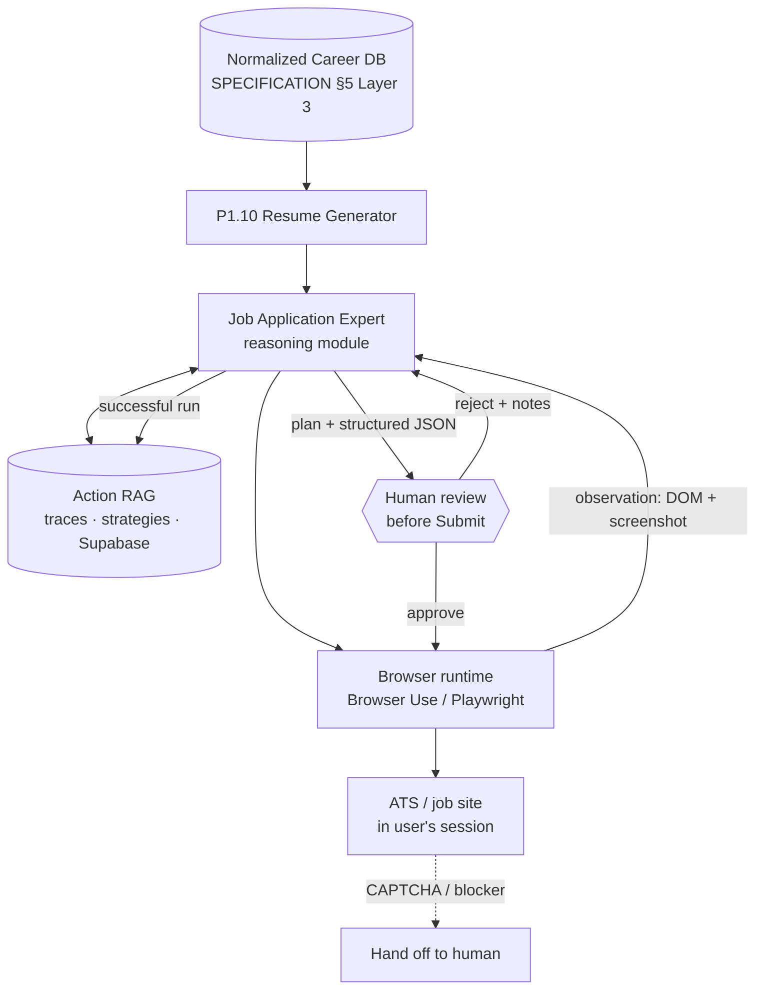
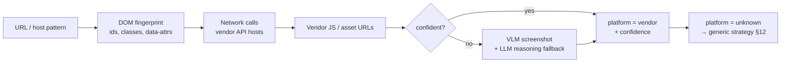
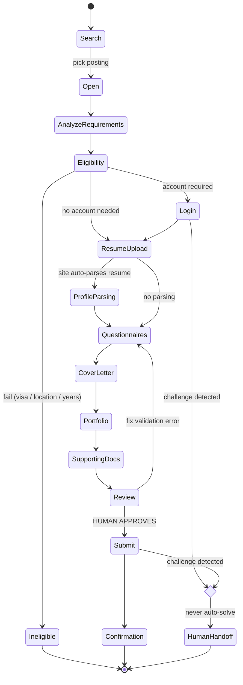
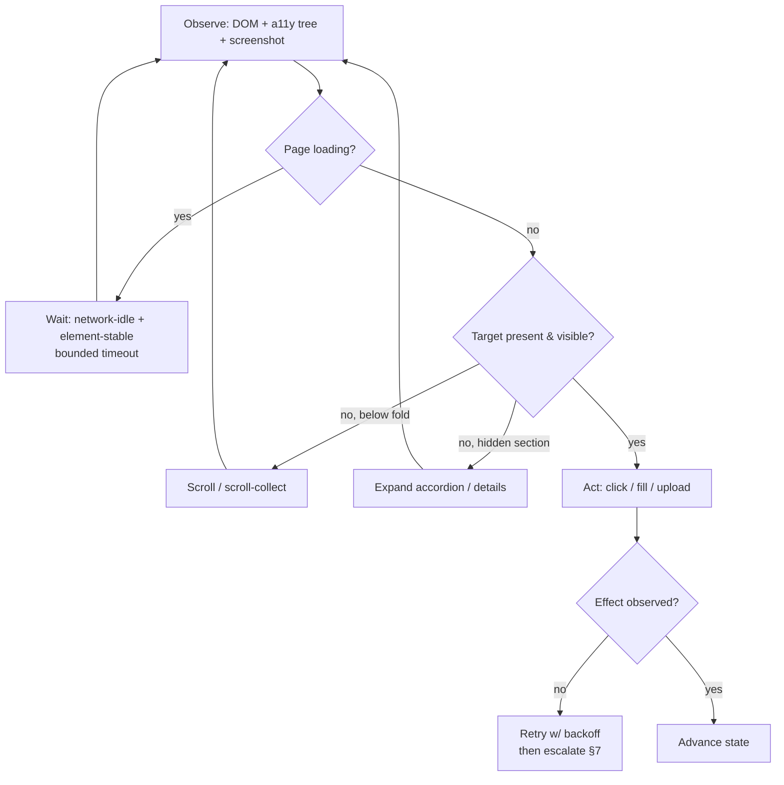
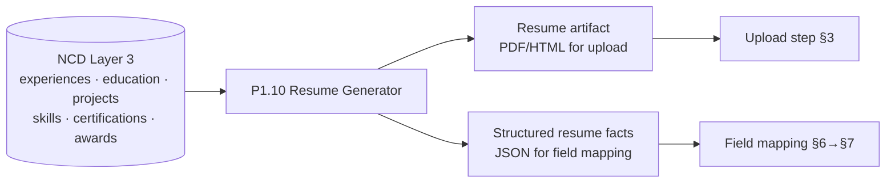
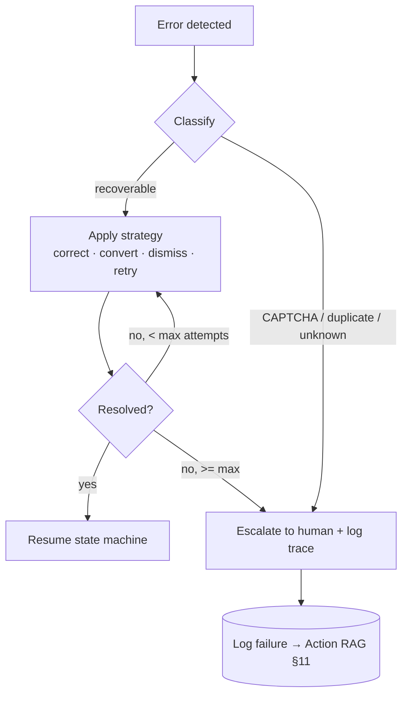
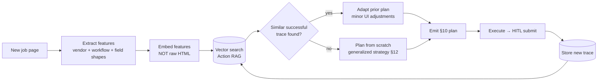
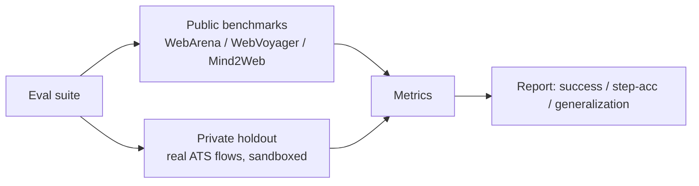

# Job Application Expert — Autonomous Browser Agent (DRAFT v0.1)

> 🚧 **STATUS: DRAFT / PROPOSAL** — not yet confirmed with the user. This designs a domain-specific
> **"Job Application Expert"** reasoning module that lives inside an autonomous browser agent and
> applies to jobs on recruitment / ATS platforms **on the user's behalf, with a human approving the
> final Submit**. It is a new module in `pytorch-fit-system`, fed by the **Normalized Career
> Database (NCD)**.
>
> Cross-refs: browser/scraping infra → [`CLIENT-SCRAPING.md`](CLIENT-SCRAPING.md); NCD + privacy
> model (Layer 2 raw, §6 privacy) → [`SPECIFICATION.md`](SPECIFICATION.md); resume source is the
> **P1.10 Resume Generator** built on the NCD. The merit/points engine
> ([`POINTS-ENGINE.md`](POINTS-ENGINE.md)) is **not** in scope here — different competition.
>
> **Org:** PyTorch FEU Tech Student Chapter · **Document version:** 0.1 · drafted 2026-06-29

> **v0.2 implementation decision (2026-07-12):** The conservative default remains review before
> submit, but a user may explicitly enable domain-scoped autonomous draft, sensitive-write, and
> submit permissions. AI screening answers are restricted to bounded NCD/Resume evidence returned
> by `search_career_evidence`, require evidence IDs, and abstain when unsupported. Autonomous submit
> still requires domain/layout validation, idempotency, and observable confirmation. CAPTCHA,
> login/identity verification, rate limits, blockers, and unknown outcomes remain non-bypassable.
> This v0.2 decision supersedes the absolute-HITL wording later in this draft.

---

## 0. TL;DR — the confirmed decisions (read these first)

Three decisions anchor everything below. Wala munang fine-tuning — sumakay muna tayo sa existing
models, mangolekta ng data, saka tayo mag-train.

1. **Agent-first → fine-tune later.** Phase 1 is **prompt + RAG driven**: an existing model
   (Claude / a vision-language model) + a browser framework (Browser Use / Playwright) + an
   **"Action RAG"** of successful traces. Every successful run is **collected as a trace** and that
   corpus becomes the **dataset for LATER LoRA/QLoRA fine-tuning**. Fine-tuning is **NOT step one** —
   wala pa tayong data to train on, so we earn the dataset by operating first.

2. **HITL: a human confirms before Submit.** The agent fills the resume, fields, and questionnaires,
   then **reviews** — but a **human approves before the final Submit**. **CAPTCHA = detect and hand
   off** to the human; **never** bypass or solve it. **No mass-application, no detection-evasion.**
   Scope is **the user's OWN applications** on **public / own data only**. Same HITL gate philosophy
   as org-ops (`docs/ORG-OPERATIONS.md`): *AI generates and eases the work; a human confirms before
   anything is final.*

3. **New NCD-fed module, multi-user-ready.** Resume/profile facts come from the **NCD** via the
   **P1.10 Resume Generator**. Traces + strategy memory live in **Supabase** (RLS, owner-scoped).
   Built multi-user from the start; **the user is the first test user**.

> ⚠️ Read **§13 ToS, ethics & boundaries** before building anything. Most job sites forbid
> automation in their Terms. This design is deliberately **HITL + own-use + public/own-data** to
> stay on the right side of that line, and it is **opt-in per site** after a ToS review.

---

## 1. Where this sits in the platform



- The **reasoning module** (this doc) is the brain; the **browser runtime** is the hands. Same split
  as `CLIENT-SCRAPING.md`: the runtime talks to the site in the **user's own logged-in session**;
  the module never touches third-party credentials directly.
- **The trace loop is the product.** Each completed application enriches the Action RAG (§11), which
  makes the next application better and eventually becomes the fine-tune dataset (§roadmap Phase 3).

> Reuses the `CLIENT-SCRAPING.md` browser blueprint (headless/visible session, scroll-collect,
> vendor-abstraction). Difference: scraping **reads**; this module **acts** (fills + clicks),
> kaya mas mataas ang stakes — hence the HITL submit gate.

---

## 2. Responsibility 1 — Website / ATS classification

Before planning anything, the module must answer: **anong platform ito?** ATS vendors share a
workflow skeleton even when companies reskin them, so identifying the vendor unlocks a known
strategy from memory (§9, §11).

### Target vendors (launch matrix)

| Vendor | Typical URL / host signal | DOM / JS fingerprint | Notes |
|---|---|---|---|
| **Greenhouse** | `boards.greenhouse.io`, `job-boards.greenhouse.io`, embedded iframe | `#grnhse_app`, `greenhouse.js`, `data-mapped-field` | Cleanest flow → **Phase 1 target** |
| **Lever** | `jobs.lever.co/<co>` | `.application-form`, `lever-jobs` postings API | Clean flow → **Phase 1 alt target** |
| **Workday** | `*.myworkdayjobs.com` | `data-automation-id` everywhere, heavy SPA | Hardest: multi-step, account required |
| **SAP SuccessFactors** | `career*.sapsf.com`, `*.successfactors.eu` | `careersection`, `jobReqId` params | Legacy + new UI variants |
| **Taleo** | `*.taleo.net` | `careerSection`, `requisitionListInterface` | Old, frame-heavy |
| **SmartRecruiters** | `jobs.smartrecruiters.com`, `careers.smartrecruiters.com` | `SmartApply`, `data-test` attrs | Public posting API exists |
| **Ashby** | `jobs.ashbyhq.com` | `__next` + Ashby GraphQL calls | Modern React SPA |
| **iCIMS** | `careers-*.icims.com`, `*.icims.com` | iframe `icims_content_iframe`, `jobImpression` | iframe nesting is the gotcha |
| **BambooHR** | `*.bamboohr.com/careers` | `BambooHR` assets, `/jobs/view.php` | SMB-focused |
| **Recruitee** | `*.recruitee.com` | `recruitee` offers API, `c-job` classes | |
| **Teamtailor** | `*.teamtailor.com` | `teamtailor` meta, Turbo/Hotwire | |
| **JazzHR** | `*.applytojob.com` | `resumator` legacy naming | |
| **Oracle Recruiting (ORC)** | `*.oraclecloud.com/.../recruitingCE` | `data-ofa`, Oracle JET | Workday-class complexity |
| **LinkedIn (Easy Apply)** | `linkedin.com/jobs` | `jobs-apply-button`, `artdeco-*` | Aggressive anti-automation; **caution** |
| **Indeed** | `indeed.com`, `smartapply.indeed.com` | `indeedApply`, `ia-*` | Mixes own apply + offsite redirect |
| **JobStreet (SEEK)** | `jobstreet.com.ph`, `seek.com.au` | SEEK GraphQL, `data-automation` | PH/SEA relevant for FEU Tech |

### Classification signal stack (cascade, cheap → expensive)



- **Infer the vendor even when company-customized.** Reskins change CSS, not the underlying
  `data-automation-id` / API host / posting-id parameter. Weight network + JS signals over visual.
- Always emit a **confidence score** + the **evidence** (which signals fired). Low confidence →
  fall back to the **generalized workflow** (§12), not a guess.
- This is the same **vendor-abstraction** discipline as `CLIENT-SCRAPING.md` §4: platform quirks
  stay encapsulated; the planner sees `platform + confidence`, not raw selectors.

---

## 3. Responsibility 2 — Workflow understanding (the state machine)

Model the hiring application as an explicit **state machine**, not a linear script. Real flows skip
states (no questionnaire), repeat states (multi-page forms), or branch (login wall mid-flow).



- **`Review → Submit` is the HITL gate.** The transition fires **only on explicit human approval**.
  The agent prepares everything up to `Review` and stops.
- **`Eligibility`** is an early exit — bakit mag-fill ng buong form kung visa-blocked or location
  mismatch agad? Cheap check, saves the user's time.
- Every state has: an **entry detector** (am I here?), an **action set** (§3 browser decisions), and
  an **exit/success condition**. The state machine is **per-platform parameterized** but the *shape*
  is shared — that shared shape is what makes generalization (§12) possible.
- **CAPTCHA / anti-bot** is a global interrupt from any state → `HumanHandoff`. Never a solve path.

---

## 4. Responsibility 3 — Browser decision-making

Given the current state + observation, pick the next low-level action. Decisions are **observation-
driven**, never blind waits.

| Situation (signal) | Decision |
|---|---|
| Target element visible + stable | `click` / `fill` |
| Element below fold | `scroll` to element, then act |
| Spinner / skeleton / `aria-busy` present | `wait` for network-idle + element-stable, bounded by timeout |
| Infinite scroll list, target not loaded | scroll-collect loop (reuse `CLIENT-SCRAPING.md` `scroll_collect`) until found or list end |
| Collapsed `<details>` / "Add another" / accordion | `expand` hidden section before reading fields |
| File input for resume | `upload` from NCD-generated artifact (§5) |
| Action had no visible effect | `retry` with backoff (max N), then re-observe; escalate if still stuck |
| Multi-step "Next" button | submit page → detect next state → continue |
| Unexpected modal / cookie banner / popup | dismiss known overlays before continuing (§8) |



- **Prefer deterministic locators where the platform is known** (vendor data-attrs), **fall back to
  vision-language grounding** (§research) when selectors fail or the site is unknown.
- **Bounded everything**: every wait/retry/scroll loop has a cap → otherwise the agent hangs or
  loops forever on a broken site.

---

## 5. Responsibility 4 — Form understanding (semantic field recognition)

Recognize **what a field means**, not what it's literally labelled. "Mobile no.", "Contact #",
"Cell", and "Phone" are all the same canonical field.

### Canonical field taxonomy

| Canonical field | Common label variants (non-exhaustive) |
|---|---|
| `full_name` / `first` / `last` | Name, Full name, Given/Family name, Legal name |
| `email` | Email, E-mail address, Contact email |
| `phone` | Phone, Mobile, Cell, Contact number, Tel |
| `address` | Address, Location, City, Country, Postal/ZIP |
| `education` | Highest qualification, Educational attainment, Degree, School |
| `experience` | Work history, Employment, Years of experience |
| `skills` | Skills, Competencies, Tech stack, Tools |
| `languages` | Languages, Language proficiency |
| `certifications` | Certs, Licenses, Credentials |
| `portfolio` | Portfolio, Personal site, Behance/Dribbble |
| `linkedin` | LinkedIn, LinkedIn URL/profile |
| `github` | GitHub, Git profile, Repository |
| `website` | Website, Blog, URL |
| `salary` | Expected salary, Compensation, Desired pay |
| `availability` | Start date, Notice period, Availability |
| `work_authorization` | Work authorization, Right to work, Eligibility to work |
| `visa_sponsorship` | Visa sponsorship, Do you require sponsorship? |

### How recognition works (signal fusion)

- **Label text** (visible `<label>`, `aria-label`, placeholder) → normalized + matched to taxonomy.
- **Input semantics** (`type=email`, `autocomplete=tel`, `name`/`id` tokens, `pattern`).
- **Surrounding context** (section heading, nearby fields) for ambiguous labels.
- **Field kind** (text, select, radio, checkbox, file, date) → drives the mapping & value format.
- **Required-ness** (`required`, `aria-required`, visual `*`) → feeds `missing_information` (§10).
- Unknown labels → **embedding similarity** against the taxonomy + LLM disambiguation; if still
  unsure, mark it for the human (never silently guess sensitive fields like salary or authorization).

> Work authorization / visa / salary are **judgment fields** — kapag hindi confident, ilagay sa
> `missing_information` para tao ang magdesisyon. Hindi tayo mag-iimbento.

---

## 6. Responsibility 5 — Resume understanding (structural parse, NCD-sourced)

The resume is **not re-parsed from a PDF** — it is read from the **NCD** (the source of truth,
SPECIFICATION §2). The P1.10 Resume Generator already produces both the human artifact (PDF/HTML)
and a **structured representation** of the same facts.



Structural sections recognized (all already first-class in the NCD): **Experience · Education ·
Projects · Awards · Skills · Research · Leadership · Certifications**.

- **Why NCD-sourced beats PDF-parsing:** no OCR/parse loss, no drift between what's uploaded and
  what's typed into fields, and it's the same normalized data the rest of the platform trusts.
- The uploaded **artifact** and the **typed fields** come from the *same* NCD snapshot → consistency
  guaranteed (sites that auto-parse the resume won't contradict the manually-mapped fields).
- Privacy: structured resume facts are **Layer-2 Private** (SPECIFICATION §6); they leave the user's
  scope only to be entered into the site the user is applying to, with their per-application consent.

---

## 7. Responsibility 6 — Field mapping (semantic, not literal)

Map **NCD facts → site fields**. This is a translation problem, not string-matching.

| Example NCD fact | Site field (varies) | Mapping logic |
|---|---|---|
| `education[0].degree = "BS Computer Science"` | "Highest Educational Attainment" (select) | map degree → closest enum option (`Bachelor's`) |
| `experience` (list) → 4.5 yrs total | "Years of experience" (number) | derive aggregate, not copy a string |
| `skills = [Python, PyTorch, …]` | "Skills" (tag input vs textarea) | adapt to widget: chips vs comma-joined |
| `links.github` | "GitHub" or generic "Website" | prefer specific field; fall back to generic |
| `availability` | "Notice period" (enum) vs "Start date" (date) | reshape value to field kind |
| salary expectation (may be absent) | "Expected salary" (required) | if absent → `missing_information`, ask human |

Mapping rules:
- **Reshape to the widget.** A select needs the nearest valid enum; a date picker needs a date; a
  tag input needs tokens. Same fact, different serialization.
- **Aggregate / derive** when the site asks for something the NCD stores granularly (total years,
  highest degree).
- **Confidence-gated.** High-confidence mappings auto-fill; low-confidence or judgment fields →
  `missing_information` for human review (consistent with §10 + the HITL gate).
- **Never fabricate.** If the NCD lacks the fact, we surface the gap; the agent does not invent
  salary, authorization status, or years it can't derive.

---

## 8. Responsibility 7 — Error recovery

Forms fail in predictable ways. Each failure class has a recovery strategy; unrecoverable ones
**escalate to the human** rather than thrashing.

| Failure | Detection | Recovery strategy |
|---|---|---|
| **Validation error** | inline error text, `aria-invalid`, red field | re-read message → correct mapped value → re-submit page |
| **Missing required field** | `required` empty after fill | re-attempt fill; if no data → `missing_information` → human |
| **Required upload missing** | file input unfilled / error | upload NCD artifact; if format unsupported → convert/escalate |
| **Wrong file format** | "PDF only" type error | regenerate artifact in required format via Resume Generator |
| **Duplicate application** | "already applied" banner | stop, report to user (do not re-apply) |
| **CAPTCHA / anti-bot** | challenge widget / iframe detected | **hand off to human (§13). Never solve.** |
| **Popup / modal / cookie wall** | overlay intercepts clicks | dismiss known overlays; if blocking & unknown → escalate |
| **Timeout** | network-idle never reached | bounded retry; reload once; then escalate |
| **Expired session** | redirect to login mid-flow | pause, prompt human to re-auth in their session, resume |



- **Failures are training signal too** — every recovery (or escalation) is logged into the Action
  RAG as a `common_validation_error` + `recovery_procedure` for next time.

---

## 9. Responsibility 8 — Dynamic-site handling

Modern ATS are SPAs. The runtime must handle framework-driven DOMs, not just static HTML.

| Challenge | Handling |
|---|---|
| **React / Angular / Vue** re-renders | act on stable a11y/role tree, not volatile class hashes; re-observe after each action |
| **Shadow DOM** (web components) | pierce shadow roots when querying; vision grounding fallback if closed |
| **Infinite scroll** (job lists) | bounded `scroll_collect` (reuse `CLIENT-SCRAPING.md`) until target/end |
| **Lazy loading / virtual lists** | scroll item into view before reading; don't assume all rows in DOM |
| **AJAX field population** (dependent dropdowns) | wait for the dependent request to settle before next field |
| **Multi-step forms / wizards** | each step = a state-machine cycle; persist progress between steps |
| **Modals & nested dialogs** | track dialog stack; act on the topmost; restore focus on close |
| **iframes** (iCIMS, embedded Greenhouse) | resolve into the correct frame before locating elements |

- This is the **read-vs-act delta** vs `CLIENT-SCRAPING.md`: same dynamic-DOM techniques, but here a
  mis-fire mutates the page, so **observe-act-verify** (§4) after every step is mandatory.

---

## 10. Responsibility 10 — Structured JSON output contract

The module's plan for a given application is a **single structured object** — the contract between
the reasoning module, the browser runtime, and the human reviewer. Skimmable, auditable, replayable.

### Schema

```jsonc
{
  "platform": {                      // §2
    "vendor": "greenhouse",
    "confidence": 0.94,
    "evidence": ["host:boards.greenhouse.io", "dom:#grnhse_app"]
  },
  "workflow": {                      // §3 — resolved state path
    "states": ["Open","AnalyzeRequirements","Eligibility","ResumeUpload",
               "Questionnaires","Review","Submit","Confirmation"],
    "current_state": "Questionnaires"
  },
  "detected_fields": [               // §5 + §7
    { "selector_hint": "#first_name", "canonical": "first_name",
      "kind": "text", "required": true, "mapped_value": "Juan",
      "source": "ncd.profile.first_name", "confidence": 0.99 },
    { "selector_hint": "#education_level", "canonical": "education",
      "kind": "select", "required": true, "mapped_value": "Bachelor's Degree",
      "source": "ncd.education[0].degree=BS Computer Science", "confidence": 0.88 }
  ],
  "required_documents": [
    { "type": "resume", "format": "pdf", "source": "resume_generator.artifact", "ready": true },
    { "type": "cover_letter", "format": "pdf", "ready": false }
  ],
  "missing_information": [           // §7 — needs human
    { "canonical": "salary", "label": "Expected salary (PHP)", "reason": "not in NCD" },
    { "canonical": "visa_sponsorship", "label": "Require sponsorship?", "reason": "judgment field" }
  ],
  "upload_strategy": {              // §3
    "field": "#resume_upload", "method": "file_input",
    "artifact": "resume_generator.artifact", "auto_parse_expected": true
  },
  "browser_actions": [             // §4 — ordered, replayable
    { "step": 1, "action": "fill", "target": "#first_name", "value": "Juan" },
    { "step": 2, "action": "upload", "target": "#resume_upload", "value": "<artifact>" },
    { "step": 3, "action": "select", "target": "#education_level", "value": "Bachelor's Degree" }
  ],
  "validation_steps": [            // §8 — post-fill checks before Review
    { "check": "no_aria_invalid" },
    { "check": "all_required_filled" }
  ],
  "recovery_plan": [              // §8 — pre-mapped fallbacks
    { "on": "validation_error", "do": "reread_message_correct_value_resubmit" },
    { "on": "captcha", "do": "handoff_to_human" }
  ],
  "hitl": { "stop_before": "Submit", "status": "awaiting_human_review" }   // §0
}
```

- `hitl.stop_before: "Submit"` is **always present** and enforced by the runtime — the contract
  itself encodes the gate.
- The object doubles as the **trace record body** (§11) once the run completes.

---

## 11. Responsibility 11 — Action RAG (trace database)

The differentiator. **Before generating a new plan, retrieve prior successful traces** for the same
platform + workflow, and adapt them. Plan-from-scratch is the fallback, not the default.

### What the Action RAG stores

- **Platform patterns** (vendor fingerprints from §2)
- **Known workflows** (state paths from §3)
- **Successful browser traces** (the §10 object + outcome)
- **Common validation errors** + the recovery that worked (§8)
- **Recovery procedures** and **navigation strategies** (§3, §4)

### Trace record schema (Supabase, RLS owner-scoped)

```jsonc
{
  "trace_id": "uuid",
  "user_id": "uuid",               // RLS scope (SPECIFICATION §6)
  "platform_vendor": "greenhouse",
  "workflow_signature": "open>analyze>eligibility>upload>questionnaire>review>submit",
  "feature_embedding": [/* vector over workflow + platform + field-shape features */],
  "plan": { /* §10 structured object */ },
  "outcome": "submitted_confirmed | failed | escalated",
  "validation_errors": [ /* what tripped, what fixed it */ ],
  "strategy_refs": ["greenhouse_upload_v3"],   // §12 reusable strategies
  "screenshots": ["storage://… (PII-scrubbed, §13)"],
  "created_at": "ts"
}
```

### Retrieval flow



- **Embed over workflow/platform features, NOT raw HTML.** HTML is noisy and per-company; the
  *workflow signature + field shapes + vendor* generalize. Ito ang susi sa generalization (§12).
- The corpus grows with every run → it is **literally the LoRA/QLoRA dataset** for Phase 3.
- Mirrors the `CLIENT-SCRAPING.md` cache discipline but for **strategies**, not page content.

---

## 12. Responsibility 12 — Generalization

Goal: handle an **unseen ATS** by recognizing the **workflow pattern**, not by remembering a
specific company's HTML.

- **Learn workflows, not selectors** (§9 strategy memory + §11 Action RAG). A "Greenhouse-style
  upload" strategy is parameterized — reused on an unknown site that *looks* Greenhouse-shaped, with
  minor UI adjustments resolved at runtime.
- **Abstraction ladder:** raw DOM → field semantics (§5) → workflow states (§3) → reusable strategy
  → generalized policy. Higher rungs transfer across sites; the lowest rung never does.
- **Unknown vendor → generalized strategy.** When §2 returns `unknown`/low-confidence, run the
  **generic state machine** with semantic field recognition + vision grounding, then **save the new
  trace** so the once-unseen site becomes a known one.
- This is exactly what makes the fine-tune (Phase 3) worth it: a model trained on the diverse trace
  corpus internalizes the *patterns*, reducing reliance on per-site RAG hits.

---

## 13. ToS, ethics & boundaries (READ BEFORE BUILDING)

> Hindi ito gray area na babalewalain natin. Most job sites' Terms **forbid automated access**. This
> design exists to apply for the **user's own jobs** with a **human in the loop** — not to scale spam
> or evade detection.

**Hard rules:**

- **HITL before Submit, always.** The agent never completes the final Submit autonomously. A human
  reviews the filled application and approves (§0, §3 state machine gate).
- **CAPTCHA = detect & hand off.** Never bypass, never solve, never use a solver service. A CAPTCHA
  is the site saying "human, please" — we comply.
- **No mass-application.** One user, their own genuine applications, at human pace. No bulk blasting.
- **No detection-evasion.** No fingerprint spoofing, no stealth plugins, no rotating identities. If
  a site blocks automation, we stop on that site.
- **Own / public data only.** Resume facts are the user's own NCD data (Layer-2 Private, §6);
  postings are public. No scraping of other people's data, no private endpoints.
- **Per-site, opt-in after ToS review.** A site is only enabled after its Terms are reviewed and the
  user opts in. Default is off.
- **PII hygiene in traces.** Screenshots and traces (§11) may capture personal data → **scrub /
  redact PII before storage**, encrypt at rest, RLS owner-scoped (SPECIFICATION §6). A screenshot of
  a filled form is sensitive.
- **Transparency to the user.** Same principle as `CLIENT-SCRAPING.md` §4: abstraction is for clean
  architecture, **not** for hiding behavior from the user. The user sees what was filled and approves
  it.

> Net: **AI generates and eases the work; a human confirms before anything is submitted** — the same
> gate as org-ops email/posting (`docs/ORG-OPERATIONS.md`).

---

## 14. Research synthesis (position vs prior art)

> ⚠️ The items below are from training knowledge (**cutoff Jan 2026**). Treat versions/benchmark
> numbers as **stale — verify the latest** before committing to any of them.

| Prior art | What it is | What we borrow |
|---|---|---|
| **Browser Use** | Open-source LLM browser-agent framework (DOM + screenshot, action loop) | Candidate Phase-1 runtime; its action space + observation format |
| **Open Operator** | Open re-implementation of computer/browser "operator" agents | Action-loop & handoff patterns; HITL framing |
| **WebArena** | Realistic self-hosted web-task benchmark | **Eval methodology** + task-success scoring (§15) |
| **WebVoyager** | Real-world live-site web agent + eval (VLM-based) | **Eval harness style** on live sites; screenshot+DOM observation |
| **Mind2Web** | Generalist web-agent dataset across many real sites | **Generalization eval** (unseen sites/domains split) |
| **WorkArena** | Enterprise (ServiceNow) task benchmark | Enterprise-form realism close to Workday/ORC complexity |
| **MiniWoB++** | Tiny synthetic UI tasks | Cheap unit-level action primitives + smoke tests |
| **BrowserGym** | Unified env/API wrapping WebArena/WorkArena/MiniWoB++ | **Standard action space + harness API** to plug our eval into |
| **AgentBench** | Multi-environment agent eval suite | Cross-task reporting format |
| **Playwright agents** | Deterministic browser automation + emerging agent layers | Reliable low-level driver + selectors fallback (also our `CLIENT-SCRAPING` base) |
| **GUI grounding** (SeeClick, etc.) | Map instructions → screen coordinates | **Vision fallback** when selectors fail / unknown sites (§4, §12) |
| **Vision-language browser models** | VLMs that read screenshots to act | Robustness on reskinned/Shadow-DOM sites |
| **LoRA / QLoRA** | Parameter-efficient fine-tuning | **Phase-3 fine-tune** on our collected trace corpus (cheap, single-GPU friendly) |

**Positioning:** we are *not* building a new general web-agent or a new benchmark. We build a
**narrow, ToS-aware, HITL job-application module** that **borrows benchmarks for eval**, **borrows
action spaces / trace formats** from BrowserGym/Browser Use, and **earns a private dataset** to
fine-tune later. Our edge is **domain specialization + Action RAG + the NCD as a clean fact source**.

---

## 15. Eval harness



**Metrics:**

- **Task success rate** — did the application reach a *valid, ready-for-human-review* state? (We do
  **not** auto-submit in eval; success = correctly filled + flagged gaps, WebArena/WebVoyager-style
  end-state scoring.)
- **Step accuracy** — per-action correctness vs ground-truth trace (Mind2Web-style).
- **Field-mapping accuracy** — % canonical fields correctly recognized + mapped (§5–§7).
- **Generalization to unseen ATS** — held-out vendors never in the RAG/training set (Mind2Web
  cross-domain split philosophy).
- **Recovery rate** — % of injected validation errors recovered without human (§8).
- **Escalation precision** — does it hand off CAPTCHA/judgment fields correctly (no false auto-fill)?

**Ground truth:**

- **Private holdout** of real ATS flows captured as **golden traces** (sandbox/test postings where
  possible — many vendors have demo boards). Never submit junk into real live postings for eval.
- Public benchmarks via **BrowserGym** for comparability; private holdout for domain realism.

> Open issue: getting clean **ground-truth submissions** without spamming real employers — see §17.

---

## 16. Phased roadmap

| Phase | Scope | Exit criteria |
|---|---|---|
| **1 — Agent-first MVP** | One clean ATS (**Greenhouse or Lever**) end-to-end, prompt+RAG, **HITL submit**. Start collecting traces. | A real own-application filled + human-approved-submitted on the chosen ATS; trace stored |
| **2 — Multi-platform + Action RAG** | Add SmartRecruiters/Ashby/Recruitee/JobStreet etc.; turn on RAG retrieval-before-plan (§11); generalized strategy for unknowns (§12) | RAG measurably improves success/step-acc vs scratch; ≥N vendors green in eval |
| **3 — Collect → fine-tune** | Use the accumulated trace corpus to **LoRA/QLoRA fine-tune** a base model; A/B vs prompt+RAG | Fine-tuned model ≥ prompt+RAG on private holdout at lower cost/latency |
| **4 — Generalization hardening** | Tackle hard vendors (Workday, Taleo, Oracle, iCIMS iframes); robustness on reskins/Shadow DOM; broaden unseen-ATS coverage | Strong unseen-ATS generalization scores; stable on enterprise flows |

> Phase 1 is **deliberately one clean ATS** — Greenhouse/Lever have the simplest flows, kaya
> mabilis maka-end-to-end at makapag-umpisa ng trace collection. Walang fine-tune dito; data muna.

---

## 17. Blocked on / open questions

1. **Browser infra (from `CLIENT-SCRAPING.md`).** Reuse the same runtime decision (MV3 extension vs
   packaged headless client)? Acting (fill/click) raises the stakes vs read-only scraping — does the
   chosen runtime support reliable uploads + file dialogs + iframe traversal?
2. **Account / credentials handling.** How does the agent operate **inside the user's logged-in
   session** without ever holding third-party credentials? Where do site logins live, and how is
   re-auth on expired sessions handled (§8) without storing passwords?
3. **Secrets management.** Model API keys, Supabase keys — env/secret-manager, never in traces or
   client bundle (per global security rules).
4. **Per-site ToS review.** Who reviews each site's Terms before enabling it (§13)? Need a documented
   opt-in checklist + a kill-switch per vendor.
5. **Trace data privacy / PII in screenshots.** What's the redaction pipeline before a screenshot or
   trace hits Supabase (§11, §13)? Scrub strategy + encryption + retention period?
6. **Eval ground truth.** How do we capture golden traces and measure success **without submitting
   spam to real employers** (§15)? Which vendors offer sandbox/demo boards?
7. **CAPTCHA frequency.** If a target ATS challenges constantly, the HITL handoff may make it
   impractical — is that vendor worth supporting at all?
8. **Multi-user readiness vs first-user reality.** Schema is multi-user + RLS from day one, but only
   the user tests Phase 1. When do we onboard a second user, and what consent flow gates it?
9. **NCD ↔ field-mapping coverage.** Does the NCD already hold every fact ATS forms commonly demand
   (salary expectation, work authorization, notice period)? If not, where do those get captured?
