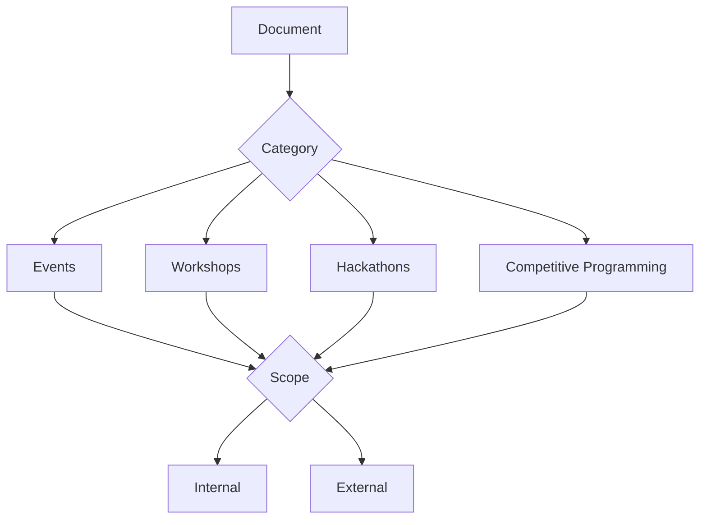
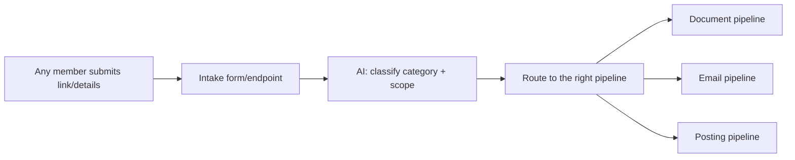
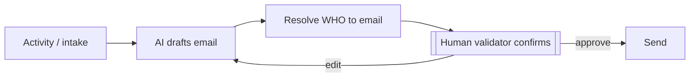
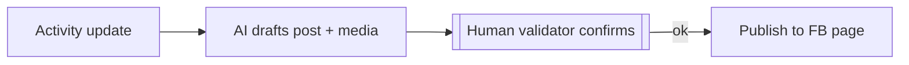
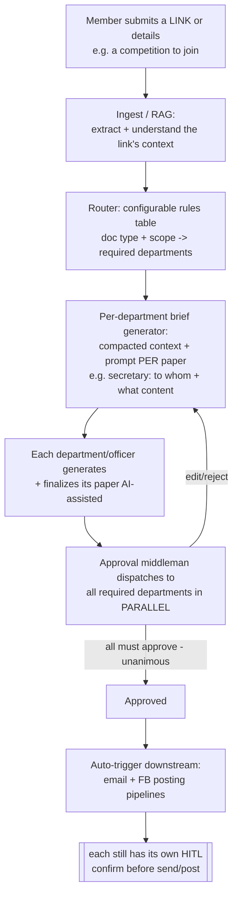
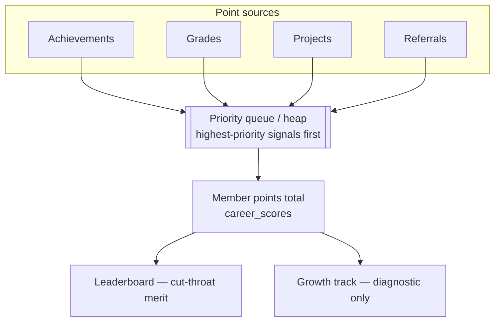
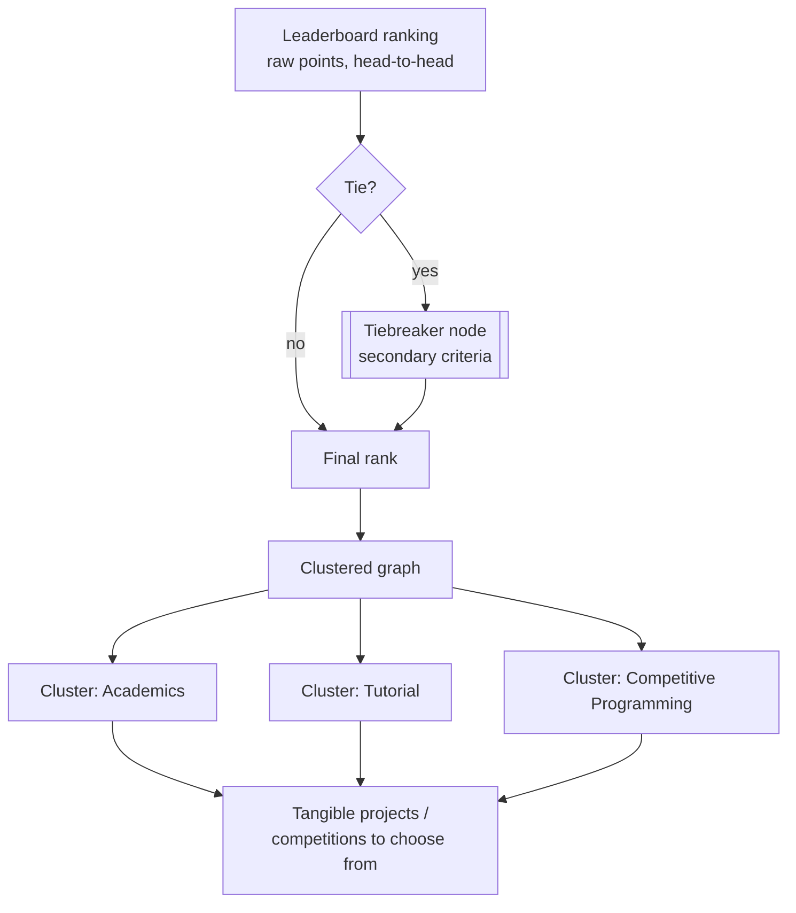
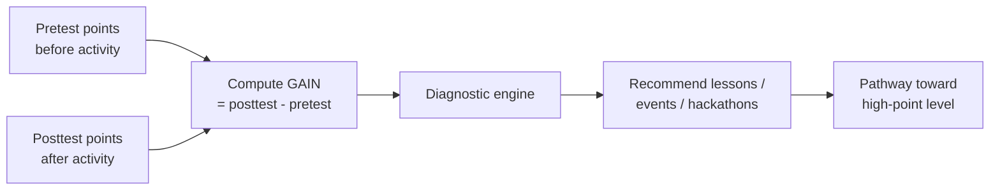
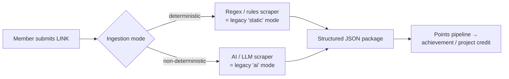
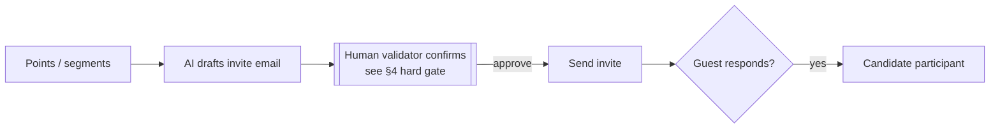

# Org Activity Operations Layer — DRAFT (requirements capture)

> ⚠️ **STATUS: WORK IN PROGRESS.** This captures a live requirements dump so nothing is lost.
> The user said *"meron pa"* (more coming) — do NOT build or finalize board items from this yet.
> Pending from user: (1) the rest of the requirements, (2) a **document template**, (3) sign-off
> on the structure below. Once complete, fold into `SPECIFICATION.md` + the board.

This layer extends the PyTorch FIT System from a personal career platform into an **operations
platform for the PyTorch FEU Tech chapter** — running the org's real activities (emails,
documents, posting, officer accountability).

---

## 1. Activity / documentation taxonomy

All documentation is organized by **category × audience scope**:

| Category | Internal | External |
|---|---|---|
| Events | ✓ | ✓ |
| Workshops | ✓ | ✓ |
| Hackathons | ✓ | ✓ |
| Competitive Programming | ✓ | ✓ |

- **Internal** = for officers/members of the chapter.
- **External** = for outside parties (partners, sponsors, other orgs, the public).
- Each document is tagged with `category` + `scope` so pipelines route correctly.

---

## 2. Intake → pipeline trigger

**Anyone** can start a pipeline by submitting a link or details about an (e.g. external) event.

Open question: who can submit (any member vs authenticated only), and what's the minimum payload
(just a URL? URL + notes?).

---

## 3. Document injector (scaffold needed)

Generate documents from structured data — **JSON or SQL** (the platform will have a database) —
into a **user-provided template**.

- Input: a record (JSON now; SQL rows once the DB exists) + a template.
- Output: a rendered document (format TBD — DOCX? PDF? Google Doc? — awaiting template).
- This mirrors the legacy `renderers/` pattern (data + template → file), now for org docs.

> **Blocked on:** the template the user will provide. Until then, scaffold only the injector
> shape (input schema + template slot + renderer interface), not the concrete template.

---

## 4. Email pipeline (HITL required)

Pipelined sending of emails tied to activities.

- **AI only drafts/generates** — a human **must confirm before send** (hard gate).
- Needs a way to determine **recipients** ("kung sino-sino ang ee-email") — per category/scope,
  or derived from the intake submission.
- Open: which email surface (Gmail API already connected? org mailing lists?).

---

## 5. Social posting pipeline (Facebook page)

Pipelined posting to the chapter's **Facebook page** — e.g. "happening now" announcements.

- Same principle: **AI generates, human validates** before publishing.
- Open: FB Page Graph API access + page token; reuse anything from the legacy scraper? (No —
  posting needs the Pages API, different from scraping.)

---

## 6. Officer scoring / accountability

Score officers on the tasks they complete.

- **Speed**: how fast they respond / close a task.
- **Quality**: **vote-based** (peers/officers vote), not auto-judged by AI.
- Ties into the board: a "Done" task by an officer feeds their score.
- Open: scoring formula, who can vote, anti-gaming, visibility (private vs leaderboard).

---

## 7. Human-in-the-loop principle (reaffirmed)

> The AI **only generates and eases document/communication work**. It never sends an email,
> publishes a post, or finalizes a quality score on its own. A human validator confirms:
> - every **email** before send,
> - every **quality** score (vote-based).

---

## 8. Open questions to resolve before building

1. Document **template(s)** + target output format(s). *(user will provide)*
2. Email surface (Gmail API / org mail) + recipient resolution rules.
3. Facebook **Page** API access + token for posting.
4. Intake: who can submit, minimum payload, auth.
5. Officer scoring formula + voting rules + visibility.
6. "meron pa" — remaining requirements from the user.

---

## 8b. CONFIRMED pipeline design (v1) — reverse-prompted & approved

> Locked with the user. Decisions below drive the eventual build.

**The flow (corrected — RAG = ingest the submitted link, not classify):**

**Locked decisions:**

1. **Ingestion (RAG):** the AI's RAG step is to **read the submitted link** (e.g. a competition
   page) and extract its context — sometimes this is needed because it must be endorsed/approved
   by school officials. RAG is *content ingestion*, not pipeline classification.
2. **Per-department brief generation:** using that context, the system produces a **compacted
   brief + prompt for each concerned department / each paper** (e.g. the secretary gets: for whom
   the paper is, what its content should be). Officers still generate/finalize the actual papers,
   AI-assisted.
3. **Routing source = configurable rules table** (admin-editable: doc type/scope → required
   approvers). Changeable without a code change.
4. **Approval semantics = parallel, unanimous** — all required departments see it at once and
   ALL must approve before proceeding.
5. **Post-approval = auto-trigger downstream** (email + FB posting), but **each downstream action
   keeps its own HITL** confirm before send/post.

**Code shape (separation of concern):**
- `LinkIngestor` (RAG over the submitted URL/details) → `ActivityContext`
- `DepartmentBriefGenerator` → per-department `{recipient, required_content, draft}`
- `RoutingRules` (config/DB table) → `required_departments`
- `ApprovalMiddleman` + registry of `DepartmentApprover` (secretariat, treasurer, …) — parallel dispatch, collect verdicts
- Downstream `EmailSender` / `Poster` behind interfaces, each HITL-gated

## 9. Folder rename note

User wants the local folder renamed to **`pytorch`**. This can't be done safely from inside the
running session (Windows locks the current working directory). Steps for the user — see the chat
summary; the GitHub repo is already `pytorch-fit-system`.

---

## 10. Points · Leaderboard · Merit & Growth — CONFIRMED (v1)

> ✅ **STATUS: CONFIRMED** with the user. This belongs to the **Org-Ops layer** and is tied to the
> chapter activity pipeline (§8b). It sits on top of the platform's analytics layer
> (SPECIFICATION §5 Layer 5: `leaderboards` · `career_scores`). Detailed engine spec lives in
> [`POINTS-ENGINE.md`](POINTS-ENGINE.md).

### 10.1 What this is (and is NOT)

The chapter runs **two parallel tracks** off the same points data — and they are deliberately
*not* the same thing:

| Track | Nature | Audience | Goal |
|---|---|---|---|
| **Leaderboard (Merit)** | **Cut-throat competition** — raw points, head-to-head ranking | Everyone, top achievers surfaced | Decide who wins **opportunities** (slots, endorsements, competition seats) |
| **Growth Track** | **Diagnostic / recommendation engine** — NOT a competing ranking | The **low-point bracket** | Show each student which lessons/events/hackathons will help them *climb* |

> **Framing (lock this, kasi madaling ma-misread):** this is **merit competition for opportunities
> + a development pathway for everyone else**. It is explicitly **NOT equity-by-points** — walang
> points redistribution, walang handouts. The org gives everyone the *chance* to grow; the actual
> opportunities are still **awarded to high-pointers** on raw merit.

### 10.2 Where points come from

Members earn points from **achievements, grades, and projects** (the highest-priority signals),
plus a **referral system** (points for referring others). Priority among signals is expressed as a
**priority queue (heap)** — achievements/grades/projects float to the top.

### 10.3 Leaderboard → clustered opportunity graph

The leaderboard connects to a **clustered graph**. Each **cluster** is a domain (academics,
tutorial, competitive programming, etc.) and points at **tangible projects/competitions** a member
can choose from. Ranking ties are broken by a dedicated **tiebreaker node** concept.

### 10.4 Growth track — pretest vs posttest GAIN

The growth track is a **recommendation engine** for the low-point bracket. It uses **GAIN** — a
member's points **before** an activity vs **after** (pretest → posttest) — to diagnose which
**lessons, events, and hackathons** that specific student needs to climb toward the high-point
level. It never ranks students against each other.

### 10.5 Entry / ingestion — link → structured JSON package

A member submits a **LINK**; an **ingestion step (RAG/scrape)** turns it into a structured JSON
**"package"** that flows through the pipeline (same shape as the activity pipeline in §8b). The
scraper can be **deterministic** (regex/rules) or **non-deterministic** (AI/LLM) — this mirrors the
legacy engine's `static` vs `ai` modes (`src/resume_builder/models.py` `Mode.STATIC` / `Mode.AI`).

> Detail and code shape: [`POINTS-ENGINE.md`](POINTS-ENGINE.md). Personal-achievement scraping
> (Facebook/GitHub) runs **client-side** — see [`CLIENT-SCRAPING.md`](CLIENT-SCRAPING.md).

### 10.6 Email invites driven by points/segments

Points and segments drive **AI-drafted email invites** to events. A guest who responds becomes a
**candidate participant**. The **HITL gate from §4 still applies** — AI drafts, a human confirms
before anything is sent.

### 10.7 Open questions / blocked-on

1. **Point weights & formula** — exact weight per source (achievement vs grade vs project vs
   referral); how grades map to points without leaking private grade data (cross-ref
   SPECIFICATION §6 privacy).
2. **Heap priority semantics** — is the priority queue for *display ordering*, *processing order*,
   or *tie-influence*? Confirm with user.
3. **Tiebreaker criteria** — what the tiebreaker node actually compares (recency? gain? referrals?).
4. **Cluster taxonomy** — final list of clusters and how a cluster maps to concrete opportunities.
5. **Growth bracket cutoff** — what point threshold defines the "low-point bracket".
6. **Pretest/posttest capture** — how/when points are snapshotted around an activity to compute GAIN.
7. **Referral anti-gaming** — preventing self-referral / fake-account farming.
8. **Opportunity awarding** — is awarding to high-pointers automatic or officer-confirmed (HITL)?
