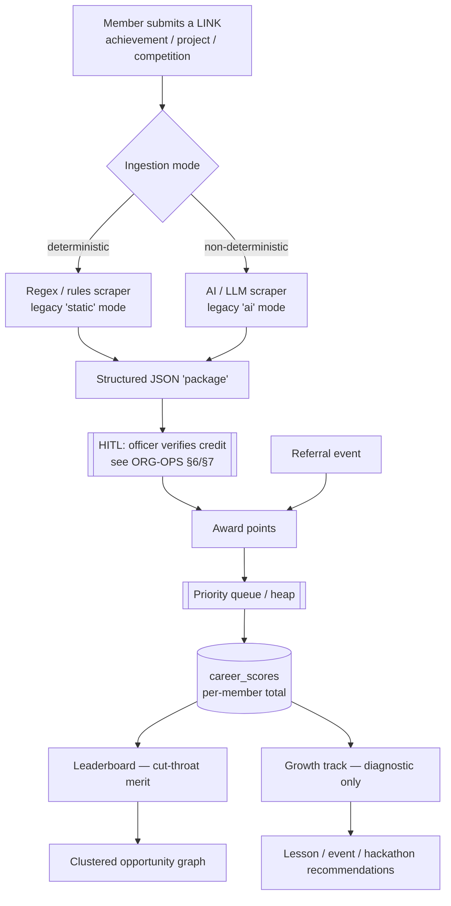
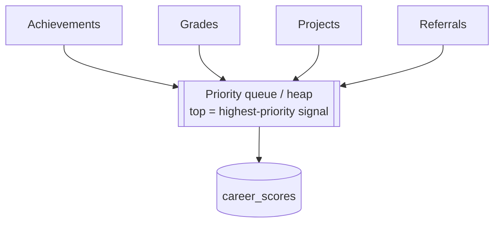
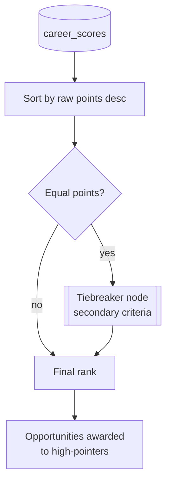
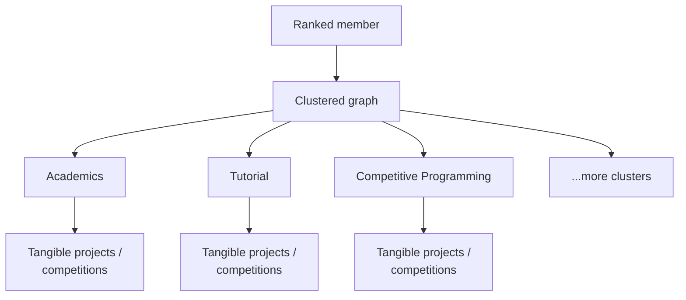
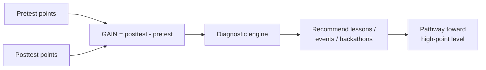
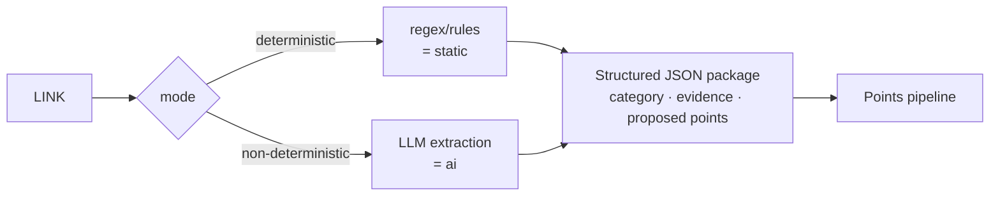
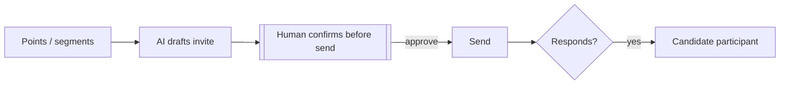
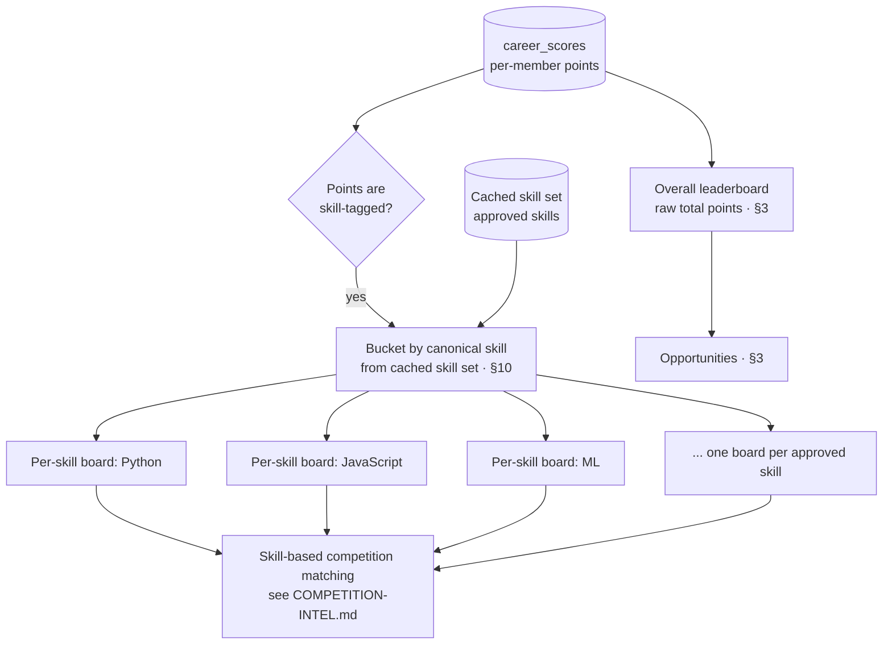
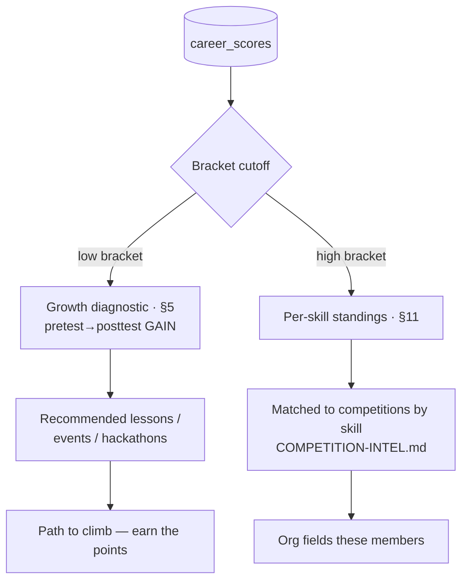

# Points · Leaderboard · Merit Engine — CONFIRMED (v1)

> ✅ **STATUS: CONFIRMED** with the user. This is the engine spec behind
> [`ORG-OPERATIONS.md` §10](ORG-OPERATIONS.md). It rides on the platform analytics layer
> (SPECIFICATION §5 Layer 5: `leaderboards` · `career_scores`) and respects the privacy model
> (SPECIFICATION §6). Personal-achievement ingestion runs client-side — see
> [`CLIENT-SCRAPING.md`](CLIENT-SCRAPING.md).

## Purpose

Turn member activity (achievements, grades, projects, referrals) into **points**, rank those
points in a **cut-throat merit leaderboard** that awards **opportunities**, and — separately — run
a **diagnostic growth engine** that tells low-point members which lessons/events/hackathons will
help them climb. Merit and growth share data; they are **not** the same competition.

> One line to keep everyone honest: **merit competition for opportunities + a development pathway
> for everyone else.** Explicitly **NOT equity-by-points** — walang redistribution, walang handouts.

---

## 1. End-to-end flow



---

## 2. Point sources & the priority heap

Members earn points from four sources. Achievements, grades, and projects are the
**highest-priority signals**; referrals add a growth/network incentive. Priority is modeled as a
**priority queue (heap)** so the strongest signals surface first.

| Source | Weight tier | Notes |
|---|---|---|
| Achievements | Highest | competition wins, awards, certifications |
| Grades | Highest | mapped to points without exposing raw grades (privacy) |
| Projects | Highest | shipped/tangible work, often GitHub-sourced |
| Referrals | Growth incentive | points for referring new members |



> **Note (Taglish):** ang heap dito ay para sa *priority/ordering* ng signals, hindi pa final kung
> ito rin ang gagamitin sa tie-influence — naka-list sa open questions sa baba.

---

## 3. Leaderboard — cut-throat merit + tiebreaker

Raw points, head-to-head. No equity adjustment. Ties resolve through a dedicated **tiebreaker
node** before a final rank is assigned.



---

## 4. Clustered opportunity graph

The leaderboard connects to a **clustered graph**: each **cluster** is a domain (academics,
tutorial, competitive programming, …) and each cluster points to **tangible
projects/competitions** a ranked member can choose from.



---

## 5. Growth track — pretest vs posttest GAIN

A **diagnostic / recommendation engine** for the low-point bracket. It compares a member's points
**before** an activity (pretest) vs **after** (posttest) to compute **GAIN**, then recommends what
that specific student needs next. It is **not** a competing ranking.



---

## 6. Ingestion: deterministic vs non-deterministic (mirrors legacy `static`/`ai`)

A member submits a **link**; ingestion produces a structured JSON **package** that flows through
the pipeline. Two ingestion modes — directly mirroring the legacy engine's mode switch
(`src/resume_builder/models.py` → `Mode.STATIC` / `Mode.AI`, selected via `--mode` in
`src/resume_builder/cli.py`):

| Mode | Legacy analogue | Mechanism | When |
|---|---|---|---|
| **Deterministic** | `static` | regex / rules / fixed selectors | structured, predictable sources |
| **Non-deterministic** | `ai` | LLM extraction via the adapter layer (SPECIFICATION §15) | messy / freeform pages |



---

## 7. Email invites from points/segments

Points and segments drive **AI-drafted** event invites; the **HITL gate (ORG-OPS §4)** still
applies. A responding guest becomes a **candidate participant**.



---

## 8. Suggested code shape (separation of concern)

Re-implemented on the new stack (Next.js + Supabase serverless), but the interfaces echo the
legacy engine's adapter discipline:

- `LinkIngestor` (mode: `deterministic | ai`) → `PointsPackage` (structured JSON)
- `PointsAwarder` → writes to `career_scores` after HITL credit verification
- `PriorityQueue` (heap) → orders signals by priority tier
- `LeaderboardRanker` + `Tiebreaker` → raw-points ranking with tie resolution
- `ClusterGraph` → cluster → tangible-opportunity mapping
- `GrowthDiagnostic` → GAIN (pretest vs posttest) → recommendations
- `ReferralTracker` → referral credit with anti-gaming checks
- `InviteDrafter` → AI draft behind the HITL send gate

> Storage maps to Layer 5 analytics (`leaderboards`, `career_scores`, `growth_metrics`). Raw
> scraped evidence is **Layer 2 Private (RLS)**; only curated fields surface publicly
> (SPECIFICATION §6).

---

## 9. Open questions / blocked-on

1. **Point formula & weights** — exact per-source weights; grade→points mapping that does not leak
   raw grades (privacy).
2. **Heap role** — display ordering vs processing order vs tie-influence. Confirm intent.
3. **Tiebreaker criteria** — what the tiebreaker node compares (recency? GAIN? referral count?).
4. **Cluster taxonomy** — final cluster list + cluster→opportunity mapping rules.
5. **Low-point bracket cutoff** — threshold that defines the growth audience.
6. **Pretest/posttest snapshotting** — when/how points are captured around an activity for GAIN.
7. **Referral anti-gaming** — self-referral / fake-account prevention.
8. **Opportunity awarding** — automatic to top-N vs officer-confirmed (HITL)?
9. **Ingestion default mode** — does a link default to deterministic with AI fallback, or AI-first?

---

## 10. Skills taxonomy (hybrid, HITL) — CONFIRMED (v1)

> ✅ **STATUS: CONFIRMED** with the user. Defines how the platform knows *which skills exist* so
> points can be skill-tagged (§11 per-skill leaderboards) and members can be matched to
> competitions ([`COMPETITION-INTEL.md`](COMPETITION-INTEL.md)). Discovery runs over curated
> achievement data — privacy still follows SPECIFICATION §6, and the approval step is the
> human-in-the-loop gate of ORG-OPERATIONS §4.

The skill set is **hybrid**, hindi purong fixed at hindi rin purong auto. Two sources feed it:

| Source | What it is | How it enters the canon |
|---|---|---|
| **PRESET seed** | a small curated list of **~20 core skills** (e.g. Python, JavaScript, ML, Web, DSA, …) | hand-seeded by officers; canonical from day one |
| **EMERGENT** | skills **discovered** from member achievements/projects that the preset didn't anticipate | enters as a **candidate**, then an admin/officer **approves** it before it becomes canonical |

> Framing: the preset keeps us from a cold start; emergence keeps us from going stale. Walang skill
> na basta-basta nagiging official — kailangan dumaan sa tao muna (HITL).

### 10.1 Discovery → candidate → approval (HITL)

```mermaid
flowchart TD
    ACH[Member achievements /<br/>projects] --> JOB[Emergent-discovery job<br/>periodic]
    JOB --> NORM[Alias normalization<br/>JS -> JavaScript, etc.]
    NORM --> CAND[(Skill candidates)]
    SEED[PRESET seed<br/>~20 core skills] --> CANON
    CAND --> REVIEW[[HITL: admin/officer approves<br/>see ORG-OPS §4]]
    REVIEW -->|approve| CANON[(Canonical skill set)]
    REVIEW -->|reject / merge alias| CAND
    CANON --> CACHE[(Cached skill set<br/>"~30 skills based on our users")]
```

### 10.2 Caching & the discovery job

- The **approved/canonical skill set is CACHED** — e.g. *"~30 skills based on our users"* — and the
  app **reads from cache**, hindi nire-recompute kada request. Per-skill leaderboards (§11) and
  competition matching read this cache.
- An **emergent-discovery job runs periodically** to propose new candidates from fresh achievement
  data. It only ever *proposes*; it never auto-promotes. Cache is invalidated/refreshed when an
  officer approves (or merges) a candidate.
- **Alias normalization** collapses surface variants into one canonical skill **before** anything
  becomes a candidate — `JS` → `JavaScript`, `py` → `Python`, `react.js` → `React`. This keeps the
  cache count honest and prevents duplicate per-skill boards for the same real skill.

> **Note (Taglish):** ang "~30" ay derived sa users natin, kaya gagalaw 'yan over time — that's the
> point of the discovery job. Hindi hardcoded; cached lang para mabilis.

---

## 11. Leaderboards: overall + categorical (per-skill) — CONFIRMED (v1)

> ✅ **STATUS: CONFIRMED** with the user. Extends §3 (the overall board) with a second layer.
> Both layers are **merit** — walang equity adjustment sa kahit alin.

There are now **two leaderboard layers**, both cut-throat merit:

| Layer | Ranks on | Scope |
|---|---|---|
| **Overall** (existing, §3) | raw total points | whole chapter, head-to-head |
| **Categorical (per-skill)** | **skill-tagged** points only | one board *per approved skill* (§10) |

The categorical boards rank members **within each approved skill** using only the points tagged to
that skill. A member can sit mid-pack overall but top a specific per-skill board — exactly the
signal competition matching needs ([`COMPETITION-INTEL.md`](COMPETITION-INTEL.md)).



- **Both are merit.** The per-skill board is just a *narrower* cut-throat ranking, not a softer one.
- **Per-skill uses skill-tagged points.** This assumes points carry a skill tag at award time —
  tracked as an open question below.
- A member appears on **every** per-skill board they have tagged points for, plus the overall board.

---

## 12. Low vs high bracket — differentiated handling — CONFIRMED (v1)

> ✅ **STATUS: CONFIRMED** with the user. Sharpens the two-track stance already in §3/§5 and in
> ORG-OPS §10.1. This is the clarification of *what each bracket actually gets* — and it is still
> **NOT equity-by-points**.

Same points data, **two tracks**, deliberately different treatment:

| Bracket | What they get | Why |
|---|---|---|
| **LOW** | the **growth DIAGNOSTIC** (§5) — recommended lessons / events / hackathons to **climb** | a *path to grow*, **not** an equity handout — they earn their way up |
| **HIGH** | **MATCHED to competitions by skill** (§11 per-skill standings → who we field) | they are the ones the org **fields/competes with** |



> **Lock this framing (madaling ma-misread):** the org gives the low bracket a **real path to
> grow** — lessons, events, hackathons, GAIN tracking — while the actual **opportunities still go
> to high performers** on merit. Pantay ang *chance to grow*; hindi pantay (at hindi dapat) ang
> distribution of opportunities. Walang redistribution, walang handouts — diagnostic guidance lang
> para sa low bracket, competition seats para sa high bracket.

> Cross-refs: the LOW track is the GAIN engine of §5; the HIGH track consumes the per-skill boards
> of §11 and the competition intelligence of [`COMPETITION-INTEL.md`](COMPETITION-INTEL.md). The
> bracket **cutoff** itself is still an open question (§9 item 5).
