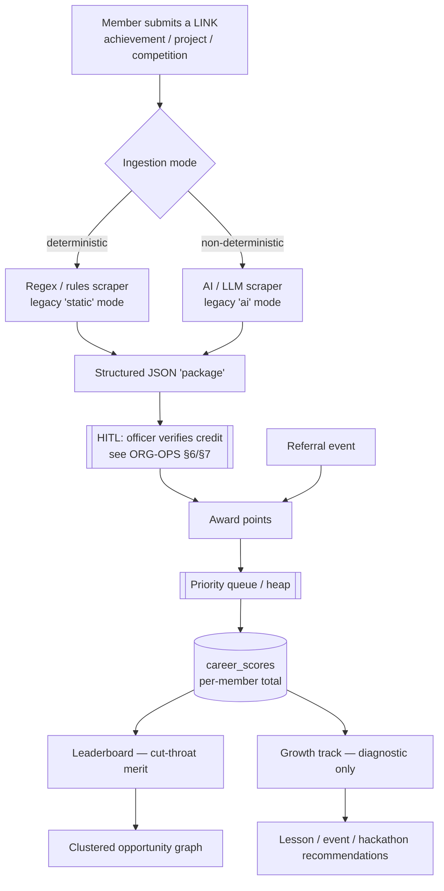
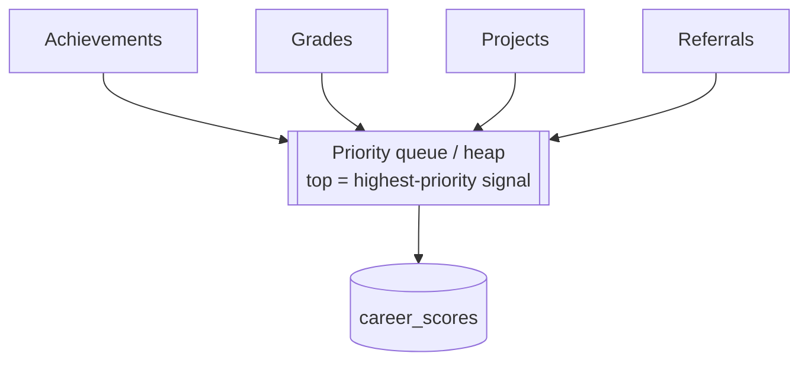
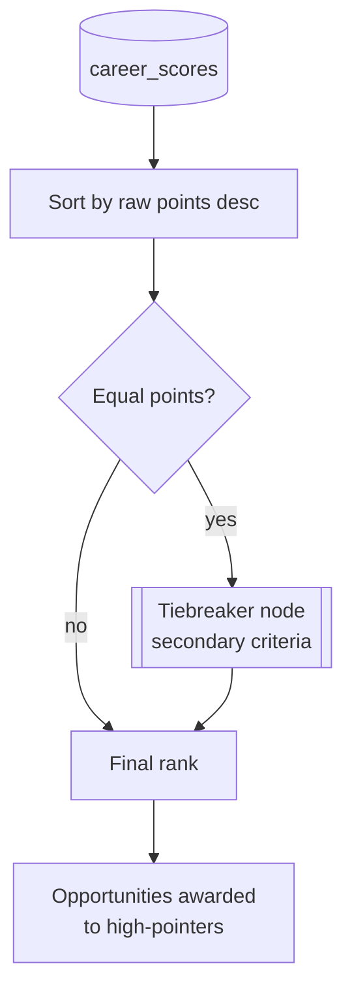
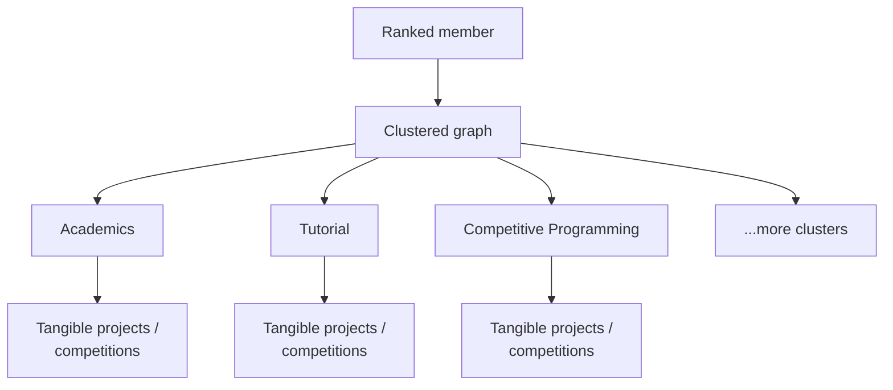
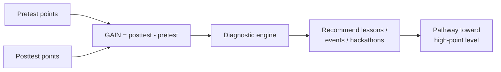
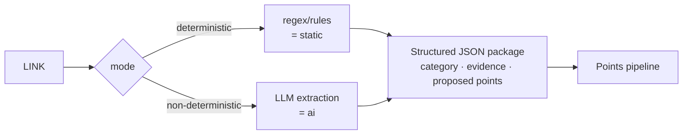
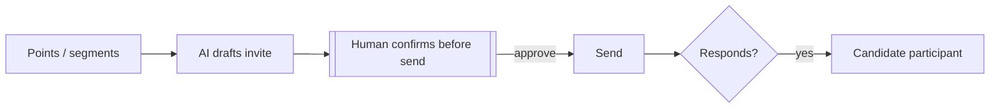

# Points · Leaderboard · Merit Engine — CONFIRMED (v1)

> ✅ **STATUS: CONFIRMED** with the user. This is the engine spec behind
> [`ORG-OPERATIONS.md` §10](ORG-OPERATIONS.md). It rides on the platform analytics layer
> (SPECIFICATION §5 Layer 5: `leaderboards` · `career_scores`) and respects the privacy model
> (SPECIFICATION §6). Personal-achievement ingestion runs client-side — see
> [`CLIENT-SCRAPING.md`](CLIENT-SCRAPING.md).

## Purpose

Turn member activity (achievements, grades, projects, referrals) into **points**, rank those
points in a **cut-throat merit leaderboard** that awards **opportunities**, and — separately — run
a **diagnostic growth engine** that tells low-point members which lessons/events/hackathons will
help them climb. Merit and growth share data; they are **not** the same competition.

> One line to keep everyone honest: **merit competition for opportunities + a development pathway
> for everyone else.** Explicitly **NOT equity-by-points** — walang redistribution, walang handouts.

---

## 1. End-to-end flow

---

## 2. Point sources & the priority heap

Members earn points from four sources. Achievements, grades, and projects are the
**highest-priority signals**; referrals add a growth/network incentive. Priority is modeled as a
**priority queue (heap)** so the strongest signals surface first.

| Source | Weight tier | Notes |
|---|---|---|
| Achievements | Highest | competition wins, awards, certifications |
| Grades | Highest | mapped to points without exposing raw grades (privacy) |
| Projects | Highest | shipped/tangible work, often GitHub-sourced |
| Referrals | Growth incentive | points for referring new members |

> **Note (Taglish):** ang heap dito ay para sa *priority/ordering* ng signals, hindi pa final kung
> ito rin ang gagamitin sa tie-influence — naka-list sa open questions sa baba.

---

## 3. Leaderboard — cut-throat merit + tiebreaker

Raw points, head-to-head. No equity adjustment. Ties resolve through a dedicated **tiebreaker
node** before a final rank is assigned.

---

## 4. Clustered opportunity graph

The leaderboard connects to a **clustered graph**: each **cluster** is a domain (academics,
tutorial, competitive programming, …) and each cluster points to **tangible
projects/competitions** a ranked member can choose from.

---

## 5. Growth track — pretest vs posttest GAIN

A **diagnostic / recommendation engine** for the low-point bracket. It compares a member's points
**before** an activity (pretest) vs **after** (posttest) to compute **GAIN**, then recommends what
that specific student needs next. It is **not** a competing ranking.

---

## 6. Ingestion: deterministic vs non-deterministic (mirrors legacy `static`/`ai`)

A member submits a **link**; ingestion produces a structured JSON **package** that flows through
the pipeline. Two ingestion modes — directly mirroring the legacy engine's mode switch
(`src/resume_builder/models.py` → `Mode.STATIC` / `Mode.AI`, selected via `--mode` in
`src/resume_builder/cli.py`):

| Mode | Legacy analogue | Mechanism | When |
|---|---|---|---|
| **Deterministic** | `static` | regex / rules / fixed selectors | structured, predictable sources |
| **Non-deterministic** | `ai` | LLM extraction via the adapter layer (SPECIFICATION §15) | messy / freeform pages |

---

## 7. Email invites from points/segments

Points and segments drive **AI-drafted** event invites; the **HITL gate (ORG-OPS §4)** still
applies. A responding guest becomes a **candidate participant**.

---

## 8. Suggested code shape (separation of concern)

Re-implemented on the new stack (Next.js + Supabase serverless), but the interfaces echo the
legacy engine's adapter discipline:

- `LinkIngestor` (mode: `deterministic | ai`) → `PointsPackage` (structured JSON)
- `PointsAwarder` → writes to `career_scores` after HITL credit verification
- `PriorityQueue` (heap) → orders signals by priority tier
- `LeaderboardRanker` + `Tiebreaker` → raw-points ranking with tie resolution
- `ClusterGraph` → cluster → tangible-opportunity mapping
- `GrowthDiagnostic` → GAIN (pretest vs posttest) → recommendations
- `ReferralTracker` → referral credit with anti-gaming checks
- `InviteDrafter` → AI draft behind the HITL send gate

> Storage maps to Layer 5 analytics (`leaderboards`, `career_scores`, `growth_metrics`). Raw
> scraped evidence is **Layer 2 Private (RLS)**; only curated fields surface publicly
> (SPECIFICATION §6).

---

## 9. Open questions / blocked-on

1. **Point formula & weights** — exact per-source weights; grade→points mapping that does not leak
   raw grades (privacy).
2. **Heap role** — display ordering vs processing order vs tie-influence. Confirm intent.
3. **Tiebreaker criteria** — what the tiebreaker node compares (recency? GAIN? referral count?).
4. **Cluster taxonomy** — final cluster list + cluster→opportunity mapping rules.
5. **Low-point bracket cutoff** — threshold that defines the growth audience.
6. **Pretest/posttest snapshotting** — when/how points are captured around an activity for GAIN.
7. **Referral anti-gaming** — self-referral / fake-account prevention.
8. **Opportunity awarding** — automatic to top-N vs officer-confirmed (HITL)?
9. **Ingestion default mode** — does a link default to deterministic with AI fallback, or AI-first?
