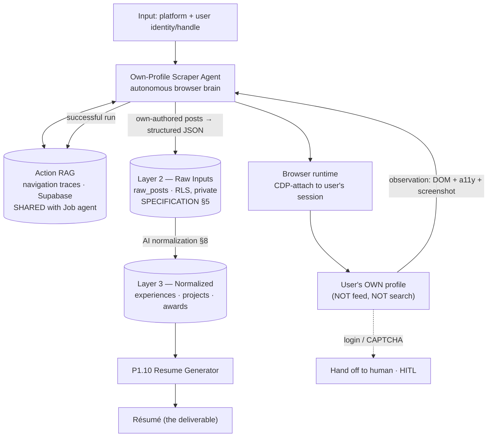
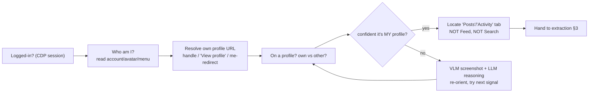
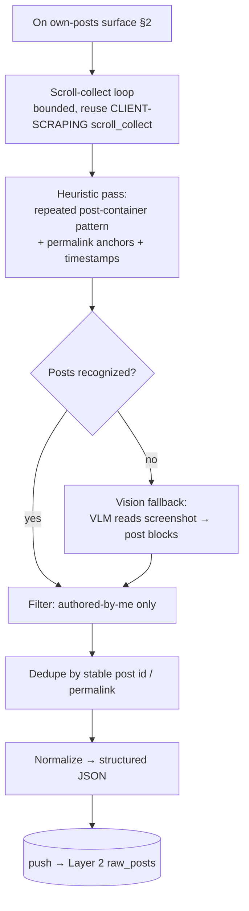
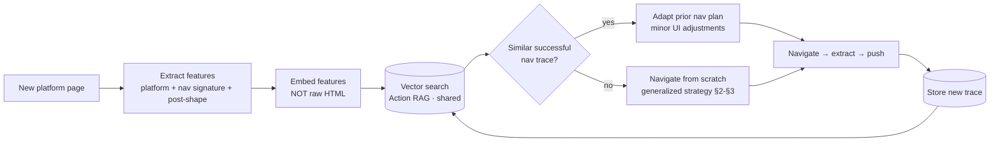
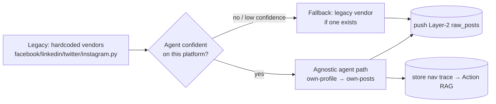
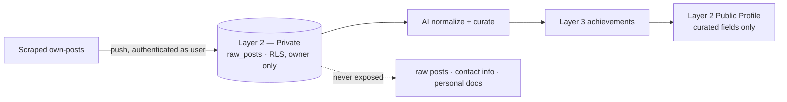

# Own-Profile Scraper — Social-Media-Agnostic Browser Agent (DRAFT v0.1)

> 🚧 **STATUS: DRAFT / PROPOSAL** — not yet confirmed with the user. This designs a
> **social-media-agnostic profile scraper agent** whose job is to collect **the user's OWN posts from
> their OWN profile** on *any* platform and feed them into the **resume pipeline** (Layer-2 raw inputs
> → normalized achievements). It is the **sibling** of the
> [Job Application Expert](JOB-APPLICATION-AGENT.md): same autonomous-browser brain, opposite verb —
> the job agent **acts** (fills + submits), this one **reads** (the user's own content).
>
> Cross-refs: shared agent architecture (Action RAG, observe→act→verify, generalization) →
> [`JOB-APPLICATION-AGENT.md`](JOB-APPLICATION-AGENT.md); browser/CDP runtime →
> [`CLIENT-SCRAPING.md`](CLIENT-SCRAPING.md); Layer-2 raw inputs + privacy (§5, §6) →
> [`SPECIFICATION.md`](SPECIFICATION.md).
>
> **Org:** PyTorch FEU Tech Student Chapter · **Document version:** 0.1 · drafted 2026-06-29

---

## 0. TL;DR — the confirmed decisions (read these first)

Wala munang per-site selectors — gawing agent muna, mag-ipon ng traces, saka mag-generalize.

1. **Purpose = serve the RESUME.** This agent collects the **user's own posts** from the **user's own
   profile** to feed the resume pipeline: **Layer-2 raw inputs → AI normalization → Layer-3
   achievements** that the **P1.10 Resume Generator** consumes. The **primary consumer is the resume
   builder** — not points, not analytics (those are downstream of the same raw data, but the design
   goal here is the résumé).

2. **Social-media-AGNOSTIC.** **No hardcoded per-site selectors / JS.** The current
   `src/resume_builder/sources/social/vendors/*.py` files are hardcoded and "only have context for
   that one website" — *that coupling is the problem we are removing*. Instead: an **RAG/LLM-driven
   browser agent** that, given a **platform + the user's identity/handle**, **navigates to the user's
   own profile** and **extracts the user's own posts**, generalizing to **unseen platforms** by
   recognizing patterns rather than memorizing markup.

3. **Reuse the Job Application Expert architecture.** Same "autonomous browser agent" brain:
   workflow understanding, **observe→act→verify** browser decisions, dynamic-site handling, an
   **Action RAG** of navigation traces, and **generalization**. This agent is the **own-profile
   scraper** half of the pair; the job agent is the **applier** half.

4. **SHARED CORE, separate purpose.** The **browser-agent runtime + Action RAG** are **shared
   infrastructure** usable by *both* this scraper and the job agent. But this agent's deliverable is
   the **résumé**. ⚠️ The **exact module boundary** — how much is shared vs scraper-specific — is
   **still to be confirmed with the user** (see §9). Flag it, hindi muna i-over-commit.

5. **Own-posts ONLY.** Never search-bar "mentions" (content the user did **not** author). This was
   just fixed in the legacy scraper — `include_mentions` is now **opt-in, default off** — and we
   carry the **same principle** forward: authored-by-me is the contract.

6. **CDP-attach to the user's logged-in browser** (per [`CLIENT-SCRAPING.md`](CLIENT-SCRAPING.md)) so
   it scrapes **as the real signed-in user**, on data the user already has access to. **CAPTCHA /
   login = human handoff (HITL)** — never bypass, never solve.

> Net: same gate as the rest of the platform — **AI gathers and eases the work; a human stays in the
> loop** for auth/CAPTCHA and the data only ever surfaces after curation (§7).

---

## 1. Goal + where it sits in the resume pipeline

The agent is the **ingestion mouth** of the résumé pipeline. It turns "my profile on platform X"
into **Layer-2 raw posts**, which the existing AI normalization (SPECIFICATION §8) lifts into
**Layer-3 achievements**, which the **P1.10 Resume Generator** renders.

- The **reasoning module** is the brain; the **browser runtime** is the hands — same split as the job
  agent (`JOB-APPLICATION-AGENT.md` §1) and the scraping blueprint (`CLIENT-SCRAPING.md` §1).
- **Difference vs the job agent:** scraping **reads** the user's own content; the job agent **acts**
  on third-party forms. Lower stakes here (no Submit), but the **own-only** + **HITL-auth** rules
  still hold.
- The **trace loop is the product** (§4): every successful navigation enriches the shared Action RAG,
  which makes the next platform faster and eventually becomes a fine-tune dataset (shared with the job
  agent — see §8 Phase 3).

---

## 2. Agnostic navigation — finding "MY profile" on an arbitrary platform

The hard part is **not** reading posts; it is **landing on the user's own profile** on a site the
agent may have never seen, **without** a hardcoded `/{handle}` template or a hand-written selector
map. The agent reasons over **signals**, not memorized markup.

### Identity & login-state signals (cheap → expensive cascade)

| Question the agent must answer | Agnostic signals it uses (no per-site code) |
|---|---|
| **Am I logged in?** | CDP-attached session already authenticated; presence of an account menu / avatar / "Log out"; absence of a login wall |
| **Who am I (identity)?** | the user-provided handle/identity; the account-menu name/avatar; "Your profile" / "Me" affordance; `me`-style self-redirects |
| **Where is my profile?** | follow the **"View profile" / avatar → profile** link rather than guessing a URL; infer `…/{handle}` only as a *hypothesis* then **verify** |
| **Is this MY profile (not someone else's)?** | name/handle/avatar **matches the logged-in identity**; presence of self-only controls ("Edit profile", "Add to story", settings gear) |
| **Where are MY posts?** | a **"Posts" / "Activity" / "Timeline"** tab on the profile — **distinguished from** the home **Feed** (others' content) and the **Search** surface (mentions) |
| **Did I land on Feed/Search by mistake?** | feed = mixed authors + composer at top; search = query box + results from many authors → **reject**, re-orient (own-only rule, §0.5) |

- **Verify, don't assume.** A URL template is a *hypothesis*; the agent confirms "this is me" via the
  identity match before extracting. Reskins and locale changes break templates, not the **"this is my
  own profile" semantic**.
- **Own-profile, never feed, never search.** The navigation target is explicitly the **authored-by-me
  surface**. The feed (others' posts) and the search bar (mentions) are **out of scope by design** —
  same lesson as the legacy `include_mentions=off` default.
- **Vision fallback for unknown shells.** When DOM/role signals are ambiguous (closed Shadow DOM,
  exotic SPA), fall back to **VLM screenshot grounding** to find the avatar / "Posts" tab — the same
  fallback the job agent uses (`JOB-APPLICATION-AGENT.md` §4).

---

## 3. Own-post extraction — agnostic strategy

Once on the **own-posts** surface, extract posts **without** site-specific selectors. The strategy is
a **signal cascade** ending in a vision fallback, plus **own-authored** filtering and dedupe.

| Concern | Agnostic approach (no hardcoded selectors) |
|---|---|
| **Find post blocks** | recognize the **repeating container pattern** (same structure repeated down the page) + **permalink anchors** + **timestamp** elements; reason over the a11y/role tree, not class hashes |
| **Get post text** | visible-text extraction within the recognized block; expand "See more" / truncation toggles before reading |
| **Get post id / link** | the **permalink anchor** is the stable key (the legacy FB vendor learned this: key on the permalink token, not `role=article`) — generalized to "the canonical link for this post" |
| **Vision fallback** | when heuristics fail (closed Shadow DOM, image-only layouts), a **VLM reads the screenshot** and returns post boundaries + text |
| **Own-authored ONLY** | keep a post only if the **author == the logged-in identity** (§2). Drop reshares/others' content unless explicitly opted in (mirrors legacy `include_mentions` default-off) |
| **Dedupe** | stable **post id / permalink** as the dedupe key; also guard against re-scrapes (idempotent push to `raw_posts`) |
| **Bounded everything** | scroll/expand/retry loops are capped (reuse `CLIENT-SCRAPING.md` `scroll_collect` discipline) so a broken page can't loop forever |

- **Deterministic-first, AI-fallback** — same split as `CLIENT-SCRAPING.md` §3: cheap heuristics
  when the layout is regular; LLM/VLM only for messy or unseen shells (cost-aware).
- The output is the **only public surface** of the scrape (per `CLIENT-SCRAPING.md` §4) — raw DOM and
  vendor quirks stay encapsulated; the pipeline sees normalized `raw_posts`.

---

## 4. Action RAG — navigation traces (SHARED with the Job agent)

Same Action RAG as `JOB-APPLICATION-AGENT.md` §11, **shared infrastructure**. Here it stores
**navigation traces** ("how to reach *my* profile and *my* posts on platform X"), not form-fill
traces. **Before navigating a known platform, retrieve the prior successful trace and adapt it**;
plan-from-scratch is the fallback.

### What a scraper trace stores

- **Platform fingerprint** (host/shell signals — analogous to the job agent's vendor fingerprint)
- **Navigation signature** (`login? → identity → own-profile → posts-tab → scroll-collect`)
- **Extraction strategy used** (heuristic vs vision; what keyed the post id)
- **Outcome** (`posts_collected | empty | escalated`) + counts
- **Recovery notes** (what re-oriented the agent off a feed/search mis-land)

- **Embed over navigation/platform features, NOT raw HTML** — HTML is noisy/per-site; the **nav
  signature + post-shape + platform** generalize. Ito ang susi sa unseen platforms (§8 Phase 3).
- **Trace record schema = the job agent's**, RLS owner-scoped (SPECIFICATION §6), with a `kind` field
  distinguishing `scrape_nav` from `job_apply`. The **corpus is the same store** so both siblings
  learn from a shared, growing dataset.
- A once-unseen platform, after one successful run, becomes a **known** one — the same flywheel as the
  job agent (`JOB-APPLICATION-AGENT.md` §12).

---

## 5. Reuse map — what's SHARED vs SCRAPER-SPECIFIC

> ⚠️ This split is the **proposed** boundary. The exact module lines are an **open question to
> confirm with the user** (§9). Treat the table as direction, not a contract.

| Capability | SHARED (with Job Application Expert) | SCRAPER-SPECIFIC (this agent) |
|---|---|---|
| **Browser runtime** | CDP-attach to user's logged-in session, observe→act→verify loop, bounded waits/retries, scroll-collect, iframe/Shadow-DOM handling | uses it **read-only** (navigate + read), no fill/submit |
| **Action RAG** | the trace store, embedding-over-features, retrieve-before-act, fine-tune corpus | **navigation traces** (own-profile reach + post-shape) vs the job agent's form-fill traces |
| **Dynamic-site handling** | SPA re-renders, lazy/virtual lists, modals/cookie walls, a11y/role-tree targeting (`JOB-APPLICATION-AGENT.md` §9) | applied to **profile/post surfaces** rather than application forms |
| **Generalization** | learn workflows not selectors; abstraction ladder; unknown → generalized strategy + save trace | generalize **"find MY profile + MY posts"** to unseen platforms (§2–§3) |
| **HITL handoff** | CAPTCHA/login = detect & hand to human, never bypass | auth handoff for read access (no Submit gate — there is nothing to submit) |
| **Platform classification** | host/DOM/network fingerprint cascade with confidence + evidence | classify a **social platform shell** (vs the job agent's ATS vendor) |
| **Purpose / deliverable** | — | **own-authored posts → Layer-2 raw → résumé** (the job agent's deliverable is a filled application) |
| **Identity reasoning** | — | "who am I / is this MY profile / is this Feed/Search?" navigation logic |
| **Extraction** | — | own-post heuristics + vision fallback, dedupe, authored-by-me filter |

---

## 6. Migration — from hardcoded vendors to the agnostic agent

Today: `src/resume_builder/sources/social/vendors/{facebook,linkedin,twitter,instagram}.py` —
each hardcodes selectors/JS for **one** site (e.g. FB keys on the `__cft__` permalink anchor). They
work, pero **brittle and non-transferable** — adding a platform means writing a new vendor by hand.

Strategy: **strangler-fig** — stand up the agnostic agent alongside, keep the vendors as a
**fallback** during transition, retire them per-platform once the agent matches or beats them.

| Legacy vendor | Keep during transition as | Retire when |
|---|---|---|
| `facebook.py` (`__cft__` permalink, `_expand_see_more`, `fetch_own_posts`) | Phase-1 **fallback + golden trace** source for FB | agent matches FB own-post recall + dedupe |
| `linkedin.py` / `twitter.py` / `instagram.py` | fallback for their platform until the agent covers it | agent green on that platform in eval |
| `base.py` / `models.py` (`SocialVendor` ABC, frozen `SocialPost`) | **keep** — the agent emits the **same `SocialPost` shape** so downstream is unchanged | n/a (the contract survives the migration) |
| `search_mentions` paths | **off by default** — `include_mentions` opt-in only | mentions stay out of scope (own-only) |

- **Reuse the hard-won ideas, drop the coupling.** The FB "key on the permalink, not `role=article`"
  lesson becomes a **generalized** extraction heuristic (§3), not site-specific code.
- The legacy vendors double as a **golden-trace** source for eval — capture their output as ground
  truth, then check the agent against it (no need to spam any live surface).

---

## 7. Privacy (cross-ref SPECIFICATION §6)

Scraped own-posts are **sensitive personal data** and follow the exact model in
[`CLIENT-SCRAPING.md`](CLIENT-SCRAPING.md) §5 and SPECIFICATION §6.

- **Scraped raw posts are Layer-2 Private (RLS)** — owner only, enforced at the database, not just the
  UI (SPECIFICATION §6, level 1).
- **Only curated achievements surface** (career summary, top skills, achievements — level 2). Raw
  posts, email, phone, certificates, full résumé **never** go public.
- **Trace privacy:** navigation traces and any screenshots (§4) may capture PII → **scrub/redact
  before storage**, encrypt at rest, RLS owner-scoped (same rule as `JOB-APPLICATION-AGENT.md` §13).
- **CDP / own-data only:** the agent reads only what the **logged-in user already sees**, with their
  consent. No private-endpoint scraping, no other people's data.

---

## 8. Phased roadmap

| Phase | Scope | Exit criteria |
|---|---|---|
| **1 — Agent-first MVP (one platform)** | **Facebook** own-profile → own-posts via **CDP-attach**, prompt+heuristics(+VLM fallback), push Layer-2 `raw_posts`. Run the legacy `facebook.py` as fallback + golden trace. Start collecting nav traces. | Agent reaches the user's **own** FB posts surface, extracts **own-authored** posts with dedupe, pushes to Layer-2, ≥ parity with legacy `facebook.py` recall |
| **2 — Multi-platform + Action RAG** | Add LinkedIn/Twitter/Instagram + others; turn on **retrieve-before-navigate** (§4); generalized nav strategy for unknown shells (§2–§3) | RAG measurably beats scratch on known platforms; ≥N platforms green; legacy vendors demotable to fallback |
| **3 — Generalize to unseen platforms** | Land on a platform **never seen before** using identity/nav signals alone; save its trace; no new per-site code | Strong unseen-platform success on a held-out split (Mind2Web-style cross-domain philosophy) |
| **4 — (optional) Fine-tune from traces** | Use the **shared** trace corpus (scrape + job-apply) to **LoRA/QLoRA** a base model; A/B vs prompt+RAG | Fine-tuned model ≥ prompt+RAG at lower cost/latency — **shared deliverable with the job agent** (`JOB-APPLICATION-AGENT.md` Phase 3) |

> Phase 1 is **deliberately one platform (FB)** — meron na tayong legacy `facebook.py` na blueprint +
> golden trace, kaya mabilis maka-end-to-end at makapag-umpisa ng trace collection. Walang fine-tune
> dito; data muna, exactly like the job agent.

---

## 9. Blocked on / open questions

1. **⭐ Shared-vs-separate module boundary (CONFIRM WITH USER).** §0.4/§5 propose that the **browser
   runtime + Action RAG are shared** between this scraper and the job agent, with **own-profile nav /
   own-post extraction / résumé feed** as scraper-specific. **How much is truly one shared package vs
   two siblings with a thin shared core is still undecided** — this is the headline open question to
   settle before building.
2. **Per-platform ToS.** Each social platform's Terms on automated access differ. Same opt-in-after-
   review + kill-switch discipline as `JOB-APPLICATION-AGENT.md` §13 — who reviews each platform?
3. **Login / credential handling.** The agent runs **inside the user's CDP-attached session** and
   never holds third-party credentials — but how is re-auth on an expired session handled, and where
   does the CDP attach happen (extension vs packaged client, mirroring `CLIENT-SCRAPING.md` §6 Q1)?
4. **Vision-model need.** How often is the VLM fallback (§2–§3) actually required vs heuristics? Cost
   and latency depend on the answer; want to measure before committing to a vision model.
5. **Trace privacy / PII in screenshots.** Navigation screenshots of the user's own profile contain
   PII → redaction pipeline + encryption + retention before anything hits Supabase (§7).
6. **Own-authored detection robustness.** How reliably can the agent tell **authored-by-me** from
   reshares/others on an unknown shell? False positives leak others' content into the résumé pipeline.
7. **Feed vs profile vs search disambiguation.** The riskiest mis-land (§2) — need a confident,
   generalizable check so we never scrape the home feed or search results.
8. **Eval ground truth.** Capture **golden traces** from the legacy vendors and from the user's own
   profile; measure recall/dedupe **without** abusing any platform (mirror `JOB-APPLICATION-AGENT.md`
   §15).
9. **CDP runtime choice.** MV3 extension vs packaged headless client (same unresolved choice as
   `CLIENT-SCRAPING.md` §6) — affects how CDP-attach + distribution work.
