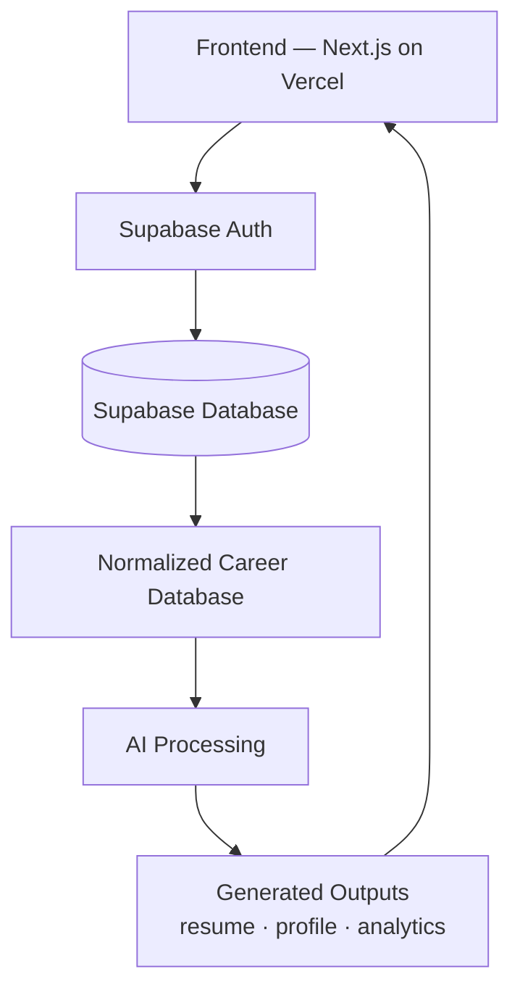
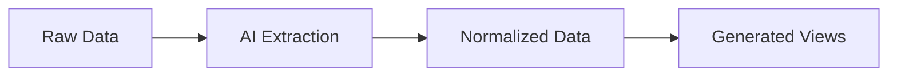
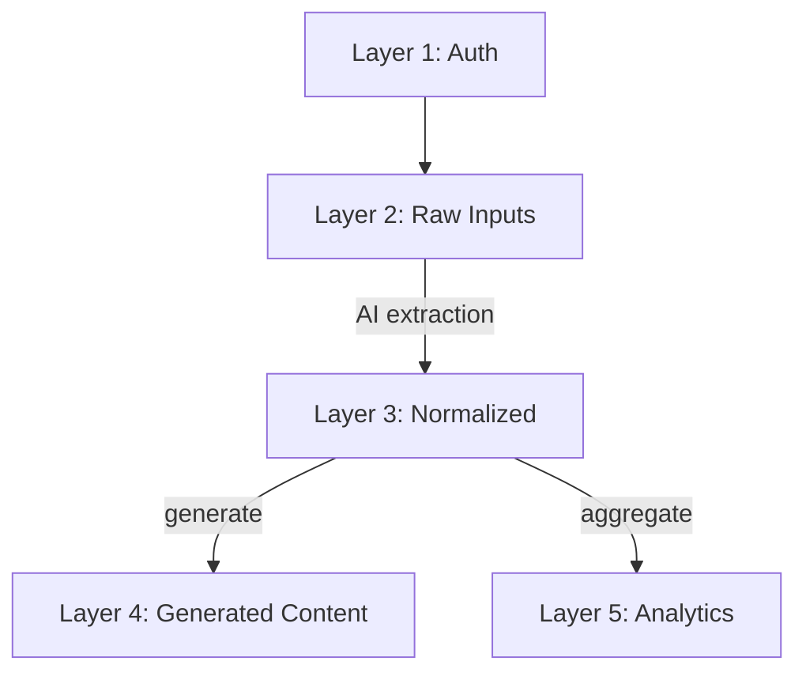
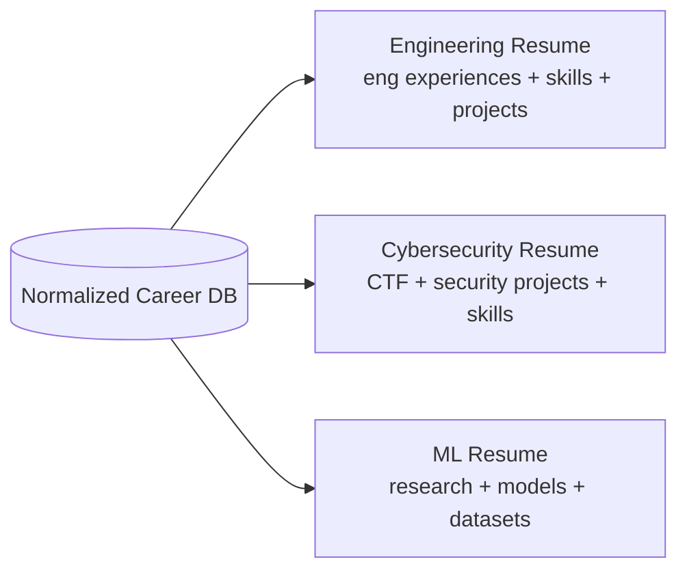
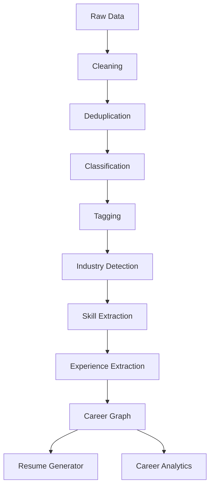
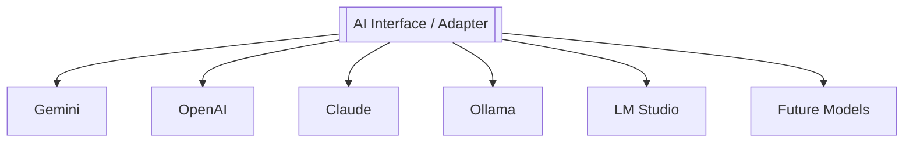

# PyTorch FIT System — AI Career Intelligence Platform

> **Master Specification** — import this single document into NotebookLM as the primary source.
> From here, NotebookLM can generate a mind map; the architect delegates from the role-based
> workstreams in §17.
>
> **Repo:** `JohnAndrewBalbarosa/pytorch-fit-system`
> **Org:** PyTorch FEU Institute of Technology (FEU Tech) Student Chapter
> **Status:** pivot in progress — from a single-output resume builder to a multi-user platform.
> **Document version:** 1.0 · authored 2026-06-27

---

## 1. Vision

This is **not** an AI resume builder. It is a **Career Intelligence Platform** that uses AI to:

- Collect a user's career-related information.
- Convert raw information into a **normalized career database**.
- Generate many AI-tailored resumes per target industry.
- Provide personal analytics to each user.
- Provide aggregated, anonymous career insights to the whole platform.
- Expose a public profile that never leaks sensitive information.
- Keep normalized data reusable for future AI features.

It serves the PyTorch FEU Tech chapter first as the launch community, and is built as a **public
multi-user platform** from day one.

---

## 2. Core Philosophy — Source of Truth

The source of truth is **NOT** the résumé, the PDF, the Facebook post, or the LinkedIn profile.

> **The source of truth is the Normalized Career Database.**

Every output is *generated* from it and is disposable:

- Resume · Public Profile · Portfolio · Analytics · Leaderboards · AI Suggestions

If an output is lost, it is regenerated from the database. The database is never reconstructed
from an output.

---

## 3. High-Level Architecture

- **MVP is serverless:** Vercel (frontend + serverless functions) + Supabase (auth, Postgres,
  storage, RLS). No permanent backend.
- **A backend is optional and future** (verification, scheduled jobs, AI queue, payments — see §13).

---

## 4. Database Philosophy

Separate **raw** from **structured** data. The résumé is never the database — it is a generated
document.

---

## 5. Database Layers

### Layer 1 — Authentication
`users` · `profiles` · `roles`

### Layer 2 — Raw Inputs (private only, RLS-protected)
`raw_posts` · `raw_certificates` · `raw_projects` · `raw_work_history` · `raw_education` ·
`raw_manual_inputs`

### Layer 3 — Normalized Tables (everything references `user_id`)
`experiences` · `projects` · `skills` · `certifications` · `awards` · `education` ·
`employment` · `organizations` · `technologies` · `industries` · `publications`

**Relationship tables:** `user_skills` · `experience_skills` · `project_skills` · `project_tags`
· `experience_tags` · `industry_tags`

### Layer 4 — Generated Content (disposable, always regenerable)
`generated_resume` · `resume_sections` · `resume_versions` · `resume_templates` ·
`career_summary` · `ai_recommendations`

### Layer 5 — Analytics
`career_metrics` · `industry_statistics` · `platform_statistics` · `growth_metrics` ·
`leaderboards` · `career_scores`

---

## 6. Privacy Levels

| Level | Visibility | Examples | Never expose |
|---|---|---|---|
| **1 — Private** | Owner only | raw posts, email, resume drafts, contact info, personal docs | — |
| **2 — Public Profile** | Everyone | nickname (e.g. `Angela #7A82F`), career summary, top skills, industry, career score, achievements | email, phone, raw posts, certificates, full resume |
| **3 — Aggregated Analytics** | Everyone | popular skills, avg career growth, industry/technology/hiring trends, anonymous statistics | any identifiable private information |

Privacy is enforced with **Row Level Security (RLS)** at the database, not just in the UI.

---

## 7. Resume Philosophy

Resumes are **generated, never stored as the source**. One database → unlimited resumes.

---

## 8. AI Pipeline

---

## 9. Career Knowledge Graph

User → Experience → Projects → Skills → Industries → Technologies → Achievements →
Organizations → Competitions → Research → Portfolio. Everything becomes connected and queryable.

---

## 10. AI Features

Automatic resume generation · industry-specific resumes · portfolio builder · career summary ·
career suggestions · missing-skills detection · career roadmap · AI feedback · resume
optimization · interview preparation · job matching · learning recommendations · career progress
timeline.

---

## 11. Analytics

**Personal:** career growth · skill distribution · activity timeline · technology usage ·
experience diversity · resume strength · industry readiness.

**Platform (anonymous):** top technologies · most common skills · most popular career paths ·
trending certifications · emerging industries · average resume score · anonymous career insights.

---

## 12. Authentication & Authorization

**Supabase Auth** — Google, GitHub, Email now; Microsoft, LinkedIn, Facebook later.

**Roles:** Anonymous · Authenticated · Premium · Research · Moderator · Admin · Super Admin.

**Permissions:**
- Authenticated → own data only.
- Admin → analytics + platform management.
- Research → aggregate analysis only.
- Never unrestricted access to personal records unless explicitly required and authorized.

---

## 13. Future Backend

Current: `Frontend → Supabase`. Future: `Frontend → Backend API → Supabase`.

Backend responsibilities: verification · scheduled jobs · AI queue · notifications · payment ·
automation · scraping · background tasks.

---

## 14. Development Phases

| Phase | Scope |
|---|---|
| **1** | Auth · profile · raw data · normalization · resume generation |
| **2** | Public profiles · career scores · analytics · resume templates |
| **3** | Portfolio builder · job matching · AI recommendations · learning roadmaps |
| **4** | Backend · verification · automation · large AI pipelines · cloud models |

---

## 15. AI Model Strategy

Never depend on one AI. Build an **adapter layer** behind a single interface.

Two kinds of "model" exist in this system and must not be confused:
1. **LLM providers** (above) — used for extraction, generation, suggestions via prompts.
2. **Trained PyTorch models** (chapter-owned) — e.g. classifiers for industry detection, skill
   extraction, or career scoring, trained on the platform's normalized data. These are a
   first-class workstream (§17 AI Engineer) and a learning vehicle for the chapter.

---

## 16. Design Principles

- Normalize data first.
- Resume is generated, never the source of truth.
- Separate raw, normalized, generated, and analytics data.
- Use Row Level Security (RLS) for user privacy.
- Expose only curated public-profile fields.
- Build for AI extensibility from the start (adapter layer).
- Keep the MVP serverless (Vercel + Supabase), with a future path to a backend.

---

## 17. Role-Based Delegation (mind-map branches)

> Each role is a workstream. NotebookLM should render these as top-level branches.

### 🏛️ Project Architect
Define system architecture · review scalability/maintainability · decide stack & principles.
**Outputs:** architecture diagrams · system documentation · technical roadmap.

### 🗄️ Database Architect
Design normalized schema · foreign keys & relationships · RLS policies · indexes & migrations.
**Outputs:** ERD · SQL migrations · database documentation.

### 🤖 AI Engineer
Design extraction pipeline · tag posts & experiences · generate resumes · compute career
metrics · **train & evaluate chapter-owned PyTorch models**.
**Outputs:** prompt library · AI workflows · trained models · evaluation metrics.

### 🎨 Frontend Engineer
Auth · dashboard · resume editor · public profile · analytics UI.
**Outputs:** React/Next.js components · UI flows · responsive layouts.

### 🔒 Security Engineer
RLS auditing · authentication flows · privacy review · public vs private separation.
**Outputs:** security checklist · threat model · access-control documentation.

### 📊 Data Analytics Engineer
Define platform metrics · build aggregate analytics · trend analysis · dashboards.
**Outputs:** analytics schema · KPI definitions · visualization plan.

### 🧪 QA Engineer
Test AI outputs · validate database consistency · test RLS · regression testing.
**Outputs:** test cases · bug reports · acceptance criteria.

### 🚀 DevOps / Infrastructure (future)
Deploy Vercel · configure Supabase · future backend deploy · CI/CD & monitoring.
**Outputs:** deployment pipeline · infrastructure documentation · monitoring setup.

---

## 18. Migration: from `resume-build-chopper` to `pytorch-fit-system`

The previous project was a **Python CLI resume builder** (single output). It is being
**superseded**. The decision is **start fresh** on the new stack (Next.js + Supabase), not to
incrementally refactor the Python codebase into the platform.

### What carries over as *reference* (not as runtime)
The legacy Python pipeline is a proven blueprint for the AI Processing layer. Reuse the *ideas*,
re-implement on the new stack:

| Legacy concept (Python) | Maps to (new platform) |
|---|---|
| `models.py` canonical contracts | Normalized DB schema (Layer 3) |
| 5-stage pipeline (role→collect→extract→synthesize→render) | AI Pipeline §8 (cleaning→…→resume generator) |
| `LLMProvider` adapter + registry | AI Model Strategy adapter §15 |
| Social scraper (Facebook/LinkedIn/…) | Raw input ingestion (Layer 2) — future backend job §13 |
| Renderers (LaTeX/PDF/HTML/MD/JSON) | Generated Content (Layer 4) resume templates |
| Role-aware filtering + Harvard principles | Resume Generator prompt logic |

### What is genuinely new
Multi-user auth · normalized relational DB with RLS · public profiles · platform analytics &
leaderboards · trained PyTorch models · web-first UX.

> The legacy engine and its module docs live under `src/resume_builder/` and
> `docs/departments/`. Treat them as **historical reference** while the new platform is built.

---

## 19. Glossary

- **NCD** — Normalized Career Database; the single source of truth.
- **RLS** — Row Level Security; per-row Postgres access control in Supabase.
- **Generated output** — any disposable artifact derived from the NCD (resume, profile, etc.).
- **Adapter layer** — the single interface in front of all LLM/model providers.
- **FIT** — FEU Institute of Technology (FEU Tech).
