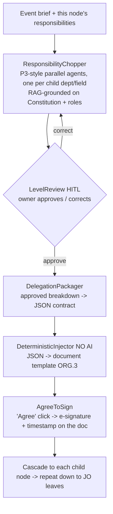
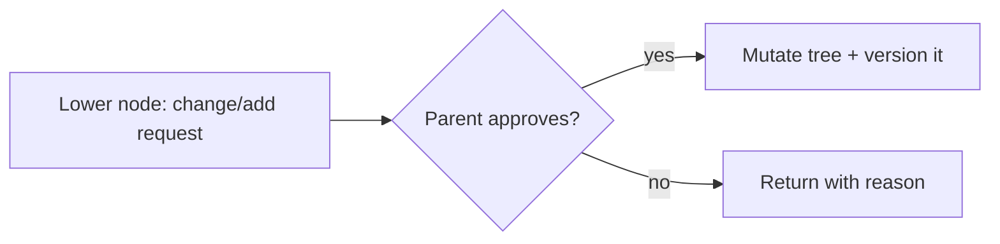

# Org Delegation Pipeline — Design

> **Status:** APPROVED (design) — 2026-06-30. Awaiting written-spec review before planning.
> **Owner:** PyTorch FEU Tech Chapter
> **Extends:** the existing Org Operations layer — `platform/org-ops/` (TypeScript pipeline: ingest,
> briefs, documents, routing, approval middleman, scoring) + `docs/ORG-OPERATIONS.md` + the ORG.* board
> items (ORG.2 DepartmentBriefGenerator, ORG.3 DocumentInjector, ORG.4 approval UI, ORG.10 data model).
> Reuses the P3 parallel-agent pattern (`src/resume_builder/interpretation/`).

---

## 1. Purpose

Turn a single **event** into a **top-down, drill-down delegation tree** of responsibilities and tasks,
where an AI proposes the breakdown at each level, a human at that level reviews/approves/corrects, and
each approval is **packaged as JSON → injected into a document → signed by an "Agree" click**. The tree
bottoms out at **Junior Officers (JOs)** holding concrete tasks. A separate, system-only **dependency
layer** tracks prerequisites (so lateness can be flagged and side-tasks can proceed), a **drill-up**
channel lets nodes escalate ideas/problems, and a **Change Control Board (CCB)** routes any
change/add request from below through the parent for approval before it mutates the tree.

**This is drill-down — there is NO compile/aggregate pipeline** (unlike the résumé system's P1 retrieval
middleman). Each level consumes the parent's **already-checked JSON** via a non-AI retrieval + injector.

## 2. The delegation tree

```
Event
  └─ Highest Authority (AI acts for the Exec board / President)        ← root
       ├─ Executive — Department A          (Exec reviews/owns)
       │    ├─ Director — Field A1          (Director reviews/owns)
       │    │    ├─ JO task  (leaf)
       │    │    └─ JO task  (leaf)
       │    └─ Director — Field A2 …
       └─ Executive — Department B …
```

- **Levels:** Highest Authority (root) → Executives (per department) → Directors (per field) → JOs (tasks).
- **Leaf = JO tasks.** The cascade stops at JO leaves.
- **Whole tree, read-all.** The entire tree is generated and stored once (it is small enough — no need to
  shard into subtrees), and is **visible to everyone** (read). Modularity + shared situational awareness.
- **Per-node e-sign.** Although everyone *sees* the whole tree, each person only **Agrees/e-signs their
  own node/level** (Exec for their department, Director for their field, JO for their task).
- **Node shape (data structure):**

```jsonc
{
  "id": "dept-A.field-A1.task-3",
  "level": "task",                 // "root" | "exec" | "director" | "task"
  "owner_role": "JO",              // who signs this node
  "title": "...",
  "responsibilities": ["..."],     // what this node is accountable for
  "children": [ /* child node ids */ ],
  "status": "pending|in_progress|done",
  "agreement": { "signed_by": null, "e_signature": null, "signed_at": null }
}
```

## 3. Per-level loop (AI propose → human check → JSON → inject → sign)

For each node, expanding to the level below:



- **ResponsibilityChopper** — reuses the P3 parallel-agent pattern: **one agent per child** (department,
  then field, then task set), grounded by retrieval over the org Constitution/Bylaws + role definitions +
  the event brief. AI proposes; it never auto-commits.
- **LevelReview (HITL)** — the node's owner approves or corrects. **Reject → re-chop only that subtree**
  (not the whole tree) with the correction notes as added context.
- **DelegationPackager** — the approved node's breakdown is packaged as the **checked-by-parent JSON**
  contract handed to the level below. The parent MUST have approved before the child receives it.
- **DeterministicInjector (no AI)** — a non-AI retrieval that takes the given JSON and injects it into a
  document template (reuses ORG.3 DocumentInjector). The injector is **bleed/format-ready** so the doc is
  presentable on render.
- **AgreeToSign** — clicking **"Agree"** on the injected document **implicitly stamps the approver's
  e-signature + timestamp** into the doc. Agree == sign.

## 4. Dependency layer (separate, system-only, AI-suggested + human-checkmarked)

A **distinct overlay** on the tree — **NOT part of the documentation/JSON the nodes sign**.

- **AI suggests** the prerequisite/dependency analysis: which departments **need** other departments'
  output, which must **finish first**, and which can **start and finish on their own** (independent).
- **Human checkmark** — each suggested dependency edge has a `✔ correct / ✘ wrong` gate; the system, not
  the document, holds it.
- **Edge types tracked per node:** **cross-sibling** (dept↔dept, field↔field), **parent-child**
  (level→level), and **intra-node** (task↔task within the same node).
- **Uses:**
  - **Scheduling / reminders** — surface which tasks have prerequisites from other departments or within
    their own; if a node is **behind schedule** on a prereq another department needs, it can be nudged.
  - **Side-tasks freedom** — when there is no hard deadline and a node doesn't want to do a prereq another
    department needs yet, the system shows the **independent side-tasks** they can do meanwhile.

## 5. Drill-up requests (v1)

A node can **request upward** — directly ask a higher position — when it has an **idea that benefits the
org** or hits a **problem along the way**. This is the bidirectional complement to drill-down delegation:
delegation flows down; requests/escalations flow up. (Distinct from the CCB below — drill-up is
ideas/problems, CCB is change/add to the tree.)

## 6. Change Control Board — CCB (v1)

Any **change or addition** a lower-hierarchy node wants to make to the tree must **route to its parent for
approval** before it applies. The parent approves/rejects; only approved changes mutate the tree. This is
**why the tree is the source of truth** — controlled, auditable mutation rather than ad-hoc edits.



## 7. Central shared tree store ("general board")

- The tree lives in **one central store**, **real-time visible to all** — when a node updates (e.g. a task
  marked **done**), **everyone sees it immediately** on the general board.
- **Backend is Backlog** (not yet built). **Interim:** persist the tree in **Supabase** (a temporary
  `delegation_tree` table/document under RLS). This interim DB store is **explicitly temporary — to be
  removed once the real backend exists**; design the access behind a thin interface so the swap is trivial.

## 8. Components (small, isolated units)

| Unit | Responsibility | Reuses |
|---|---|---|
| `DelegationTree` model | node/tree data structure + status + agreement | pydantic |
| `ResponsibilityChopper` | per-level AI breakdown (parallel agents, RAG-grounded) | P3 parallel-runner pattern, LLM/RAG |
| `LevelReview` | HITL approve/correct; reject → re-chop subtree | approval middleman (ORG.S4) |
| `DependencyAnalyzer` | AI-suggested prereq edges + human checkmark (separate layer) | LLM |
| `DelegationPackager` | approved node → JSON contract | — |
| `DeterministicInjector` | non-AI JSON → document render | ORG.3 DocumentInjector |
| `AgreeToSign` | Agree click → e-signature + timestamp | documents.ts |
| `CascadeOrchestrator` | drives drill-down to JO leaves, gated by approvals | pipeline.ts |
| `DrillUpRequests` | upward idea/problem escalation | — |
| `ChangeControlBoard` | lower change/add → parent approval → tree mutation | approval middleman |
| `TreeStore` (interim Supabase) | central real-time tree persistence (temporary) | Supabase + RLS (ORG.10) |

Only `ResponsibilityChopper` and `DependencyAnalyzer` touch the LLM, behind a mockable seam.

## 9. Error handling & principles

- **HITL at every level** — AI proposes; a human approves/corrects before anything cascades or signs
  (the same gate as the rest of the platform).
- **No silent mutation** — tree changes only via approved CCB requests; every change is versioned/audited.
- **Per-subtree re-chop** — a rejection re-runs only the affected subtree, never the whole tree.
- **Bounded AI** — parallel choppers are capped + reconciled like the P3 runner (sent/returned/retry).

## 10. Also in scope (org-ops layer, this initiative)

- **Board → CSV/Excel export** — export the board/todo (and per-event projects) to CSV/Excel for officers'
  convenience, especially for a specific event saved as a project.
- **Hidden repos / per-team access** — org base permission set to `none`; repos granted per team
  (`officers`, `members`) so org-exclusive repos are hidden by default (out of convenience: officers see
  the repos meant for them immediately, especially job-related ones).

## 11. Open / deferred

- Exact RAG corpus + chunking for `ResponsibilityChopper` (Constitution, Bylaws, role matrix, event brief).
- Document template format for the injected, signable docs (HTML/PDF) — align with the DocumentInjector.
- e-signature storage/format + audit trail fields.
- Real backend (Backlog) replacing the interim Supabase `TreeStore`.
- UI for the general board / tree visualization + dependency checkmarks (platform/ side).
- Drill-up routing rules (who an escalation reaches at each level).
