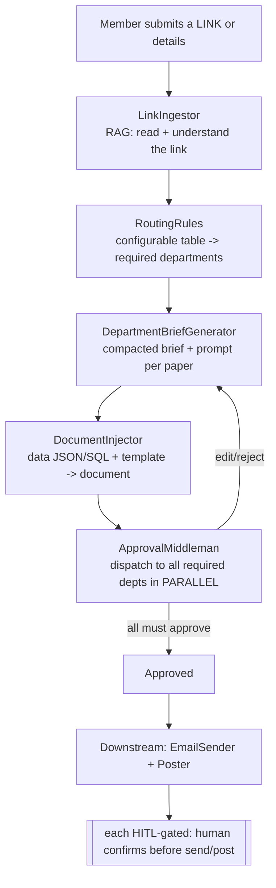

# `platform/org-ops` — Org Activity Operations (scaffold)

> **Scaffold / contracts only.** These TypeScript interfaces define the pipeline confirmed in
> [`docs/ORG-OPERATIONS.md`](../../docs/ORG-OPERATIONS.md) §8b. They are the drop-in contract
> layer for the future Next.js + Supabase app. Human/external-dependent and template-dependent
> implementations are intentionally left as stubs (`throw new Error("not implemented")`).

## Pipeline

## Separation of concern (one file per stage)

| File | Responsibility | Status |
|---|---|---|
| `types.ts` | Shared domain types (the contract) | ✅ defined |
| `ingest.ts` | `LinkIngestor` — RAG over the submitted URL/details | 🔲 stub (needs RAG infra) |
| `routing.ts` | `RoutingRules` — configurable doc-type/scope → departments | ✅ table-driven impl |
| `briefs.ts` | `DepartmentBriefGenerator` — per-department compacted brief | 🔲 stub (needs LLM) |
| `documents.ts` | `DocumentInjector` — data + template → document | 🔲 stub (needs template) |
| `approval.ts` | `DepartmentApprover` + `ApprovalMiddleman` (parallel/unanimous) | ✅ middleman impl |
| `downstream.ts` | `EmailSender`, `Poster` — HITL-gated | 🔲 stub (needs surfaces) |
| `scoring.ts` | `OfficerScoring` — speed + vote-based quality | 🔲 stub |
| `pipeline.ts` | Orchestrator wiring all stages | ✅ skeleton |

## Principles (locked)

1. **RAG = ingest the submitted link**, not classify it.
2. **Per-department briefs** are generated from the link context; officers finalize the papers.
3. **Routing = configurable rules table** (admin-editable; see `config/routing-rules.example.json`).
4. **Approval = parallel + unanimous** — all required departments must approve.
5. **HITL everywhere it matters:** the AI only generates/eases. A human confirms every email send,
   every post, and every quality score (vote-based).

## What's blocking real implementation

- The **document template** (user will provide) → `documents.ts` + `config/document-template.example.json`.
- **RAG infrastructure** (vector store / retrieval) → `ingest.ts`.
- **Email surface** (Gmail API / org mail) + recipient resolution → `downstream.ts`.
- **Facebook Page API** token → `downstream.ts`.
- **Departments + roles + voting** model in Supabase → `approval.ts`, `scoring.ts`.
