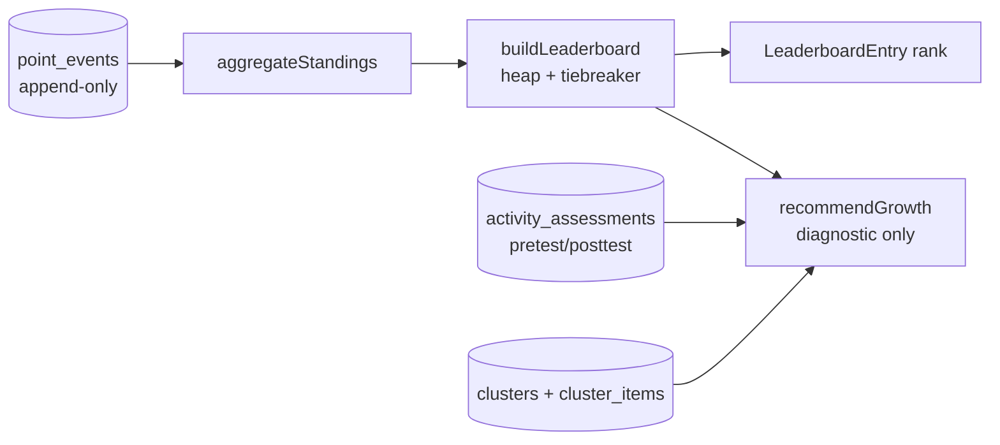

# `platform/org-ops/points` — Points · Leaderboard · Growth engine

> **Pure logic, no I/O.** These modules turn plain values into standings, rankings, and growth
> recommendations. Persistence (the append-only `point_events` ledger, the `leaderboard` matview)
> lives in the Supabase data-access layer — see `supabase/migrations/0002_*`, `0003_*` and
> `docs/POINTS-ENGINE.md`.

## The two tracks (confirmed)

| Track | What it is | Module |
|---|---|---|
| **Merit leaderboard** | Cut-throat ranking. Raw weighted points, deterministic tiebreaker. No handouts. | `leaderboard.ts` |
| **Growth diagnostic** | NOT a ranking. Finds the low-point bracket and recommends reachable lessons/events/hackathons by pretest→posttest gain. | `growth.ts` |

## Data flow

## Files

| File | Responsibility |
|---|---|
| `types.ts` | Domain contracts (mirror the SQL + `../types.ts`). |
| `heap.ts` | Generic `PriorityQueue` — the heap the leaderboard ranks on. |
| `scoring.ts` | Source weights (achievement/grade/project highest) + ledger → standings. |
| `leaderboard.ts` | `outranks` comparator + `buildLeaderboard` (merit, tiebroken). |
| `growth.ts` | `gain`, `lowPointBracket`, `recommendGrowth` (diagnostic). |
| `index.ts` | Barrel / public surface. |

## Design rules

- **Append-only is sacred.** Standings are always re-derived from the ledger; nothing here mutates
  history.
- **No PII.** Standings/leaderboard carry only `nickname` — never email/phone/raw data
  (SPECIFICATION §6). The engine falls back to `memberId`, never invents identity.
- **No clock, no network.** Timestamps are passed in as ISO strings so every function is pure and
  unit-testable. Weights are defaults; the SQL `weight` column can override per event.
- **Growth ≠ equity.** `growth.ts` only *recommends*; it never edits rank or moves points.

## Open questions

- Final source weights + whether grades need normalization across courses.
- `lowFraction` cutoff for the bracket (default 0.5) — tune with real data.
- Gain→difficulty mapping in `difficultyCeiling` (currently +5 gain per difficulty step).
- Cold start: members with no events yet — show them or hide them from the public board?
