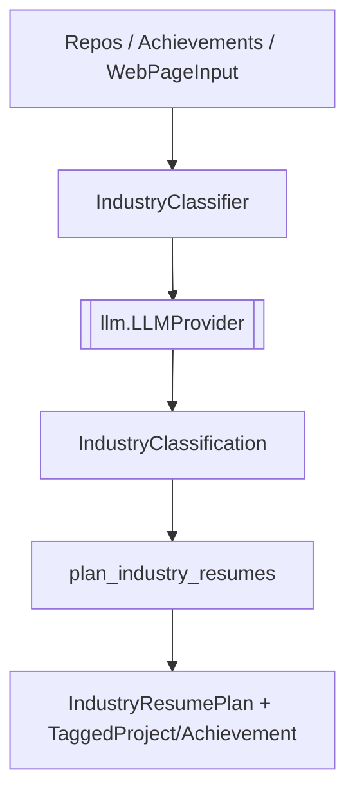

# `classification/` — Industry Classification & Tagging

Turns raw repos and achievements into industry-aware, tagged résumé plans. This is where an
`LLMProvider` decides which industry a candidate's work maps to and how to specialize output per
industry. Part of **Department 03 (Intelligence)**.

> 📖 [Dept 03 — Intelligence](../../../docs/departments/03-intelligence/README.md)

## Files

| File | Role |
|---|---|
| `industry.py` | `IndustryClassifier`, `IndustryClassification`, `IndustryResumePlan`, `TaggedAchievement`, `TaggedProject`, `WebPageInput`, `ExtractionRule`, `plan_industry_resumes()` + dedupe/normalize helpers |

## Call flow

## Rules

Depend on the `LLMProvider` ABC (`..llm`), never a concrete provider. Domain types and the Harvard
principles come from `..core`. Keep classification logic provider-agnostic so `static` mode (NullProvider)
degrades cleanly.
