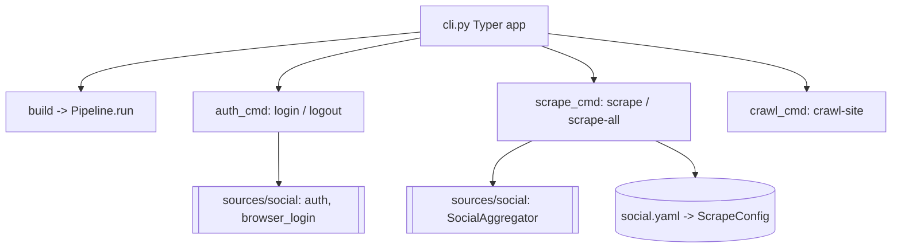

# `commands/` — CLI Subcommands

Implementations behind the `resume-build` CLI for things outside the main build flow — namely
social auth and standalone scraping. Wired into the Typer app in `cli.py`. **Department 01.**

> 📖 [Dept 01 — Core / Orchestration](../../../docs/departments/01-core-pipeline/README.md)

## Where these sit

## Files

| File | Role |
|---|---|
| `auth_cmd.py` | `login` / `logout` for social vendors (session management) |
| `scrape_cmd.py` | `scrape` / `scrape-all` — run the social aggregator standalone |
| `crawl_cmd.py` | `crawl-site` - learn HTML actions and crawl an adaptive same-domain sample |
| `utils.py` | Shared CLI helpers |

## Rules

Keep command bodies thin — parse args, call into `sources/` or `Pipeline`, print results. No
business logic here; delegate to the owning department.
