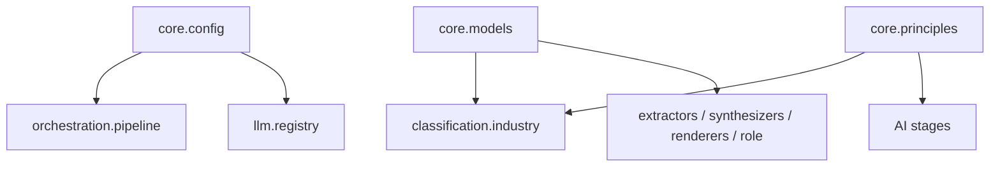

# `core/` — Domain Models, Config & Principles

The foundational layer every other module depends on: the Pydantic domain model graph, runtime
settings, and the shared Harvard writing principles. Nothing here imports sibling stages, so this is
the bottom of the dependency tree. Part of **Department 01 (Core / Orchestration)**.

> 📖 [Dept 01 — Core / Orchestration](../../../docs/departments/01-core-pipeline/README.md)

## Files

| File | Role |
|---|---|
| `models.py` | Pydantic domain graph: `Mode`, `DocumentType`, `RoleSpec`, `Repo`, `RawDocument`, `Evidence`, `ContactInfo`, `Resume` and its parts (`ResumeProject`, `ResumeExperience`, `ResumeEducation`, `ResumeCertification`, `ResumeAchievement`) |
| `config.py` | `Settings` (pydantic-settings) + cached `get_settings()`; `PROJECT_ROOT` anchor |
| `principles.py` | `HARVARD_PRINCIPLES` — the shared résumé-writing prompt constant |

## Dependency position

## Rules

Pure foundation — never import a stage, pipeline, or provider from here. Keep models immutable-friendly
and free of side effects. Read configuration through `get_settings()`, never hardcode paths or keys.
