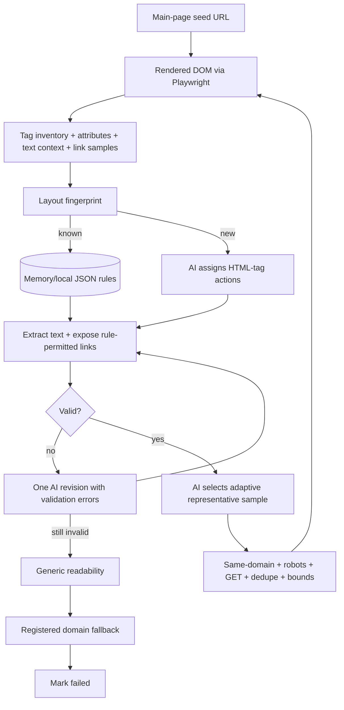

# `extraction/` — P2 Website-Agnostic Extraction

Converts raw URLs and GitHub repo references into structured
`CleanedSource` records that P3 (interpretation) can consume without knowledge
of the original source format. The package handles two distinct paths: arbitrary
websites (fetch → AI rule inference → apply → cap) and GitHub repositories (git-tree
walk at one of three scan depths).

No LLM is required for the GitHub path. For websites, `ExtractionRuleEngine` calls
the LLM once per unique DOM fingerprint and caches the result, so repeat visits to
the same template class cost nothing.

The multi-page agentic path is `AgenticCrawler`. It observes the rendered DOM, asks the AI to
classify HTML regions as `ignore`, `extract`, `crawl`, or `extract_and_crawl`, executes those
actions, validates the result, and gives the AI one revision attempt before using fallbacks.
Crawler content is not token-capped; its consumer owns context policy.

## Agentic crawler flow



On the seed page, link selection samples one representative useful page per useful main top-bar
category. Deeper sampling adapts to content and distinct layouts within hard safety boundaries.
Learned layouts and `latest-run.json` live under `out/crawler-rules/` by default; `LayoutStore` is
the persistence seam for a future backend.

The crawler's cache key is `crawler_dom.fingerprint` — a **strict class-vocabulary hash**: two
pages share a learned layout only when their full set of stable `tag#id` / `tag.class` /
`tag[role]` selectors is identical. A near-match is treated as a *different* layout (cache miss →
fresh AI inference) rather than risk replaying another page's rules. This favours accuracy over
token savings; see the benchmark below for the cost of that choice.

## Benchmark — token cost & output vs agent tool-calling

Why route structure-learning through the LLM and replay it in Python, instead of letting an agent
scrape by reading each page into its context? The cost curves diverge sharply with page count `N`.
Full harness, data, and reproduction steps: [`benchmarks/scraper_token_cost/`](../../../benchmarks/scraper_token_cost/).

**Complexity (LLM tokens):**

| Strategy | Complexity | Why |
|---|---|---|
| Agent tool-calling (naive, accumulating context) | **O(N²)** | every prior page is re-read each turn |
| Agent tool-calling (best case, per-page isolation) | **O(N)** | each page enters context once; loses cross-page reasoning |
| `AgenticCrawler` pipeline | **O(N)** small slope **+ bounded O(L)** | rule-learning is paid once per *distinct layout* `L`, not per page; extraction is deterministic Python (0 tokens) |

**Projected total tokens** (quotes.toscrape.com, `tiktoken cl100k_base`, L=2):

| pages | agent O(N²) naive | agent O(N) best | pipeline | pipeline vs best |
|---|---|---|---|---|
| 5 | 45,446 | 16,882 | 18,619 | 0.9× (≈ tie) |
| 25 | 938,930 | 82,010 | 25,539 | **3.2× cheaper** |
| 100 | 14,465,420 | 326,240 | 51,489 | **6.3× cheaper** |

Crossover ≈ **6 pages**: below it the agent is cheaper (less fixed overhead); above it the pipeline
wins and the gap widens because the agent is super-linear and the pipeline is not.

**Output shape** is the flip side of the trade:

| | Agent tool-calling | `AgenticCrawler` pipeline |
|---|---|---|
| Shape | structured per-field JSON `{text, author, tags[]}` | flat extracted-text blob per page (`apply_tag_rules` joins EXTRACT regions) |
| Fits | ready-to-use records | the resume **evidence-text corpus** this package exists to feed P3 |
| Cost | full HTML re-ingested every page | one rule-learn per layout, then free Python replay |

> **Measured vs modeled.** Page/inventory/fingerprint sizes and both strategies' real output were
> *measured* against the live pages and this package's real functions. The per-call LLM token
> constants and all `N`-scaling projections are *modeled* — no live LLM was billed. Every datum is
> tagged `measured` or `assumed` in `benchmarks/scraper_token_cost/data/measured.json`, and the
> complexity claims are locked by `tests/unit/test_scraper_token_benchmark.py`.

## Data flow

```mermaid
flowchart TD
    subgraph Website path
        URL[URL] --> SF[SourceFetcher.fetch]
        SF -->|static HTML| VT{visible text ≥ 200 chars?}
        VT -->|yes| Rule[ExtractionRuleEngine.rules_for]
        VT -->|no / thin| HF[headless fallback]
        HF --> Rule
        Rule -->|cache hit on fingerprint| AR[apply_rules]
        Rule -->|cache miss| SK[build_skeleton]
        SK --> LLM[LLM structured call]
        LLM --> Cache[(fingerprint cache)]
        Cache --> AR
        AR --> Cap[apply_token_cap]
        Cap --> CS[CleanedSource kind=website]
    end

    subgraph GitHub path
        Repo[full_name + depth] --> GRS[gather_repo_sources]
        GRS -->|readme| CR[collect_repo_readme<br/>root README × 1]
        GRS -->|markdown| CM[collect_repo_markdown<br/>README.* + docs/*.md ≤ 50]
        GRS -->|code| CC[collect_repo_code<br/>source files ≤ 40]
        CR & CM & CC --> Blobs[_collect_blobs<br/>git-tree walk + base64 decode]
        Blobs --> Cap2[apply_token_cap]
        Cap2 --> CS2[CleanedSource kind=github_readme / github_code]
    end
```



## Files

| File | Role |
|---|---|
| `models.py` | `CleanedSource` pydantic model; `apply_token_cap`; token-cap constants |
| `fetch.py` | `SourceFetcher` — static-first HTTP get with optional headless fallback |
| `skeleton.py` | `build_skeleton` (compact DOM outline) + `template_fingerprint` (SHA-1 cache key) |
| `rules.py` | CSS-subset `apply_rules` + `ExtractionRuleEngine` (AI rule gen with fingerprint cache) |
| `github_traversal.py` | Three-depth GitHub collectors + `gather_repo_sources` user-facing selector |
| `web.py` | `extract_website` — single-call orchestrator for the website path |
| `crawler.py` | `AgenticCrawler` (observe → infer → validate → revise → crawl loop) + `RobotsPolicy` + `PlaywrightPageFetcher` |
| `crawler_dom.py` | `build_dom_inventory` (DOM observation w/ link names), `apply_tag_rules` (deterministic execution of AI tag actions), `fingerprint` (strict class-vocabulary cache key), `safe_same_domain_url` |
| `crawler_models.py` | Crawler pydantic models: `HtmlTagRule`/`NodeAction`, `LearnedLayout`, `LinkCandidate`/`LinkSelection`, `ExtractedPage`, `CrawlRun` |
| `crawler_store.py` | `LayoutStore` — memory-first learned-layout cache, local JSON persistence, run writer |
| `domain_fallbacks.py` | Registered per-domain scraper adapters used only after AI + readability fail |

## Contracts / key signatures

```python
# models.py
CHARS_PER_TOKEN = 4
DEFAULT_TOKEN_CAP = 3000          # tokens
DEFAULT_CAP_CHARS = 12_000        # chars

class CleanedSource(BaseModel):
    source_id: str
    kind: str                     # "github_readme" | "github_code" | "website"
    title: str = ""
    text: str = ""
    section_hints: list[str] = []
    truncated: bool = False
    degraded: bool = False

def apply_token_cap(text: str, cap_chars: int = DEFAULT_CAP_CHARS) -> tuple[str, bool]: ...

# fetch.py
class SourceFetcher:
    def __init__(self, headless_fetch: Callable[[str], str] | None,
                 http_get: Callable[[str], str] | None) -> None: ...
    def fetch(self, url: str) -> tuple[str, bool]: ...  # (html, degraded)

# skeleton.py
def build_skeleton(html: str, max_nodes: int = 400) -> str: ...
def template_fingerprint(html: str, max_nodes: int = 200) -> str: ...   # SHA-1 hex

# rules.py
def apply_rules(html: str, rule: ExtractionRule) -> str: ...
class ExtractionRuleEngine:
    def __init__(self, llm: LLMProvider, cache: dict | None = None) -> None: ...
    def rules_for(self, source_id: str, html: str) -> ExtractionRule: ...

# github_traversal.py
SCAN_DEPTHS: tuple[str, ...] = ("readme", "markdown", "code")
def gather_repo_sources(full_name: str, gh_json: GhJson,
                        depth: str = "markdown", ref: str = "HEAD",
                        cap_chars: int = DEFAULT_CAP_CHARS) -> list[CleanedSource]: ...

# web.py
def extract_website(url: str, fetcher: SourceFetcher,
                    engine: ExtractionRuleEngine,
                    cap_chars: int = DEFAULT_CAP_CHARS) -> CleanedSource: ...
```

## GitHub scan depths

| Depth | Collector | Files matched | Max files | Kind |
|---|---|---|---|---|
| `readme` | `collect_repo_readme` | Root `README.*` only | 1 | `github_readme` |
| `markdown` | `collect_repo_markdown` | `README.*` anywhere + `docs/*.md` | 50 | `github_readme` |
| `code` | markdown + `collect_repo_code` | Above + source extensions (`.py .js .ts .java .go .rs …`) skipping `node_modules`, `dist`, `build`, `vendor`, `__pycache__`, `.venv`, etc. | 50 + 40 | `github_readme` + `github_code` |

Callers pick the depth that matches the token budget of the downstream model.

## CSS selector subset

`apply_rules` understands only: `tag`, `.class`, `#id`, `[role=value]`, and `tag.class`.
No descendant combinators, no pseudo-selectors. `ExtractionRuleEngine` is told to stay within this
subset in its system prompt so the LLM never generates rules that the matcher cannot evaluate.

## Rules

- `SourceFetcher` never raises; network failures degrade to `degraded=True` on the returned source.
- `ExtractionRuleEngine` caches by `template_fingerprint` so pages sharing the same DOM shape
  (e.g. all GitHub README pages) pay one LLM call. The cache is immutable on a hit (model_copy
  with the new source_id; the cached rule itself is never mutated).
- Every `CleanedSource.text` is guaranteed to be within `cap_chars` characters. `truncated=True`
  signals downstream that content was clipped.
- Markdown noise (HTML comments, badge links, images) is stripped before capping on the GitHub path.
- This package is P2; it feeds P3 (`interpretation/`). It does not call the LLM at all on the
  GitHub path, and calls it at most once per template on the website path.
