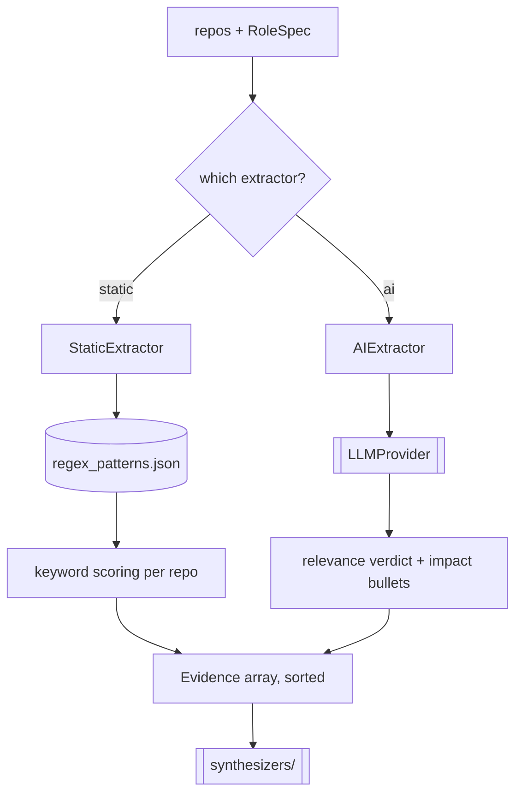

# `extractors/` — Role Relevance Extraction (Stage 3)

Scores and filters GitHub repos by how well they match the target role, emitting `Evidence`.
Part of **Department 03 (Intelligence)**.

> 📖 [Dept 03 — Intelligence](../../../docs/departments/03-intelligence/README.md)

## Contract

```python
class Extractor(ABC):
    def extract(self, repos: list[Repo], role: RoleSpec) -> list[Evidence]
        # return Evidence sorted by score desc
```

## Process



## Files

| File | Role |
|---|---|
| `base.py` | `Extractor` ABC |
| `static_extractor.py` | Regex keyword scoring (reads `config/regex_patterns.json`) |
| `ai_extractor.py` | LLM relevance filtering + bullet generation |

## Rules

Both implementations return the **same `Evidence` shape**. Keep editorial discipline — score by
what the repo *is*, not just the languages it lists. AI path should degrade to keyword logic on
failure.
