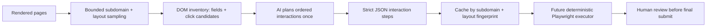
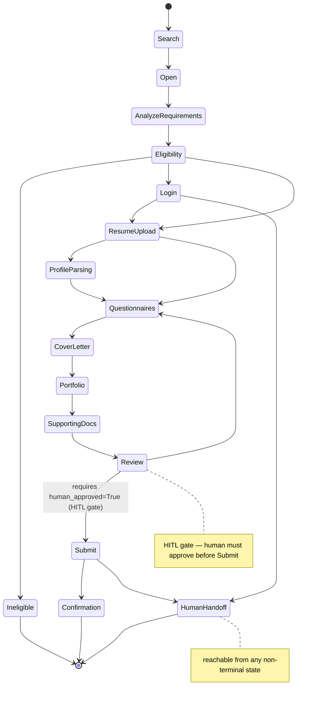

# `job_application/` — Job Application Expert

Contract and logic layer for automating job-application form filling. Defines the
schema for an `ApplicationPlan`, the canonical field taxonomy ATS forms map to,
the state machine that governs the application workflow, and helper utilities that
translate NCD (Normalized Candidate Data) values into detected form fields.

The package now includes the structure-learning boundary before browser execution:
bounded subdomain/layout sampling, rendered DOM inventories with explicit non-link
`click_candidate` tags, and an AI-generated ordered interaction plan. The deterministic
Playwright action executor, ATS vendor fingerprints, and Action-RAG recovery remain deferred.

## Dynamic website planning



Clickable `div`, `role=button`, tabs, accordions, expanders, modal openers, and same-page
panels are first-class interaction candidates—not discarded because they lack an `<a href>`.
Every planned interaction records selector, purpose, expected state change, and an optional
`wait_for_selector`. Final submit is schema-guarded with `requires_human=True`.

## Workflow state machine



## Files

| File | Role |
|---|---|
| `models.py` | `ApplicationPlan` schema — platform, workflow, fields, documents, HITL gate |
| `field_taxonomy.py` | `CANONICAL_FIELDS` dictionary + `normalize_label` + `JUDGMENT_FIELDS` |
| `state_machine.py` | `STATES`, `TRANSITIONS`, `WorkflowStateMachine` with HITL-guarded transition |
| `field_mapping.py` | NCD→field helpers: `build_detected_field`, `total_years_experience`, `degree_to_enum` |
| `website_planner.py` | subdomain/layout sampler + interactive DOM inventory + AI step planner |

## Contracts / key signatures

```python
# models.py
class ApplicationPlan(BaseModel):
    platform: PlatformInfo
    workflow: WorkflowInfo
    detected_fields: list[DetectedField]
    required_documents: list[RequiredDocument]
    missing_information: list[MissingInformation]
    upload_strategy: UploadStrategy | None
    browser_actions: list[BrowserAction]
    validation_steps: list[ValidationStep]
    recovery_plan: list[RecoveryRule]
    hitl: Hitl  # stop_before MUST be "Submit" — enforced by model_validator

class Hitl(BaseModel):
    stop_before: str = "Submit"   # any other value raises ValueError at construction
    status: str = "awaiting_human_review"

# field_taxonomy.py
CANONICAL_FIELDS: dict[str, list[str]]  # 19 canonical keys → variant label lists
JUDGMENT_FIELDS: frozenset[str] = frozenset({"salary", "work_authorization", "visa_sponsorship"})

def normalize_label(label: str) -> str | None: ...   # longest-match variant → canonical key
def is_judgment_field(canonical: str) -> bool: ...

# state_machine.py
STATES: tuple[str, ...] = (
    "Search", "Open", "AnalyzeRequirements", "Eligibility", "Ineligible",
    "Login", "ResumeUpload", "ProfileParsing", "Questionnaires", "CoverLetter",
    "Portfolio", "SupportingDocs", "Review", "Submit", "Confirmation", "HumanHandoff",
)
class WorkflowStateMachine:
    def next_states(self, state: str) -> set[str]: ...
    def can_transition(self, a: str, b: str) -> bool: ...
    def transition(self, current: str, target: str, *, human_approved: bool = False) -> str: ...

# field_mapping.py
def build_detected_field(canonical: str, label: str, kind: str,
                         required: bool, ncd_value: str | None,
                         ) -> DetectedField | MissingInformation: ...
def total_years_experience(spans: list[tuple[float, float]]) -> float: ...
def degree_to_enum(degree: str, options: list[str]) -> str | None: ...
```

## HITL gate

Two enforcement points guarantee a human reviews before submission:

1. **Schema level** — `ApplicationPlan.hitl.stop_before` is validated by a Pydantic
   `model_validator`; any value other than `"Submit"` raises `ValueError` at plan creation.
2. **State machine level** — `WorkflowStateMachine.transition("Review", "Submit")` raises
   `ValueError` unless `human_approved=True` is explicitly passed.

These two checks are independent so neither can be silently bypassed.

## Judgment fields

Fields in `JUDGMENT_FIELDS` (`salary`, `work_authorization`, `visa_sponsorship`) are never
auto-filled. `build_detected_field` unconditionally returns a `MissingInformation` record
for them, escalating the decision to the human regardless of what NCD data is available.

## What is deferred

- **Browser execution** — deterministic Playwright execution of the planned interactions
- **ATS detection** — vendor fingerprinting from platform evidence
- **Action-RAG** — retrieval-augmented recovery from application errors

The schema and state machine defined here are the contracts those components will implement.
