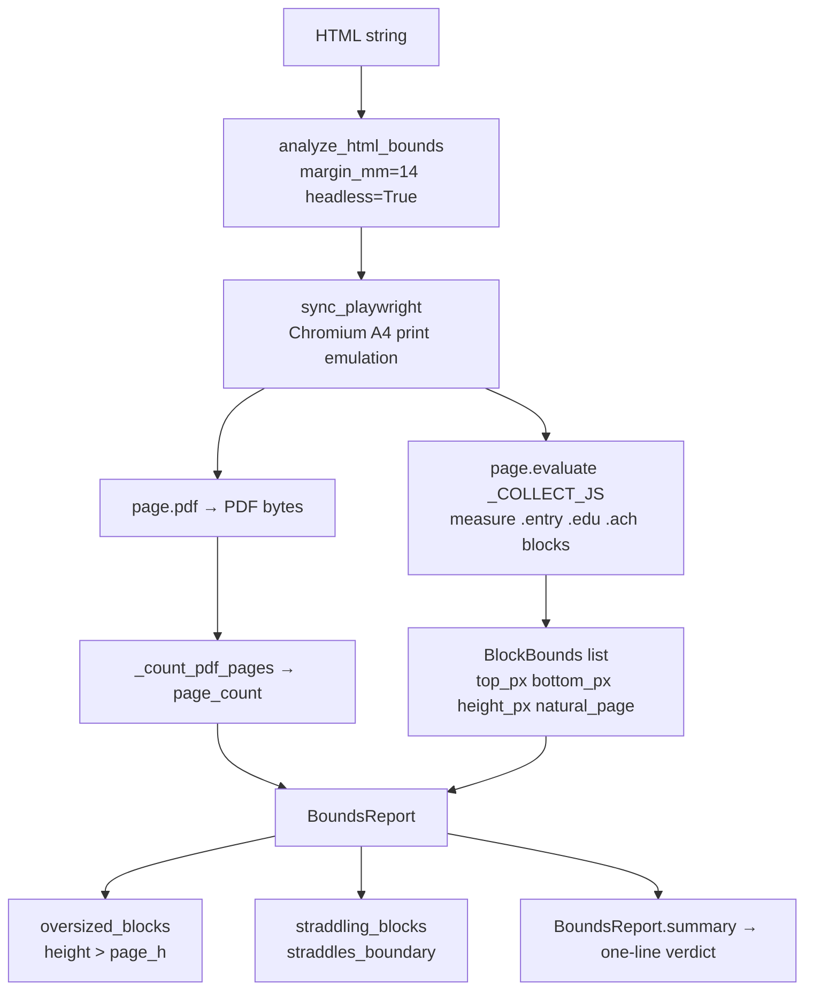

# `layout/` — Page-Bounds Analysis (P5 cross-cut)

Measures whether a rendered HTML resume actually fits within its printed page
boundaries. A flowing HTML document has no intrinsic concept of A4 pages, so
`analyze_html_bounds` delegates to a headless Chromium instance (Playwright), emulates
print media at A4, counts pages from the produced PDF, then measures every
atomic resume block in natural flow to report oversized entries (unavoidable
mid-page bleeds) and straddling entries (blocks the print stylesheet moves to
the next page, explaining whitespace).

The geometry helpers (`page_content_height_px`, `straddles_boundary`) are pure functions
and are unit-tested without a browser.

## Flow



## File

| File | Role |
|---|---|
| `bounds.py` | `analyze_html_bounds` Playwright entry point; pure geometry helpers; `BlockBounds` + `BoundsReport` models |

## Contracts / key signatures

```python
# bounds.py
A4_WIDTH_MM = 210.0
A4_HEIGHT_MM = 297.0

def page_content_height_px(page_height_mm: float = 297.0, margin_mm: float = 14.0) -> float: ...
def page_content_width_px(page_width_mm: float = 210.0, margin_mm: float = 14.0) -> float: ...
def straddles_boundary(top: float, bottom: float, page_height: float) -> bool: ...

class BlockBounds(BaseModel):
    label: str; section: str; top_px: float; bottom_px: float; height_px: float
    natural_page: int   # 0-based in continuous flow
    oversized: bool     # height > page_h → unavoidable bleed
    straddles: bool     # crosses a page line in natural flow

class BoundsReport(BaseModel):
    page_count: int             # authoritative from actual PDF
    page_height_px: float; page_width_px: float
    content_height_px: float    # total natural document height
    fits_one_page: bool
    oversized_blocks: list[BlockBounds]
    straddling_blocks: list[BlockBounds]
    blocks: list[BlockBounds]   # all measured blocks
    def summary(self) -> str: ...   # "Resume fits 1 page." | "Resume spans N pages."

def analyze_html_bounds(html: str, *, margin_mm: float = 14.0,
                        headless: bool = True) -> BoundsReport: ...
```

## Rules

- Requires Playwright + Chromium (`pip install playwright && python -m playwright install chromium`).
  `analyze_html_bounds` raises `RuntimeError` with actionable guidance if either is missing.
- On Windows, `_proactor_loop_policy_on_windows` temporarily swaps the event-loop policy so
  Playwright's subprocess launch succeeds even if the host process uses a Selector loop.
- JS is injected to disable `break-inside` before measuring natural flow, so the straddle
  analysis reflects where page breaks *would* fall without print-stylesheet intervention.
- The `page_count` in `BoundsReport` comes from the actual PDF the browser produces — this is
  the authoritative page count, not an estimate from content height.
- Atomic blocks are identified by CSS selectors `.entry`, `.edu`, `.ach` — matching the
  class names used in `resume.html.j2`.
- Skill grids use `plan_skill_layout`: actual group labels/items + usable page width determine the
  column count. Bounds analysis then validates the injected result. Fixed/manual column counts are
  not a substitute for rendered measurement.
