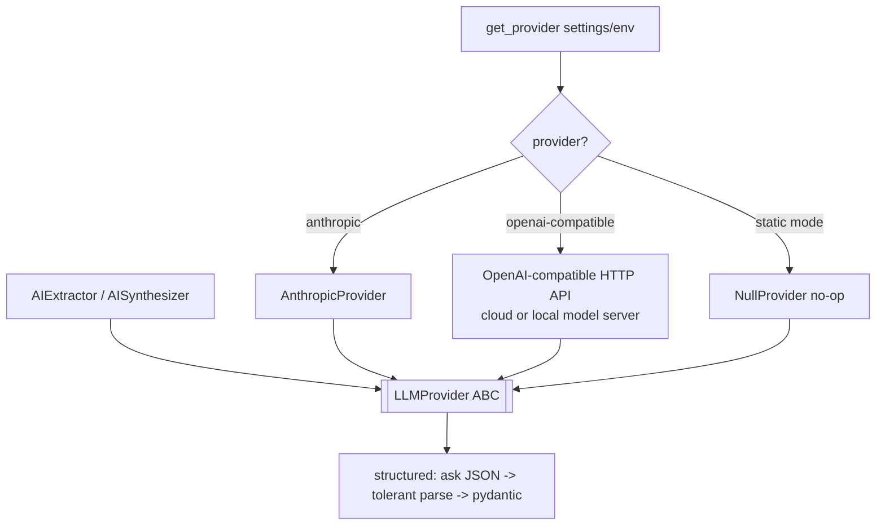

# `llm/` — Provider-Agnostic LLM Layer

One interface, many providers. Pipeline stages depend only on the `LLMProvider` ABC; choosing a
provider is a registry concern, not a stage concern. Part of **Department 03 (Intelligence)**.

> 📖 [Dept 03 — Intelligence](../../../docs/departments/03-intelligence/README.md)

## Contract

```python
class LLMProvider(ABC):
    name: str
    def complete(self, prompt: str, system: str | None = None, max_tokens: int = 1024) -> str
    def structured(self, prompt: str, schema: type[T],
                   system: str | None = None, max_tokens: int = 2048) -> T
```

## Selection + call flow



## Files

| File | Role |
|---|---|
| `base.py` | `LLMProvider` ABC + tolerant JSON parser + `LLMUnavailableError` |
| `registry.py` | `get_provider()` factory (settings/env driven) |
| `anthropic_provider.py` | Claude API |
| `openai_provider.py` | OpenAI-compatible HTTP API; remote or locally hosted server |
| `claude_session_provider.py` | Development-only interactive fixture; not in runtime registry |
| `null_provider.py` | No-op for `static` mode |

## Rules

Never import a concrete provider in a stage — use the ABC. No hardcoded keys (read from
settings/env). Add a provider by subclassing + registering. `structured()` has a default
(JSON + tolerant parse); override only for native tool-use APIs.

Production AI execution must cross an HTTP API boundary. Configure
`RESUME_LLM_API_BASE_URL`, `RESUME_LLM_API_KEY`, and `RESUME_LLM_MODEL`; a local model is supported
only when it exposes the same API contract. The current Codex/Claude chat session may generate
fixtures during development, but it is not embedded in or selectable by the shipped system.
