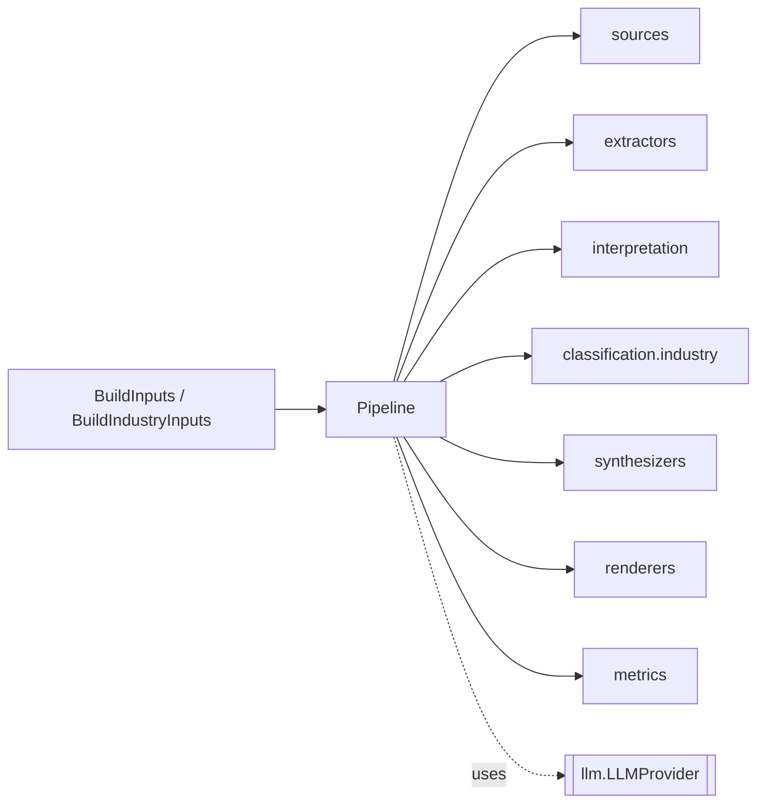

# `orchestration/` — The Build Pipeline

The conductor. `Pipeline` wires every stage together — sources → extraction → interpretation →
classification → synthesis → rendering — and exposes the two input shapes the CLI and web app build
résumés from. It depends on many subsystems but is depended on only by entrypoints. Part of
**Department 01 (Core / Orchestration)**.

> 📖 [Dept 01 — Core / Orchestration](../../../docs/departments/01-core-pipeline/README.md)

## Files

| File | Role |
|---|---|
| `pipeline.py` | `Pipeline` orchestrator + `BuildInputs` / `BuildIndustryInputs` request shapes |

## Stage wiring

## Rules

Stages must not call each other directly — the pipeline owns sequencing and data hand-off. Pull
configuration from `..core.config`, domain types from `..core.models`, and choose providers via the
`llm` registry. Keep this module about wiring, not business logic.
