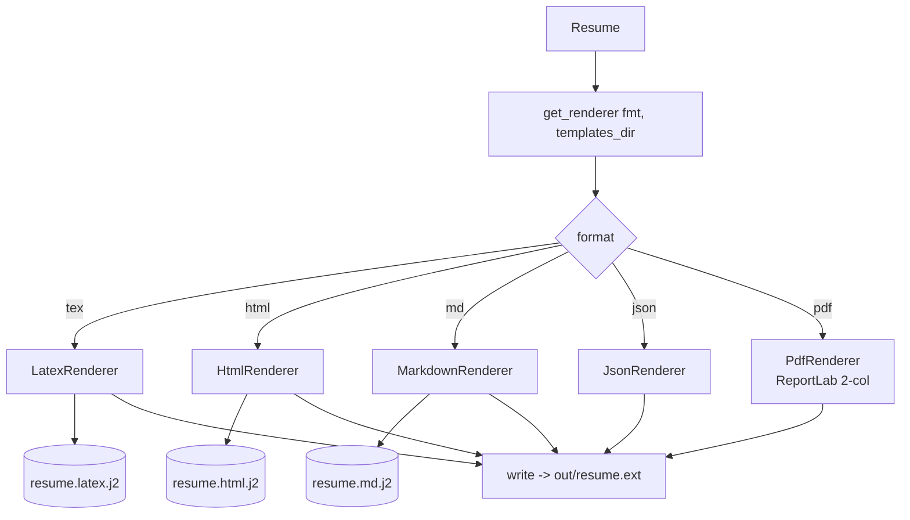

# `renderers/` — Output (Stage 5)

Turns the canonical `Resume` model into real files in five formats. The most self-contained
module — no LLM, no scraping, no mode logic. **Department 04.**

> 📖 [Dept 04 — Rendering / Output](../../../docs/departments/04-rendering/README.md)

## Contract

```python
class Renderer(ABC):
    extension: str
    def render(self, resume: Resume) -> str | bytes     # subclasses implement THIS
    def write(self, resume, out_dir, stem="resume") -> Path   # shared base logic
```

## Process



## Files

| File | Output |
|---|---|
| `base.py` | `Renderer` ABC + shared `write()` |
| `registry.py` | `get_renderer(fmt, templates_dir)` |
| `latex_renderer.py` | `.tex` |
| `html_renderer.py` | `.html` |
| `markdown_renderer.py` | `.md` |
| `json_renderer.py` | `.json` |
| `pdf_renderer.py` | `.pdf` (ReportLab / LaTeX→PDF) |

## Rules

Renderers are **pure**: input `Resume`, output a file. No fetching, no LLM, no mutation, no mode
branching. Templates live in `config/templates/` (data, not code). Add a format = subclass +
register. Handle empty sections gracefully; escape format-specific special chars.
