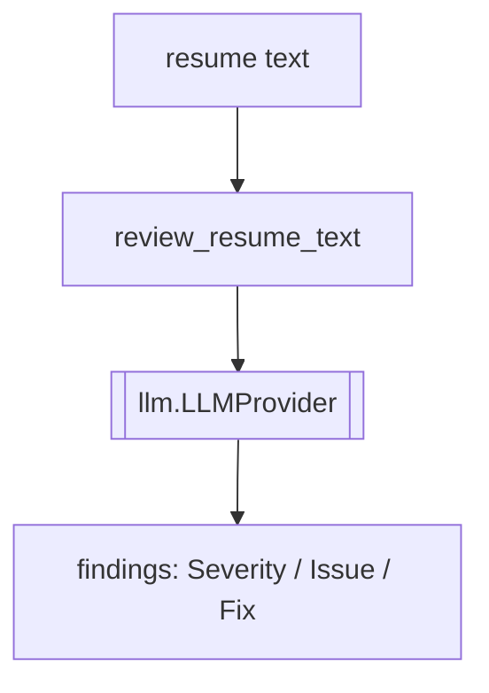

# `review/` — Résumé Review Orchestration

Findings-only review of a finished résumé. Builds the multi-subagent review prompt (structure,
signal-to-noise, achievement, ATS auditors) and runs it through an `LLMProvider`, returning concise
defect findings rather than a rewrite. Part of **Department 03 (Intelligence)**.

> 📖 [Dept 03 — Intelligence](../../../docs/departments/03-intelligence/README.md)

## Files

| File | Role |
|---|---|
| `review_orchestrator.py` | `review_resume_text()` + `REVIEW_SYSTEM_PROMPT` and `MAX_RESUME_REVIEW_CHARS` |

## Flow

## Rules

Depend only on the `LLMProvider` ABC (`..llm`). Cap input at `MAX_RESUME_REVIEW_CHARS`. Return findings
only — never rewrite the résumé here.
