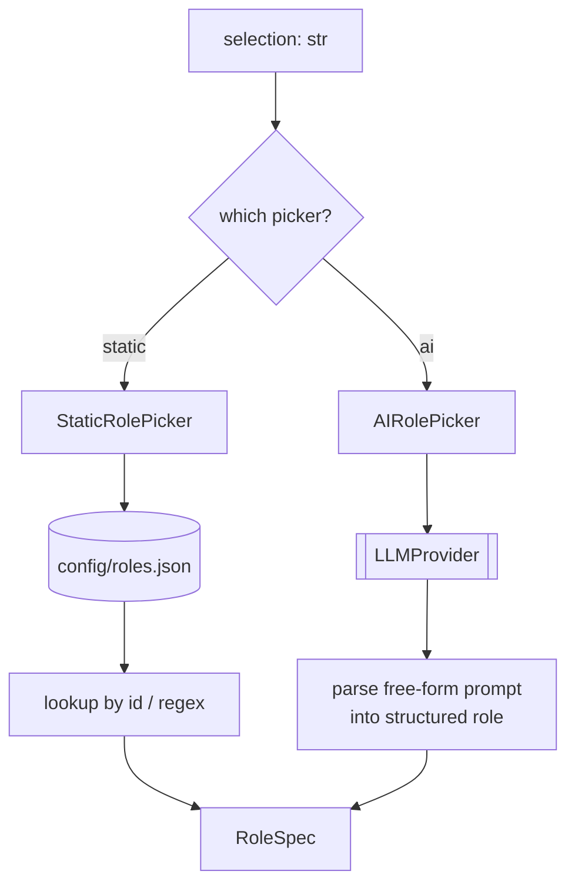

# `role/` — Role Picking (Stage 1)

Turns a user's role choice into a `RoleSpec` (keywords, must-have skills, summary hint) that the
rest of the pipeline targets. Part of **Department 01**.

> 📖 [Dept 01 — Core / Orchestration](../../../docs/departments/01-core-pipeline/README.md)

## Contract

```python
class RolePicker(ABC):
    def pick(self, selection: str) -> RoleSpec      # id (static) or free prompt (ai)
    def list_available(self) -> list[RoleSpec]      # static: from config; ai: []
```

## Process



## Files

| File | Role |
|---|---|
| `base.py` | `RolePicker` ABC + `RoleNotFoundError` |
| `static_picker.py` | Loads a `RoleSpec` from `config/roles.json` by id |
| `ai_picker.py` | Uses the LLM to clarify a free-text role into a `RoleSpec` |

## Extend

Add a role to `config/roles.json` (no code) for static mode. New picking *strategy* → subclass
`RolePicker`. Never break the `pick()` signature — Dept 01's `Pipeline` depends on it.
