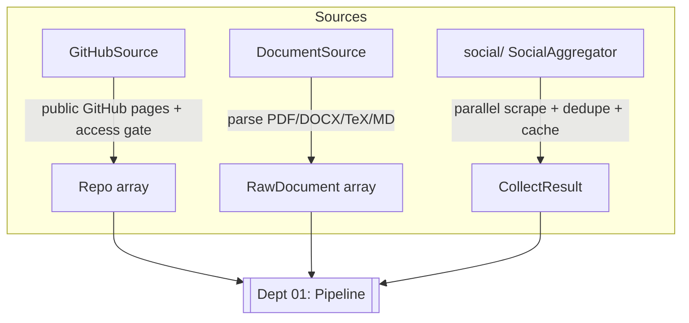

# `sources/` — Data Collection (Stage 2)

Pulls raw evidence *into* the system and normalizes it into `models.py` shapes. **Department 02.**

GitHub collection is user-agnostic and website-first. The username/organization is required at
runtime; no personal account is compiled into the collector. Normal public GitHub pages are read
with browser-like headers and access-gate checks. `RESUME_GITHUB_SOURCE=cli` enables the optional
authenticated `gh` developer backend, but it is not the product default.

> 📖 [Dept 02 — Sources / Data Collection](../../../docs/departments/02-sources/README.md)

## Contract

```python
class SourceCollector(ABC):
    name: str
    def collect(self, **kwargs) -> Any   # concrete return types differ per source
```

| Collector | Input | Output |
|---|---|---|
| `GitHubSource` | runtime GitHub user/org (website default; optional `gh` backend) | `list[Repo]` |
| `DocumentSource` | file path | `list[RawDocument]` |
| `SocialAggregator` (in [`social/`](social/README.md)) | `ScrapeConfig` | `CollectResult` |

## Process



## Files

| File | Role |
|---|---|
| `base.py` | `SourceCollector` ABC |
| `github.py` | GitHub repos via the `gh` CLI |
| `document.py` | Local resume parsing (PDF/DOCX/TeX/MD) → text |
| [`social/`](social/README.md) | The heavy social-scraping subsystem |

## Golden rule

A source failure must **degrade, never crash** the build. Normalize at the boundary — no raw
HTML/DOM leaks downstream. Sources are mode-agnostic (no `ai`/`static` logic here).
