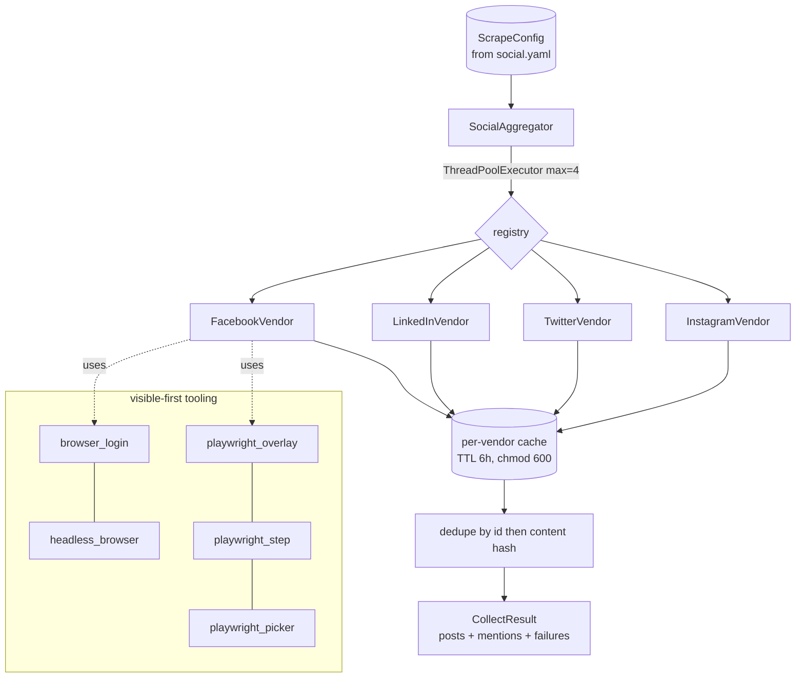

# `sources/social/` — Social Scraping Subsystem

The heaviest and most fragile module in the codebase. Scrapes a candidate's own posts and
mentions across vendors, in parallel, with caching and full failure isolation. **Department 02.**

> 📖 [Dept 02 — Sources](../../../../docs/departments/02-sources/README.md)
> ⚠️ Read the Facebook gotchas below before touching `vendors/facebook.py`.

## Architecture



## Vendor contract

```python
class SocialVendor(ABC):
    name: str
    def fetch_own_posts(self, handle: str, limit: int = 50) -> list[SocialPost]   # [] on fail
    def search_mentions(self, full_name: str, limit: int = 50) -> list[SocialMention]
```

## Files

| File | Role |
|---|---|
| `aggregator.py` | `SocialAggregator` — dispatch + dedupe + cache (never re-raises) |
| `base.py` | `SocialVendor` ABC + `VendorUnavailableError` |
| `models.py` | `SocialPost`, `SocialMention`, `ScrapeConfig` (frozen, `extra=forbid`) |
| [`vendors/`](vendors/README.md) | Concrete per-platform handlers |
| `auth.py` / `browser_login.py` / `browser_cookies.py` / `state.py` | login, sessions, cookies, persistence |
| `headless_browser.py` / `http.py` | Playwright session pool + HTTP fallback |
| `playwright_overlay.py` | Non-destructive DevTools-style highlights |
| `playwright_step.py` | Step-through debugger (walk first N posts) |
| `playwright_picker.py` | Hover/click element selector |
| `playwright_debug.py` | Visual debug config |

## Non-negotiable rules

1. **Resilience** — a broken vendor → entry in `CollectResult.failures` + empty result, never an
   exception into the build.
2. **Parallel + cached** — `ThreadPoolExecutor(max_workers=4)`, per-vendor TTL cache (6h).
3. **Cross-vendor dedupe** — `(vendor, id)` then content hash (collapses crossposts).
4. **Add a vendor** = subclass `SocialVendor` + register in `build_default_aggregator()` with a
   **lazy import** (missing optional deps must not break other paths).

## Facebook gotchas (hard-won — do not relearn)

- **Visible-first workflow:** develop in a *visible* browser; go headless only after sign-off.
- **FB posts are NOT `role="article"`** — only comments are. Detect posts by the permalink /
  timestamp anchor (`__cft__` token + post id). Using `role=article` = the "0 posts" bug.
- **Highlight the post UNIT**, not the tiny `__cft__` anchor — that's the "invisible highlight" bug.
