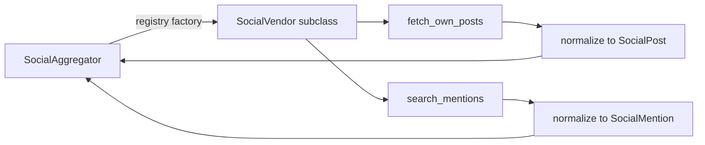

# `sources/social/vendors/` — Concrete Social Handlers

One file per platform. Each implements the `SocialVendor` interface and is registered lazily in
`build_default_aggregator()`. The aggregator **never** imports these directly. **Department 02.**

> 📖 [social/ subsystem](../README.md) · [Dept 02](../../../../../docs/departments/02-sources/README.md)

## Each vendor implements

```python
def fetch_own_posts(self, handle: str, limit: int = 50) -> list[SocialPost]   # [] on failure
def search_mentions(self, full_name: str, limit: int = 50) -> list[SocialMention]
```

## How a vendor fits in



## Files

| File | Strategy |
|---|---|
| `facebook.py` | Playwright (visible-first) + `mbasic.facebook.com` cookie fallback |
| `linkedin.py` | LinkedIn handler |
| `twitter.py` | Via Nitter |
| `instagram.py` | Instagram handler |

## Rules for a new vendor

1. Subclass `SocialVendor`, set `name`.
2. Return `[]` on any failure (or raise `VendorUnavailableError` — the aggregator catches it).
3. Normalize output to `SocialPost` / `SocialMention` — no raw DOM leaks.
4. Register it in `aggregator.build_default_aggregator()` with a **lazy import**.
