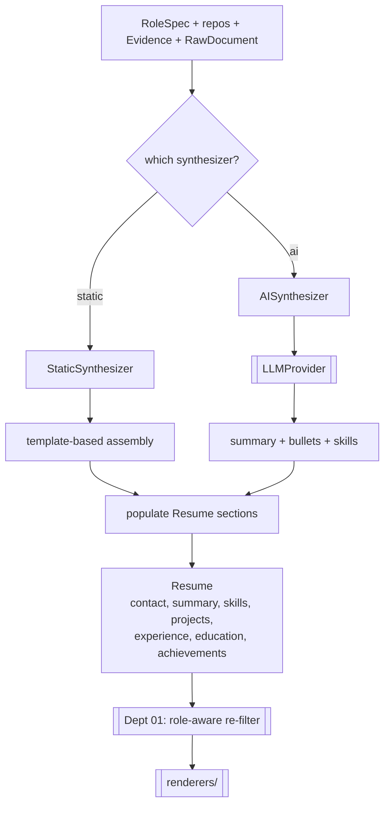

# `synthesizers/` — Resume Assembly (Stage 4)

Assembles the role, evidence, repos, and documents into the canonical `Resume` model.
Part of **Department 03 (Intelligence)**.

> 📖 [Dept 03 — Intelligence](../../../docs/departments/03-intelligence/README.md)

## Contract

```python
class Synthesizer(ABC):
    def build(self, role: RoleSpec, repos: list[Repo],
              evidence: list[Evidence], documents: list[RawDocument]) -> Resume
```

## Process



## Files

| File | Role |
|---|---|
| `base.py` | `Synthesizer` ABC |
| `static_synth.py` | Template-based assembly (no LLM) |
| `ai_synth.py` | LLM-driven content generation |

## Rules

`ai` and `static` must produce **structurally identical** `Resume` objects. Never pad sections —
empty is correct when nothing qualifies. Apply Harvard principles for impact-focused bullets.
After you build, Dept 01 runs a final role-aware filter on projects/achievements — keep output
filter-friendly.
