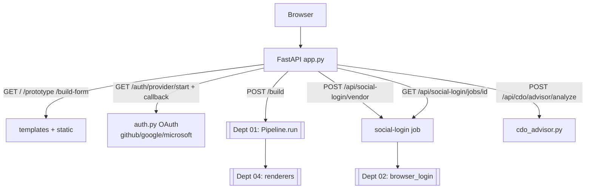

# `web/` — FastAPI "CareerLens" Prototype

The browser-facing prototype that wraps the CLI pipeline in a UI, with OAuth identity and
assisted social-login. **Department 05.**

> 📖 [Dept 05 — Web / SaaS](../../../docs/departments/05-web-saas/README.md)
> ⚠️ Prototype: **no user DB, no billing, no rate limiting yet.**

## Request flow

## Files

| File | Role |
|---|---|
| `app.py` | FastAPI routes (pages, auth, build, social-login, advisor, healthz) |
| `auth.py` | `WebAuthSettings` — GitHub/Google/Microsoft OAuth (`read:user`, `user:email`) |
| `cdo_advisor.py` | Resume injection / compliance analysis |
| `mock_data.py` | Prototype fixtures |
| `dev_server.py` | Local dev server |
| `templates/` | Jinja2 HTML |
| `static/` | CSS / JS |

## Rules

- **Don't fork the engine — call it.** `/build` is a thin adapter to `Pipeline.run()`.
- OAuth is **identity, not authorization-to-act** (don't expand scopes without a product call).
- Secrets via env only (see `docs/web-auth-setup.md`).
- Long/interactive logins run as **jobs** (start → poll), never block a request thread.
- Validate all request bodies; treat advisor input + uploads as untrusted.
